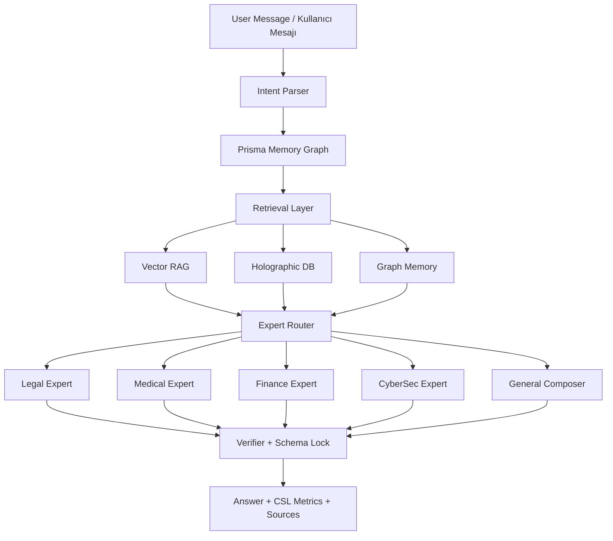
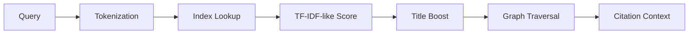

<div align="center">

# OmniEngine v7.4

### Titan Protocol

**TR:** Yerel, denetlenebilir ve uzman yönlendirmeli kurumsal yapay zeka altyapısı  
**EN:** Local-first, auditable enterprise AI with deterministic expert routing

[](.)
[](.)
[](.)
[](.)
[](.)
[](.)

</div>

---

## Kısa Özet / Executive Summary

**TR**  
OmniEngine, hassas alanlarda kullanılmak üzere tasarlanmış yerel bir AI orkestrasyon sistemidir. Amaç yalnızca cevap üretmek değil; isteği doğru uzmana yönlendirmek, yerel bilgi tabanından kanıt çekmek, şema ve doğrulayıcı katmanlarından geçirmek, gerekirse güvenli biçimde reddetmektir.

**EN**  
OmniEngine is a local AI orchestration system for sensitive enterprise domains. It does not rely on fluent generation alone; it routes each request to a domain expert, retrieves local evidence, validates outputs through schema and verifier layers, and can abstain when the safe answer is not to answer.

---

## Neden Farklı? / Why It Matters

| Sorun / Problem | OmniEngine Yaklaşımı / Approach |
|:--|:--|
| Hassas verinin buluta çıkması | Local-first runtime, SQLite/Prisma persistence, air-gapped Docker target |
| Kritik alanlarda halüsinasyon | Legal, medical, finance, cyber uzmanları + verifier/abstain kararları |
| Cevabın nasıl üretildiğinin belirsizliği | CSL metrics, expert identity, risk level, source/citation context |
| Demo sırasında “AI çalışıyor mu?” hissinin zayıf olması | Canlı memory graph, benchmark dashboard, PDF trust report |
| Kurumsal entegrasyon için zayıf veri kalıcılığı | Conversations, messages, memory graph, benchmark/audit modelleri için Prisma schema |

---

## Sistem Akışı / System Flow



---

## Güncel Durum / Current State

Son kontrol: **2026-05-27**

| Katman / Layer | Durum / Status |
|:--|:--|
| Next.js build | Passing |
| ESLint | Passing |
| Python runtime | Healthy |
| CUDA | Available on local RTX 4060 Laptop GPU |
| Prisma schema | Valid |
| OCR dependencies | PyMuPDF, pdf2image, pytesseract, PIL installed |
| Model registry | Intent parser and composer checkpoints found |

Doğrulanan komutlar:

```bash
npm run build
npm run lint
npx prisma validate
npm run python:diagnose
```

---

## Özellik Haritası / Feature Map

| Alan / Area | Özellik / Capability |
|:--|:--|
| Chat Orchestration | `/api/chat` üzerinden legal, medical, finance, cyber ve general routing |
| Interactive Memory | `react-force-graph-2d` ile canlı node-edge hafıza grafiği |
| Benchmark Analytics | Recharts ile score trend, capability radar, weakness map, expert usage |
| PDF Report | `/benchmark` ekranından trust report export |
| OCR-RAG | PyMuPDF + Tesseract/pdf2image fallback |
| HoloDB | TF-IDF benzeri skor, graph traversal, citation-style context |
| Persistence | Prisma + SQLite conversation, message, memory, audit, document, benchmark modelleri |
| Docker | Node, Python, Tesseract, Poppler, Prisma generation, Xenova model cache |
| Security | SSRF private IP blocking, upload type/size guard, schema locks |

---

## Uzmanlar / Domain Experts

| Expert | File | What It Does |
|:--|:--|:--|
| Legal | `src/python/legal_expert.py` | Legal-risk prompts, structured law references, safe drafting behavior |
| Medical | `src/python/medical_expert.py` | Pre-analysis only, numeric reference checks, no diagnosis |
| Finance | `src/python/finance_expert.py` | Debt/EBITDA, current ratio, equity ratio, Basel/BDDK-style rule table |
| CyberSec | `src/python/cyber_expert.py` | Defensive MITRE/OWASP-style guidance, exploit/malware instruction refusal |
| General | `src/python/composer.py` | Non-regulated synthesis with RAG/HoloDB/memory context |

---

## Karşılaştırmalı Konumlandırma / Comparative Positioning

Bu tablo model zekası benchmarkı değildir. Amaç OmniEngine’in ürün mimarisini bulut tabanlı LLM platformlarıyla konumlandırmaktır.

| Kriter / Criterion | OmniEngine | OpenAI API / ChatGPT Enterprise | Anthropic Claude API / Enterprise | Google Gemini / Vertex AI |
|:--|:--:|:--:|:--:|:--:|
| Local / air-gapped deployment | Native target | Cloud service | Cloud service | Cloud service / Google Cloud |
| Default base-model training on business/API data | Local only | Not used by default | Not used for commercial/API by default | Vertex AI: not used without permission |
| Abuse / service retention outside customer infra | None by design | May retain API inputs/outputs for limited abuse monitoring windows | Standard commercial/API retention documented; zero-retention options exist | Vertex/Gemini retention depends on feature and service configuration |
| Deterministic domain experts | Built-in Python modules | Requires custom app layer | Requires custom app layer | Requires custom app layer |
| Local HoloDB / symbolic graph | Built-in | External/custom | External/custom | External/custom |
| Interactive memory graph | Built-in | Custom implementation | Custom implementation | Custom implementation |
| OCR + local RAG ingestion | Built-in target | Custom implementation | Custom implementation | Custom implementation |
| PDF trust report | Built-in target | Custom implementation | Custom implementation | Custom implementation |
| Best fit | Regulated local AI, private demos, offline enterprise workflows | General cloud AI, high capability, broad ecosystem | Long-context and enterprise assistant workflows | Google Cloud / Vertex AI ecosystem |

Sources for vendor data-control positioning:

- OpenAI data controls and enterprise privacy: [platform docs](https://platform.openai.com/docs/guides/your-data), [enterprise privacy](https://openai.com/policies/api-data-usage-policies/), [security and privacy](https://openai.com/security-and-privacy/)
- Anthropic commercial/API data usage and retention: [Claude data usage docs](https://docs.anthropic.com/es/docs/claude-code/data-usage), [security docs](https://docs.anthropic.com/en/docs/claude-code/security)
- Google Gemini / Vertex AI data governance: [Vertex AI data governance](https://cloud.google.com/vertex-ai/generative-ai/docs/data-governance), [Gemini API terms](https://ai.google.dev/gemini-api/terms_preview), [Gemini API logs policy](https://ai.google.dev/gemini-api/docs/logs-policy)

---

## Holographic DB

HoloDB, OmniEngine’in yerel sembolik bilgi katmanıdır. Aktif okuyucu: `src/lib/HoloDB.ts`.

Mevcut akış:



Geliştirme hedefleri:

- Domain `.holo` dosyalarını ana HoloDB’ye merge etmek veya federated loader yazmak.
- Edge yoğunluğunu artırmak: hedef node başına 3-8 anlamlı edge.
- Node metadata alanlarını genişletmek: `language`, `jurisdiction`, `source_type`, `license`, `valid_from`, `valid_to`, `risk_class`, `confidence`.
- Edge ontology eklemek: `supports`, `contradicts`, `requires`, `has_exception`, `mitigates`, `maps_to_mitre`, `has_threshold`.
- HoloDB eval seti kurmak: beklenen node id top-3 içinde mi, yanlış domain geldi mi, citation doğru mu?

---

## Veri Seti Yol Haritası / Dataset Roadmap

Minimum metadata standardı:

```json
{
  "id": "finance_tr_0001",
  "domain": "finance",
  "subdomain": "credit_risk",
  "language": "tr",
  "source": "manual_rule_table",
  "license": "internal",
  "split": "train",
  "risk_level": "regulated",
  "expert": "finance",
  "citation_required": true,
  "requires_abstain": false
}
```

Öncelikli veri işleri:

| Öncelik | Veri işi |
|:--:|:--|
| P0 | Train/validation/hidden split sızıntısını engelle |
| P0 | Abstain veri seti oluştur: eksik veri, zararlı talimat, belirsiz hukuk, okunamayan OCR |
| P1 | Finance ve Cyber domainlerini büyüt |
| P1 | Citation-grounded legal/medical/finance/cyber örnekleri ekle |
| P1 | Numeric consistency testleri ekle |
| P2 | OCR-noisy PDF örnekleri üret |
| P2 | RAG prompt-injection dokümanları ekle |

---

## Kurulum / Installation

```bash
npm install
npm run db:generate
npm run db:push
pip install -r src/python/requirements.txt
npm run python:diagnose
npm run dev
```

`.env.local` örneği:

```env
OMNI_PYTHON_PATH=C:\Users\YourName\AppData\Local\Programs\Python\Python310\python.exe
```

OCR için ayrıca sistem seviyesinde:

- Tesseract OCR
- Turkish language pack
- Poppler

---

## Docker

```bash
docker compose build
docker compose up -d
```

Docker hedefi:

- Next.js production runtime
- Python runtime
- Python requirements
- Tesseract OCR + Turkish language pack
- Poppler
- Prisma client generation
- Xenova embedding model cache

---

## Bilinen Kalan İşler / Known Remaining Work

- Eski Python yorumlarındaki mojibake/encoding kalıntılarını temizle.
- Benchmark sonuçlarını Prisma `BenchmarkRun` tablosuna yaz.
- RAG document metadata ve chunk kayıtlarını Prisma’ya geçir.
- HoloDB merge/federated loader geliştir.
- Finance/Cyber veri tabanlarını kaynak ve citation id ile büyüt.
- Offline Docker smoke test yap.
- `npm audit` çıktısını triage et.
- API E2E testlerini CI benzeri bir akışa bağla.

---

## Pitch Cümlesi / One-Liner

**TR:** OmniEngine, hassas kurumsal veriyi buluta çıkarmadan, uzman modüller ve doğrulayıcı katmanlarla denetlenebilir AI cevabı üretir.  
**EN:** OmniEngine produces auditable AI responses for sensitive enterprise workflows without sending private data to a cloud model.

---

## License

Non-Commercial Academic & Enterprise Evaluation License.

