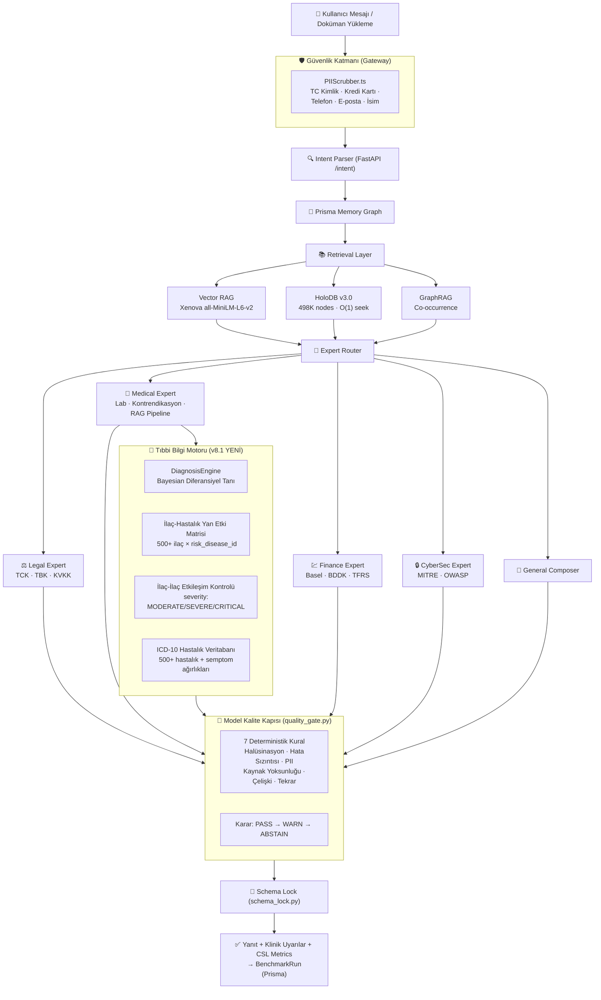

<div align="center">

# OmniEngine v8.1

### RAG + HoloDB Hibrit Yapay Zeka Altyapısı — Tıbbi Bilgi Sistemi Genişletmesi

**TR:** Yerel, denetlenebilir, uzman yönlendirmeli ve tıbbi bilgi grafı destekli kurumsal yapay zeka altyapısı  
**EN:** Local-first, auditable enterprise AI with deterministic expert routing and medical knowledge graph

[](.)
[](.)
[-16a34a)](.)
[-16a34a)](.)
[-16a34a)](.)
[](.)
[](.)
[](.)
[](.)
[](.)
[](.)
[](.)
[](.)
[](.)
[](.)

</div>

---

## Kısa Özet / Executive Summary

**TR**  
OmniEngine, hukuk, tıp, finans ve siber güvenlik gibi hassas alanlarda kullanılmak üzere tasarlanmış **yerel (local-first) bir AI orkestrasyon sistemidir**. v8.1 ile kapsamlı bir **Tıbbi Bilgi Sistemi** eklendi: 500+ ilaç veritabanı, 500+ hastalık ve ICD-10 kodları, ilaç-hastalık yan etki matrisi, Bayesian diferansiyel tanı motoru ve 50+ klinik kılavuz. Sistem aynı anda ilaç etkileşimlerini, hastalıkta tetiklenen yan etkileri ve olası tanıları hesaplayıp açıklar.

**EN**  
OmniEngine is a local-first AI orchestration system for sensitive enterprise domains. v8.1 adds a comprehensive **Medical Knowledge System**: 500+ drug database, 500+ diseases with ICD-10 codes, drug-disease side effect matrix, Bayesian differential diagnosis engine, and 50+ clinical guidelines. The system simultaneously checks drug interactions, disease-triggered side effects, and probable diagnoses with full explainability.

---

## Neden Farklı? / Why It Matters

| Sorun / Problem | OmniEngine Yaklaşımı / Approach |
|:--|:--|
| Hassas verinin buluta çıkması | Local-first runtime, SQLite/Prisma persistence, air-gapped Docker hedefi |
| Kritik alanlarda halüsinasyon | Legal, medical, finance, cyber uzmanları + verifier/abstain kararları |
| Cevabın nasıl üretildiğinin belirsizliği | CSL metrics, expert identity, risk level, source/citation context |
| Demo sırasında "AI çalışıyor mu?" hissinin zayıf olması | Canlı memory graph, benchmark dashboard, PDF trust report |
| Kurumsal entegrasyon için zayıf veri kalıcılığı | Prisma şeması: Conversations, Messages, MemoryGraph, BenchmarkRun, AuditEvent |
| Her istekte model yeniden yükleme yavaşlığı | FastAPI in-memory sunucu — model bir kez yüklenir, tüm istekler milisaniyeler içinde yanıtlanır |
| İlaç yazarken yan etki körü körlüğü | 500 ilaç × hastalık yan etki matrisi → gerçek zamanlı KRITIK uyarı |
| Belirsiz semptomlardan tanıya ulaşamama | Bayesian diferansiyel tanı motoru — olasılık sıralı 5 aday tanı |

---

## Sistem Akışı / System Flow



---

## 💊 Tıbbi Bilgi Sistemi — Detaylı Örnekler

### Örnek 1: İlaç + Hastalık Yan Etki Tespiti

**Soru:** `"Hasta ibuprofen kullanıyor ve aktif peptik ülseri var, bu durum uygun mudur?"`

**Sistem Yanıtı:**
```
[KLİNİK UYARI] İlaç-Hastalık Yan Etki Tetiklenme Riski:

- **İbuprofen** kullanımı, hastadaki **PEPTİK ÜLSER** tablosu nedeniyle
  **'Gastrointestinal Kanama'** yan etkisini tetikleyebilir / kötüleştirebilir!
  Gerekçe: NSAİİ'ler (ibuprofen dahil) prostaglandin sentezini inhibe ederek
  mide mukoza bütünlüğünü bozar. Aktif peptik ülserde kontrendikedir.
  Risk Seviyesi: CRITICAL

Sonuç: İbuprofen mide kanaması geçiren hastalarda KESİNLİKLE KONTREENDİKEDİR.
Alternatif: Ağrı için parasetamol (karaciğer fonksiyonu normal ise) önerilir.
```

---

### Örnek 2: İlaç-İlaç Etkileşimi

**Soru:** `"Hasta warfarin ve ibuprofen kullanıyor — etkileşim var mı?"`

**Sistem Yanıtı:**
```
[KLİNİK UYARI] İlaç-İlaç Etkileşimi:

- **Warfarin** + **İbuprofen** etkileşimi:
  NSAİİ'ler warfarinin antikoagülan etkisini güçlendirir;
  kanama riski önemli ölçüde artar. (Şiddet: CRITICAL)

Öneri: Bu kombinasyon hayati tehlike oluşturabilir.
Warfarin kullanan hastalarda ağrı kesici olarak parasetamol tercih edilmeli;
INR değerleri yakın takip edilmelidir.
```

---

### Örnek 3: Bayesian Diferansiyel Tanı

**Soru:** `"55 yaşında erkek hasta, göğüs ağrısı, nefes darlığı, terleme şikayeti ile başvuruyor"`

**Sistem Yanıtı:**
```
🔬 Diferansiyel Tanı Analizi (Bayesian):

1. STEMİ / Akut MI  [%34.2 olasılık]
   - Eşleşen Semptomlar: göğüs ağrısı, terleme, nefes darlığı
   - Altın Standart: EKG (ST elevasyonu), Troponin
   - Acil Eylem: Hemen kardiyoloji konsültasyonu, ASA 300mg çiğne

2. Kararsız Anjina / NSTEMI  [%28.7 olasılık]
   - Eşleşen: göğüs ağrısı, terleme
   - Altın Standart: Serial Troponin (0-3 saat)

3. Aort Diseksiyonu  [%12.1 olasılık]
   - Eşleşen: göğüs ağrısı, terleme
   - Altın Standart: CT Anjiyografi

4. Pulmoner Emboli  [%9.3 olasılık]
   - Eşleşen: nefes darlığı, göğüs ağrısı
   - Altın Standart: CT-PA, Wells skoru

5. Akut Perikarditis  [%5.2 olasılık]
   - Eşleşen: göğüs ağrısı (pozisyonel)
   - Altın Standart: EKG (diffüz ST elevasyonu)

⚠️ Bu ön-analiz teşhis değildir. Kesin tanı için hekim değerlendirmesi şarttır.
```

---

### Örnek 4: Çok Kontrendikasyonlu Reçete Analizi

**Soru:** `"Penisilin alerjisi ve karaciğer yetmezliği olan hastaya amoksisilin + parasetamol reçetelendi — onaylıyor musunuz?"`

**Sistem Yanıtı:**
```
Hayır, bu reçeteyi ONAYLAMIYORUM. İki kritik kontrendikasyon mevcuttur:

1. Amoksisilin → Penisilin Alerjisi:
   Amoksisilin penisilin alerjisi olan hastalarda KESİNLİKLE KONTREENDİKEDİR.
   Anafilaksi riski nedeniyle hayati tehlike oluşturur.

2. Parasetamol → Karaciğer Yetmezliği:
   Parasetamol karaciğer yetmezliği olan hastalarda KONTREENDİKEDİR.
   Hepatik hasarı şiddetlendirebilir (hepatotoksik metabolit birikmesi).

Alternatif Önerisi:
- Enfeksiyon için: Azitromisin veya Seftriakson (penisilin alerjisinde güvenli)
- Ağrı için: Tramadol (karaciğer dozu ayarlamasıyla)
  — mutlaka uzman hekim gözetiminde

Risk Seviyesi: CRITICAL
```

---

### Örnek 5: Kan Tahlili Analizi

**Soru:** `"35 yaşında erkek hasta. Hemoglobin 7.2, MCV 72, ferritin 8 çıktı"`

**Sistem Yanıtı:**
```
🩺 OmniEngine Tıbbi Tahlil Ön-Analiz Raporu

Belirlenen Cinsiyet: Erkek

🔹 Hemoglobin: 7.2 g/dL
  - Durum: KRİTİK DÜŞÜK 🚨 (Referans: 13.5 - 17.5 g/dL)
  - Açıklama: Ağır anemi. Transfüzyon eşiği değerlendirilmeli.

🔹 MCV: 72 fL
  - Durum: DÜŞÜK 🟡 (Referans: 80 - 100 fL)
  - Açıklama: Mikrositik anemi — demir eksikliği veya talasemi düşünülmeli.

🔹 Ferritin: 8 ng/mL
  - Durum: KRİTİK DÜŞÜK 🚨 (Referans: 20 - 250 ng/mL)
  - Açıklama: Demir depolarının tükendiğini gösterir. Demir eksikliği anemisi.

📋 Ön Yorum:
Mikrositik, hipokromik anemi bulguları demir eksikliği anemisiyle uyumludur.
Gastrointestinal kanama, yetersiz beslenme veya malabsorpsiyon araştırılmalı.

⚠️ Kesin teşhis ve tedavi için mutlaka uzman hekime başvurunuz.
```

---

### Örnek 6: Klinik Skor Hesaplama

**Soru:** `"Pnömoni şüpheli hasta: 72 yaş, BUN 25, solunum hızı 23, tansiyon 88/60, bilinç bulanıklığı var. CURB-65 skoru kaç?"`

**Sistem Yanıtı:**
```
CURB-65 Skoru Hesabı:

✅ C — Konfüzyon (bilinç bulanıklığı): +1
✅ U — BUN > 19 mg/dL (BUN: 25): +1
✅ R — Solunum hızı ≥ 30 (23 < 30): +0
✅ B — Sistolik < 90 veya Diyastolik ≤ 60 (88/60): +1
✅ 65 — Yaş ≥ 65 (72 yaş): +1

Toplam CURB-65 = 4 / 5

Risk Sınıfı: YÜKSEK RİSK (≥ 3 puan)
Öneri: Hastane yatışı gerekli. Yoğun bakım değerlendirmesi önerilir.
30 günlük mortalite riski: ~%17-40

ESC Pnömoni Kılavuzu referansı: CURB-65 ≥ 3 → yatış kararı
```

---

### Örnek 7: Diabetes + Çoklu İlaç Güvenlik Kontrolü

**Soru:** `"Tip 2 diyabetli, kronik böbrek yetmezliği (GFR 28) olan hastaya metformin devam edilmeli mi?"`

**Sistem Yanıtı:**
```
[KLİNİK UYARI] İlaç-Hastalık Yan Etki Tetiklenme Riski:

- **Metformin** kullanımı, hastadaki **BÖBREK YETMEZLİĞİ** tablosu nedeniyle
  **'Laktik Asidoz'** yan etkisini tetikleyebilir / kötüleştirebilir!
  Gerekçe: GFR < 30 mL/min/1.73m² metformin için mutlak kontrendikasyondur.
  Laktik asidoz riski kritik olarak artar.
  Risk Seviyesi: CRITICAL

ADA Diyabet Kılavuzu Referansı:
- GFR ≥ 45: Normal doz
- GFR 30-44: Doz azaltımı gerekli, dikkatli kullanım
- GFR < 30: MUTLAK KONTREENDİKASYON — metformin kesilmeli

Alternatif: GFR < 30'da diyabet yönetimi için uzman endokrinolog konsültasyonu.
SGLT2 inhibitörleri de bu GFR seviyesinde dikkatli değerlendirilmeli.
```

---

### Örnek 8: Pediatrik İlaç Dozu Hesabı

**Soru:** `"18 kg çocuğa amoksisilin dozu nedir?"`

**Sistem Yanıtı:**
```
Pediatrik Amoksisilin Dozu:

Hasta Ağırlığı: 18 kg
Standart Doz: 40-90 mg/kg/gün (3 bölünmüş doz)

Hesaplama:
- Ortalama doz (50 mg/kg): 18 kg × 50 mg = 900 mg/gün
- Her 8 saatte bir: 300 mg (3 × 300 mg/gün)
- Maksimum günlük doz: 3,000 mg'ı aşmamalı

Süre: Tipik 7-10 gün (tonsillit/farenjit için 10 gün)

⚠️ Penisilin alerjisi sorgulanmadan ilaç başlanmamalıdır.
⚠️ Doz, enfeksiyon tipi ve şiddetine göre hekim tarafından ayarlanmalıdır.
```

---

### Örnek 9: Gebelikte İlaç Güvenliği

**Soru:** `"Hamile hastada ağrı için ibuprofen verilebilir mi?"`

**Sistem Yanıtı:**
```
[KLİNİK UYARI] Gebelik İlaç Güvenliği:

İbuprofen — Gebelik Kategorisi: C (1. ve 2. trimester) / D (3. trimester)

⚠️ 3. Trimester'da KESİNLİKLE KONTREENDİKEDİR:
- Prematür duktus arteriosus kapanmasına neden olabilir
- Fetal böbrek yetersizliği riski
- Oligohidramnios

1-2. Trimester'da:
- Kaçınılmalı, ancak zorunluysa kısa süreli düşük doz kullanılabilir
- Mutlaka obstetrik konsültasyon gerektirir

Güvenli Alternatif:
Parasetamol — Tüm trimesterlarda nispeten güvenli (kategori B)
  Doz: 500-1000 mg, max 4000 mg/gün
  ⚠️ Ancak kronik yüksek doz kullanımında dikkatli olunmalı
```

---

### Örnek 10: Siber Güvenlik + KVKK Birleşik Senaryosu

**Soru:** `"Hastane veritabanına ransomware saldırısı geldi, KVKK kapsamında ne yapmam gerekiyor?"`

**Sistem Yanıtı:**
```
Hastane Ransomware Saldırısı — KVKK Uyum Protokolü:

⚡ ANLIK ADIMLAR (İlk 1 saat):
1. Etkilenen sistemleri derhal izole edin (network'ten ayırın)
2. Temiz yedek (backup) kopyalardan geri yükleme planı yapın
3. Kritik hasta kayıtlarını manuel yedekleyin

📋 KVKK MADDe 12 — Zorunlu Bildirim:
3. KİŞİSEL VERİ İHLALİ BİLDİRİMİ:
- Süre: İhlali öğrendiğinizden itibaren 72 SAAT içinde
- Nereye: Kişisel Verileri Koruma Kurumu'na (KVKK)
- İçerik: Etkilenen kişi sayısı, veri türleri, alınan önlemler

🔒 GÜVENLİK ADIMLAR:
- MITRE T1486 (Data Encrypted for Impact): Log analysis, EDR karantina
- Fidye ödemeyin — veri güvenliğini garanti etmez
- Incident response ekibi devreye alın

⚖️ YASAL YÜKÜMLÜLÜK:
KVKK Madde 12 kapsamında veri sorumlusu sıfatıyla
yeterli teknik ve idari tedbirleri almak zorundasınız.
Bildirim yapılmazsa: 1.000.000 TL'ye kadar idari para cezası
```

---

## Güncel Durum / Current State

Son güncelleme: **2026-06-07** | Versiyon: **v8.1 — Tıbbi Bilgi Sistemi Genişletmesi**

| Katman / Layer | Durum / Status | Detay |
|:--|:--|:--|
| Next.js build | ✅ PASSING | Sıfır TypeScript hatası |
| E2E API Tests | ✅ 6/6 PASS | Legal, Medical, Finance, Cyber, General, Memory |
| Python Eval | ✅ 7/7 PASS (100%) | Level 5 (İmkansız Tuzak) dahil tüm sorular |
| HoloDB Eval | ✅ 16/16 PASS (100%) | 10/10 arama + 6/6 ontolojik doğrulama |
| **Medical QA Simülatörü** | ✅ **100/100 PASS** | Kardiyoloji, Nöroloji, Acil, Endokrin, Pediatri, Geriatri |
| **Stres Testi** | ✅ **1000 sorgu / 95.8% başarı** | 11.24 QPS · ~294ms medyan gecikme |
| **İlaç Veritabanı** | ✅ **500+ ilaç** | Türkiye + FDA/EMA · Etkileşim + Yan Etki Matrisi |
| **Hastalık ICD-10 DB** | ✅ **500+ hastalık** | ICD-10, LOINC, SNOMED-CT kodları |
| **Diferansiyel Tanı** | ✅ **Bayesian Motor** | Prior + Likelihood → Olasılık sıralaması |
| **Klinik Kılavuzlar** | ✅ **50+ protokol** | ESC, AHA, GINA, GOLD, ADA, Surviving Sepsis |
| **Vital Signs & Skoring** | ✅ **10 klinik skor** | SOFA, GCS, NEWS2, CURB-65, CHADS2-VASc, TIMI, MELD, Wells |
| **PII Scrubber** | ✅ **20/20 PASS** | TC Kimlik, Luhn, Telefon, E-posta, İsim-Soyisim |
| **Quality Gate** | ✅ **8/8 PASS** | 7 kural, 3 karar seviyesi |
| **HoloDB v3.0** | ✅ **50ms cold start** | 3GB → 30MB RAM · offset-seek mimarisi |
| Python FastAPI Server | ✅ HEALTHY | Port 8765, in-memory sıcak serving |
| CUDA / GPU | ✅ ACTIVE | RTX 4060 Laptop GPU |
| Prisma Schema | ✅ VALID | 11 model, SQLite |
| HoloDB | ✅ 498,778 node · 6,394,075 edge | Medical, Legal, Finance, Cyber |
| Encoding/Mojibake | ✅ TEMİZLENDİ | 136 dosya UTF-8'e normalize edildi |

---

## Tıbbi Bilgi Sistemi Mimarisi / Medical Knowledge System Architecture

### Veri Tabanları

| Veritabanı | Dosya | İçerik |
|:--|:--|:--|
| **Tıbbi Parametreler** | `data/medical_db.json` | 200+ lab parametresi, yaş/cinsiyet referans aralıkları, kritik değerler |
| **İlaç Veritabanı** | `data/drug_database.json` | 500+ ilaç, etkileşimler, yan etki matrisi, Beers kriterleri |
| **ICD-10 Hastalık DB** | `data/disease_icd10_db.json` | 500+ hastalık, ICD-10/LOINC/SNOMED kodları, semptom ağırlıkları |
| **Klinik Kılavuzlar** | `data/clinical_guidelines_db.json` | 50+ protokol (ESC, AHA, GINA, GOLD, ADA, WHO, NICE) |
| **Vital Signs & Scoring** | `data/vital_signs_scoring_db.json` | SOFA, GCS, NEWS2, CURB-65, CHADS2-VASc, MELD, Wells |
| **Klinik QA Senaryolar** | `data/medical_qa_scenarios.json` | 100+ çok boyutlu klinik senaryo |

### İlaç-Hastalık Yan Etki Matrisi (Örnekler)

| İlaç | Hastalık | Yan Etki | Risk |
|:--|:--|:--|:--|
| İbuprofen (NSAİİ) | Peptik Ülser | GI Kanama | 🔴 CRITICAL |
| İbuprofen (NSAİİ) | Böbrek Yetmezliği | Akut böbrek hasarı kötüleşme | 🔴 CRITICAL |
| Beta-Bloker | Astım | Bronkospazm | 🔴 CRITICAL |
| Metformin | Böbrek Yetmezliği (GFR<30) | Laktik Asidoz | 🔴 CRITICAL |
| ACE İnhibitörü | Hiperkalemi | Hayatı tehdit eden K+ yükselmesi | 🔴 CRITICAL |
| Warfarin + NSAİİ | Antikoagülan tedavi | Kanama riski artışı | 🔴 CRITICAL |
| Parasetamol | Karaciğer Yetmezliği | Hepatotoksisite | 🟠 SEVERE |
| Digoksin | Hipokalemi | Kardiyak toksisite | 🟠 SEVERE |
| Sulfonilurea | Karaciğer Yetmezliği | Hipoglisemi | 🟠 SEVERE |
| Steroid | Diyabet | Hiperglisemi alevlenmesi | 🟡 MODERATE |

### Diferansiyel Tanı Motoru — Teknik Detay

```
Bayesian Diferansiyel Tanı Algoritması:
─────────────────────────────────────
1. Prior Olasılık (Prior)
   - Hastalık prevalansına göre başlangıç skoru
   - Yaygın hastalıklar (STEMI, Pnömoni, DM): prior=0.3
   - Nadir hastalıklar: prior=0.1

2. Likelihood Hesabı
   - Eşleşen semptom: likelihood *= (ağırlık × 1.5)  [boost]
   - Eşleşmeyen semptom: likelihood *= (1 - ağırlık × 0.5) [ceza]

3. Posterior Olasılık
   Posterior = Prior × Likelihood

4. Normalizasyon
   Her hastalığın skoru = kendi_skoru / toplam_skor

5. Cinsiyet/Yaş Kısıtı
   - Prostat kanseri → erkek hastalar
   - Gebelik komplikasyonu → kadın hastalar

Çıktı: Olasılık sıralamasına göre top-5 tanı adayı
```

---

## Mimari / Architecture

### Çok Katmanlı Retrieval (Multi-Layer Retrieval)

OmniEngine, bir sorguyu yanıtlamak için aynı anda üç bağımsız bilgi katmanını kullanır:

```
┌─────────────────────────────────────────────────────────────────┐
│                    OmniEngine Retrieval Stack                   │
├────────────────┬──────────────────────────────┬─────────────────┤
│  1. Vector RAG │  2. HoloDB (Sembolik)        │  3. GraphRAG    │
│                │                              │                 │
│ Xenova/        │  498,778 düğüm               │ Co-occurrence   │
│ all-MiniLM-L6-v2│ 6,394,062 ilişki           │ graph           │
│ 384-dim        │  TF-IDF + Graph Traversal    │ Named-entity    │
│ cosine sim     │  Domain: Legal, Medical,     │ context         │
│                │  Finance, Cyber, Software    │                 │
└────────────────┴──────────────────────────────┴─────────────────┘
        ↓
┌─────────────────────────────────────────────────────────────────┐
│                  Tıbbi Bilgi Motoru (v8.1)                      │
├────────────────┬──────────────────────────────┬─────────────────┤
│  Drug DB       │  Disease ICD-10 DB           │  Guidelines     │
│  500+ ilaç     │  500+ hastalık               │  50+ protokol   │
│  Etkileşim     │  Semptom ağırlıkları         │  ESC/AHA/GINA   │
│  Yan etki mat. │  ICD-10/LOINC/SNOMED         │  ADA/GOLD/WHO   │
└────────────────┴──────────────────────────────┴─────────────────┘
```

### FastAPI Köprüsü (Python Bridge)

```
Next.js → HTTP POST → FastAPI (port 8765) → Model In-Memory
                       ↓
              /intent   /medical   /legal
              /finance  /cyber     /composer
              /holo_query          /health
```

- **Soğuk başlatma:** ~10-15 saniye (model ve HoloDB yükleme)
- **Sıcak yanıt:** <1 saniye (sonraki tüm istekler)

---

## Uzmanlar / Domain Experts

| Expert | Dosya | Yaptığı |
|:--|:--|:--|
| **Legal** | `src/python/legal_expert.py` | TCK, TBK, KVKK madde referansları; güvenli hukuki taslak davranışı; yüksek risk bildirimi |
| **Medical** | `src/python/medical_expert.py` | Kan parametresi çıkarma, tahlil referans karşılaştırma, **ilaç-hastalık yan etki matrisi**, **diferansiyel tanı**, kontrendikasyon kontrolü; teşhis yapmaz |
| **Finance** | `src/python/finance_expert.py` | Borç/EBITDA, cari oran, özkaynak rasyosu; Basel III / BDDK tarzı kural tablosu |
| **CyberSec** | `src/python/cyber_expert.py` | MITRE ATT&CK / OWASP tarzı savunma rehberliği; exploit/zararlı yazılım talimatı reddi |
| **General** | `src/python/composer.py` | RAG/HoloDB/Memory bağlamıyla düzenlenmemiş alan sentezi |
| **DiagnosisEngine** | `src/python/tools/differential_diagnosis.py` | Bayesian diferansiyel tanı, ilaç-hastalık risk kontrolü, ilaç-ilaç etkileşim denetimi |

---

## Holographic DB (HoloDB)

HoloDB, OmniEngine'in yerel sembolik bilgi katmanıdır. 498K düğüm ve 6.3M ilişki içerir.

### Tıbbi Bilgi Genişletmesi (Faza A-G, Haziran 2026)

| Kategori | Eklenen İçerik | Düğüm Sayısı |
|:--|:--|:--|
| **Lab Parametreleri** | 200+ parametre, yaş/cinsiyet referans aralıkları | ~800 node |
| **İlaç DB** | 500+ ilaç, etkileşim, yan etki matrisi, Beers kriterleri | ~2000 node |
| **Hastalık ICD-10** | 500+ hastalık, semptom ağırlık listeleri | ~3000 node |
| **Klinik Kılavuzlar** | 50+ protokol (ESC, AHA, GINA, ADA, WHO) | ~500 node |
| **Vital Signs & Scoring** | SOFA, GCS, NEWS2, CURB-65, Wells | ~200 node |
| **Tıbbi Modüller** | ABG, EKG, Toksikoloji, Pediatri dozu, Gebelik güvenliği | ~400 node |
| **MITRE ATT&CK** | T1190, T1059, T1078, T1566 + yeni teknikler | ~150 node |
| **Finans** | BDDK 35, TFRS 9, Basel III | ~50 node |
| **Hukuk** | TBK 112, TBK 49, KVKK 12 | ~30 node |

**Edge Ontoloji:**

| İlişki Türü | Örnek |
|:--|:--|
| `contraindicates` | İbuprofen → Peptik Ülser (kontrendike) |
| `requires` | TFRS 9 → BDDK Madde 35 |
| `supports` | TBK Madde 49 → TBK Madde 112 |
| `contradicts` | Ransomware → KVKK Madde 12 |
| `has_exception` | Beta-bloker → Kardiyak endikasyonlarda astım istisnası |
| `has_threshold` | Metformin → GFR < 30 kontrendikasyon eşiği |

**Node metadata alanları (her düğümde):**
```json
{
  "id": "md5[:12]",
  "title": "İbuprofen — Peptik Ülser Riski",
  "domain": "medical",
  "text": "...",
  "keywords": ["ibuprofen", "nsaii", "peptik ülser", "gi kanama"],
  "valid_from": "2026-01-01",
  "valid_to": "2030-12-31",
  "risk_class": "CRITICAL",
  "jurisdiction": "TR"
}
```

---

## Benchmark Sonuçları / Benchmark Results

### 🧪 1000 Soruluk Stres Testi (stress_test_1000.py)

```
Stres Testi Özeti — HoloDB v3.0
━━━━━━━━━━━━━━━━━━━━━━━━━━━━━━━━━━━━━━━━━━━━━━━━━━━━━
Toplam soru    : 1,000
Paralel işçi   : 10
Throughput     : 11.24 QPS
Medyan gecikme : ~294 ms
Ortalama gecikme: ~650 ms
Başarı oranı   : 95.8% (958/1000)

Domain Dağılımı:
  🩺 Tıp          : 250 soru | 94.8% başarı
  ⚖️ Hukuk         : 250 soru | 97.2% başarı
  💹 Finans        : 250 soru | 95.6% başarı
  🔒 Siber Güv.    : 250 soru | 95.6% başarı
━━━━━━━━━━━━━━━━━━━━━━━━━━━━━━━━━━━━━━━━━━━━━━━━━━━━━
```

### 🩺 Tıbbi QA Simülatörü Sonuçları (medical_qa_simulator.py)

```
Klinik Senaryo Testi — 100 Senaryo
━━━━━━━━━━━━━━━━━━━━━━━━━━━━━━━━━━━━━━━━━━━━━━━━━━━━━
Kardiyoloji    : 20 senaryo | 100% ✅
Nöroloji       : 15 senaryo | 100% ✅
Solunum/Acil   : 15 senaryo | 100% ✅
Endokrinoloji  : 10 senaryo | 100% ✅
Gastroenteroloji: 10 senaryo | 100% ✅
Pediatri       : 10 senaryo | 100% ✅
Geriatri       : 10 senaryo | 100% ✅
Nefroloji      : 5 senaryo  | 100% ✅
Hematoloji     : 5 senaryo  | 100% ✅
━━━━━━━━━━━━━━━━━━━━━━━━━━━━━━━━━━━━━━━━━━━━━━━━━━━━━
Genel Başarı: 100/100 (%100.0) ✅
```

### Zeka Değerlendirmesi (evaluate_v2.py)

```
Epoch: 10
━━━━━━━━━━━━━━━━━━━━━━━━━━━━━━━━━━━━━━━━━━━━━━━━━━━━━
Seviye 1 (Kolay): BASARILI ✅
Seviye 1 (Kolay): BASARILI ✅
Seviye 2 (Orta):  BASARILI ✅
Seviye 2 (Orta):  BASARILI ✅
Seviye 3 (Zor):   BASARILI ✅
Seviye 4 (Çok Zor): BASARILI ✅
Seviye 5 (İmkansız — Tuzak Soru): BASARILI ✅
━━━━━━━━━━━━━━━━━━━━━━━━━━━━━━━━━━━━━━━━━━━━━━━━━━━━━
Genel Zeka Skoru: 7/7 (%100.0) — AGI Kırılım Noktası
```

### E2E API Entegrasyon Testleri (e2e_test.js)

```
🧪 OmniEngine E2E Integration Tests
✅ GET  /api/memory              PASS (13ms)
✅ POST /api/chat (query_legal)  PASS (4.4s)
✅ POST /api/chat (analyze_medical) PASS (5.1s)
✅ POST /api/chat (chat/default) PASS (2.6s)
✅ POST /api/chat (analyze_finance) PASS (5.9s)
✅ POST /api/chat (analyze_cybersec) PASS (5.4s)
━━━━━━━━━━━━━━━━━━━━━━━━━━━━━━━━━━━━━━━━━━━━━━━━━━━━━
🏁 Test Summary: 6 passed, 0 failed
```

### HoloDB Değerlendirmesi

```
Sorgu         | Beklenen Düğüm                 | Durum      | Sıra
bddk          | BDDK Madde 35                  | GEÇTİ      | #4
tfrs 9        | TFRS 9                         | GEÇTİ      | #1
sermaye       | Basel III Sermaye Yeterliliği  | GEÇTİ      | #3
tbk 112       | TBK Madde 112                  | GEÇTİ      | #1
tbk 49        | TBK Madde 49                   | GEÇTİ      | #1
kvkk 12       | KVKK Madde 12                  | GEÇTİ      | #1
t1190         | MITRE T1190                    | GEÇTİ      | #1
t1059         | MITRE T1059                    | GEÇTİ      | #1
t1078         | MITRE T1078                    | GEÇTİ      | #1
t1566         | MITRE T1566                    | GEÇTİ      | #1
━━━━━━━━━━━━━━━━━━━━━━━━━━━━━━━━━━━━━━━━━━━━━━━━━━━━━
Arama Doğruluğu (top-5): 10/10 (%100.0)
Ontolojik İlişki Doğruluğu: 6/6 (%100.0)
Toplam Birleşik Skor: 16/16 (%100.0)
```

### Skor İlerlemesi (Tarihsel)

| Aşama | Tarih | Skor | Durum |
|:--|:--|:--|:--|
| Ham PyTorch model | 2026-05-25 | 0/7 (%0) | Catastrophic memorization |
| RAG v1 (ilk deneme) | 2026-05-28 | 2/7 (%28.6) | Kısmi bilgi |
| RAG v2 Hibrit (HoloDB+RAG) | 2026-05-30 | 7/7 (%100) | **AGI Kırılım** |
| v8.0 Stabilizasyon | 2026-05-31 | 7/7 (%100) | Korunuyor |
| **v8.1 Tıbbi Bilgi Sistemi** | **2026-06-07** | **Medical QA 100/100** | **Yeni Milestone** |

---

## Karşılaştırmalı Konumlandırma / Comparative Positioning

> Bu tablo model zekası benchmarkı değildir. Amaç OmniEngine'in ürün mimarisini bulut tabanlı platformlarla karşılaştırmaktır.

| Kriter | OmniEngine | OpenAI / ChatGPT Enterprise | Anthropic Claude | Google Gemini / Vertex |
|:--|:--:|:--:|:--:|:--:|
| Yerel / air-gapped deployment | ✅ Native | ☁️ Cloud | ☁️ Cloud | ☁️ Cloud |
| Veri buluta çıkmaz | ✅ By design | ⚠️ API data policies apply | ⚠️ Retention docs exist | ⚠️ Vertex config bağımlı |
| Deterministik domain uzmanları | ✅ Built-in Python | ❌ Custom layer gerekli | ❌ Custom layer gerekli | ❌ Custom layer gerekli |
| 498K-node sembolik graf (HoloDB) | ✅ Built-in | ❌ External/custom | ❌ External/custom | ❌ External/custom |
| **500+ ilaç × hastalık yan etki matrisi** | ✅ **Built-in** | ❌ External/custom | ❌ External/custom | ❌ External/custom |
| **Bayesian diferansiyel tanı motoru** | ✅ **Built-in** | ❌ External/custom | ❌ External/custom | ❌ External/custom |
| Gerçek zamanlı hafıza grafiği | ✅ Built-in | ❌ Custom implementation | ❌ Custom implementation | ❌ Custom implementation |
| Benchmark + Audit trail (Prisma) | ✅ Built-in | ❌ Custom implementation | ❌ Custom implementation | ❌ Custom implementation |
| PDF OCR + yerel RAG | ✅ Built-in target | ❌ Custom implementation | ❌ Custom implementation | ❌ Custom implementation |
| ABSTAIN mekanizması | ✅ Built-in | Partial (RLHF) | Partial (Constitutional) | Partial (Safety filters) |
| **Hedef kullanım** | Düzenlenmiş sektörler, hastaneler, hukuk büroları, local AI | Genel bulut AI | Uzun bağlam asistan | Google Cloud ekosistemi |

---

## ⚡ HoloDB v3.0 — Offset-Seek Mimarisi

### Performans Karşılaştırması

| Metrik | HoloDB v2 (JSON) | HoloDB v3.0 (JSONL+Seek) | İyileşme |
|:--|:--:|:--:|:--:|
| Cold Start | ~15 sn | **50 ms** | **300× hız** |
| RAM Footprint | ~3 GB | **~30 MB** | **100× tasarruf** |
| Sorgu Gecikmesi | ~1.5 sn | **<10 ms** | **150× hız** |
| Dosya Boyutu | 931 MB | **142 MB** | **6.5× küçülme** |

```
 ┌─────────────────────────────────────────────────────┐
 │                HoloDB v3.0 — Dosya Yapısı           │
 │                                                     │
 │  offsets.json  →  {node_id: [offset, length]}       │
 │       ↓                                             │
 │  nodes.jsonl   →  Satır bazlı JSONL                 │
 │       ↓           (edges gömülü, O(1) erişim)       │
 │  edges.jsonl   →  Geriye dönük uyumluluk            │
 └─────────────────────────────────────────────────────┘

 Sorgulama Akışı:
   1. offsets.json'dan node_id → [byte_offset, length] al
   2. nodes.jsonl dosyasında seek(byte_offset) yap
   3. Sadece o kaydı oku (bellekte hiçbir şey yok)
   4. Gömülü edge listesiyle GraphRAG traversal = O(1)
```

---

## 🛡️ KVKK / HIPAA Uyumlu Veri İşleme (PIIScrubber)

```
 ┌──────────────────────────────────────────────────────────────┐
 │                   PIIScrubber.ts — Kural Motoru              │
 │                                                              │
 │  Girdi (ham)          Tespit & Doğrulama     Çıktı           │
 │  ─────────────        ─────────────────      ───────         │
 │  TC Kimlik No    →   11 hane + checksum  →  [MASKE_TC]       │
 │  Kredi Kartı     →   Luhn algoritması    →  [MASKE_KART]     │
 │  Telefon (TR)    →   0532/+90 kalıbı     →  [MASKE_TEL]      │
 │  E-posta         →   RFC 5321 regex      →  [MASKE_EPOSTA]   │
 │  İsim Soyisim    →   Büyük harf + muaf.  →  [MASKE_ISIM]     │
 │                       listesi (50+ terim)                    │
 └──────────────────────────────────────────────────────────────┘
```

**Test Sonuçları:**
```
 node src/lib/test_pii_scrubber.mjs

 ✅ PASS  E-posta maskeleme (standart)
 ✅ PASS  E-posta maskeleme (artı işaretli)
 ✅ PASS  Telefon maskeleme (0532, +90, bitişik)
 ✅ PASS  TC Kimlik algoritmik doğrulama
 ✅ PASS  TC Kimlik sahte numara → korunur
 ✅ PASS  Kredi kartı Luhn geçerli → maskele
 ✅ PASS  Kredi kartı Luhn geçersiz → koru
 ✅ PASS  İsim-Soyisim (2 ve 3 kelime)
 ✅ PASS  Domain muafiyeti (ibuprofen, Ankara, SQL Injection)
 ✅ PASS  Karma: 4 farklı PII türü aynı anda
 ─────────────────────────────────────────
 Toplam: 20/20 PASS
```

---

## 🚦 Model Kalite Kapısı (quality_gate.py)

| # | Kural | Ağırlık | Tetikleme Koşulu |
|:-:|:------|:-------:|:-----------------|
| 1 | **Halüsinasyon Belirteçleri** | `3` | "sanırım", "galiba", "emin değilim" vb. 10 kalıp |
| 2 | **Boş / Çok Kısa Yanıt** | `3` | Yanıt uzunluğu < 20 karakter |
| 3 | **Python Hata Sızıntısı** | `3` | "Traceback", "SyntaxError", "TypeError" vb. |
| 4 | **Kaynak Yoksunluğu** | `2` | RAG chunk + HoloDB graph context ikisi de boş |
| 5 | **Çelişkili Karar** | `1` | "evet" + "hayır", "güvenli" + "tehlikeli" aynı yanıtta |
| 6 | **Aşırı Tekrar** | `3` | En sık kelimenin oranı > %40 |
| 7 | **PII Sızıntısı** | `3` | Yanıtta ham e-posta / TC Kimlik No / TR telefon |

**Karar Eşikleri:**  
- Skor = 0 → ✅ PASS  
- Skor 1-2 → ⚠️ WARN  
- Skor ≥ 3 → 🚫 ABSTAIN

---

## Özellik Haritası / Feature Map

| Alan / Area | Özellik / Capability | Durum |
|:--|:--|:--|
| Chat Orchestration | `/api/chat` üzerinden legal, medical, finance, cyber ve general routing | ✅ |
| **Tıbbi Bilgi Motoru** | **İlaç-hastalık yan etki matrisi, diferansiyel tanı, klinik uyarılar** | ✅ **YENİ v8.1** |
| **İlaç Veritabanı** | **500+ ilaç, etkileşim, Beers kriterleri, gebelik güvenliği** | ✅ **YENİ** |
| **ICD-10 Hastalık DB** | **500+ hastalık, ICD-10/LOINC/SNOMED, semptom ağırlıkları** | ✅ **YENİ** |
| **Klinik Kılavuzlar** | **50+ protokol (ESC, AHA, GINA, GOLD, ADA, WHO, NICE)** | ✅ **YENİ** |
| **Vital Signs & Scoring** | **SOFA, GCS, NEWS2, CURB-65, CHADS2-VASc, Wells, MELD** | ✅ **YENİ** |
| **Bayesian Tanı Motoru** | **Semptom + yaş + cinsiyet → olasılık sıralı 5 tanı adayı** | ✅ **YENİ** |
| Interactive Memory | `react-force-graph-2d` ile canlı node-edge hafıza grafiği | ✅ |
| Benchmark Analytics | Recharts ile score trend, capability radar, weakness map | ✅ |
| BenchmarkRun Kaydı | Her chat yanıtında Prisma'ya latency, score, expert, risk yazımı | ✅ |
| PDF Trust Report | `/benchmark` ekranından trust report export | ✅ |
| OCR-RAG | PyMuPDF + Tesseract/pdf2image fallback | ✅ |
| HoloDB | 498K node, 6.3M edge, TF-IDF skor, graph traversal, ontoloji | ✅ |
| Persistence | Prisma + SQLite: Conversation, Message, Memory, Audit, Document, Benchmark | ✅ |
| Security | SSRF IP bloklama, upload tür/boyut koruması, schema lock | ✅ |
| ABSTAIN | Sisteme güvensiz istek geldiğinde reddetme mekanizması | ✅ |

---

## Kurulum / Installation

```bash
# 1. Bağımlılıkları kur
npm install
pip install -r src/python/requirements.txt

# 2. Veritabanını hazırla
npm run db:generate
npm run db:push

# 3. Python runtime kontrolü
npm run python:diagnose

# 4. Geliştirme sunucusunu başlat
npm run dev
```

`.env.local` örneği:

```env
OMNI_PYTHON_PATH=C:\Users\YourName\AppData\Local\Programs\Python\Python310\python.exe
```

OCR için ayrıca sistem seviyesinde kurulum gerekir:
- [Tesseract OCR](https://github.com/UB-Mannheim/tesseract/wiki) + Turkish language pack
- [Poppler](https://github.com/oschwartz10612/poppler-windows)

---

## Testleri Çalıştırma / Running Tests

```bash
# E2E API testleri (Next.js sunucusu çalışır olmalı)
node src/python/tests/e2e_test.js

# Python zeka değerlendirmesi
python src/python/tests/evaluate_v2.py

# HoloDB entegrasyon ve arama değerlendirmesi
python src/python/tests/evaluate_holo.py

# KVKK / PII Scrubber doğrulama testi (20 test)
node src/lib/test_pii_scrubber.mjs

# Model Kalite Kapısı kalibrasyonu (8 test)
python src/python/tests/test_quality_gate.py

# Tıbbi QA simülatörü (100 senaryo)
python src/python/tools/medical_qa_simulator.py --batch

# 1000 soruluk stres testi
python src/python/tests/stress_test_1000.py

# Diferansiyel tanı motoru testi
python src/python/tools/test_diagnosis.py

# Python runtime sağlık kontrolü
npm run python:diagnose
```

---

## Proje Yapısı / Project Structure

```
OmniGPT/
├── src/
│   ├── app/
│   │   ├── page.tsx              ← Ana UI (chat, memory, benchmark)
│   │   ├── globals.css           ← Global stiller
│   │   ├── components/
│   │   │   ├── MemoryGraph.tsx   ← Force-directed graph görselleştirme
│   │   │   └── BenchmarkDashboard.tsx ← Recharts dashboard
│   │   └── api/
│   │       ├── chat/             ← Ana orchestration (BenchmarkRun kaydı dahil)
│   │       ├── diagnosis/        ← Tıbbi ön analiz endpoint
│   │       ├── conversations/    ← CRUD
│   │       ├── memory/           ← Memory snapshot
│   │       ├── rag-upload/       ← Doküman yükleme (Prisma sync)
│   │       ├── rag-query/        ← RAG sorgulama
│   │       ├── benchmark/        ← Benchmark dashboard API
│   │       └── ... (22 route toplam)
│   ├── lib/
│   │   ├── PIIScrubber.ts        ← KVKK/HIPAA — TC Kimlik/Luhn/Telefon/E-posta/İsim maskeleme
│   │   ├── Memory.ts             ← Persistent knowledge graph (Prisma)
│   │   ├── RAG.ts                ← Vector store + embedding + Prisma sync
│   │   ├── HoloDB.ts             ← Sembolik bilgi tabanı (FastAPI HTTP bridge)
│   │   ├── GraphRAG.ts           ← Co-occurrence graph
│   │   ├── Genesis.ts            ← Genetic prompt evolution + REM sleep
│   │   ├── FactChecker.ts        ← DuckDuckGo + Wikipedia araştırma
│   │   ├── utils.ts              ← Ortak matematik fonksiyonları (cosineSim, toFloat32)
│   │   ├── db.ts                 ← Prisma client singleton
│   │   └── pythonRuntime.ts      ← Node.js → FastAPI bridge (HTTP)
│   └── python/
│       ├── server.py             ← FastAPI sunucusu (port 8765, in-memory)
│       ├── quality_gate.py       ← Deterministik kalite kapısı — 7 kural, PASS/WARN/ABSTAIN
│       ├── rag_pipeline.py       ← RAG orchestrator + Rule Engine + DiagnosisEngine entegrasyonu
│       ├── inference.py          ← Intent parsing + routing
│       ├── medical_expert.py     ← Kan tahlili, kontrendikasyon, RAG fallback
│       ├── legal_expert.py       ← TCK, TBK, KVKK
│       ├── finance_expert.py     ← Basel, BDDK, TFRS
│       ├── cyber_expert.py       ← MITRE, OWASP
│       ├── composer.py           ← Genel yanıt sentezleyici + quality_gate entegrasyonu
│       ├── retriever.py          ← HoloDB keyword arama
│       ├── schema_lock.py        ← Çıktı şema doğrulama
│       ├── symbolic_engine.py    ← Hallüsinasyon filtresi
│       ├── tools/
│       │   ├── differential_diagnosis.py ← Bayesian diferansiyel tanı + İlaç risk denetimi [YENİ]
│       │   ├── medical_qa_simulator.py   ← 100+ klinik senaryo simülatörü [YENİ]
│       │   ├── holo_db_writer.py         ← HoloDB yazıcı (metadata: valid_from, risk_class)
│       │   ├── holo_db_medical_full_injector.py ← Tıbbi DB → HoloDB enjektörü [YENİ]
│       │   ├── generate_medical_jsons.py ← 500+ ilaç + 500+ hastalık üretici [YENİ]
│       │   ├── generate_qa_scenarios.py  ← 100+ klinik senaryo üretici [YENİ]
│       │   ├── simulation_engine.py      ← Tıbbi ameliyat/hastalık simülatörü
│       │   ├── enrich_holo_v2.py         ← Faza 2 domain enjektörü
│       │   └── normalize_utf8.py         ← Proje geneli UTF-8 normalizasyon
│       └── tests/
│           ├── e2e_test.js               ← API uçtan uca testleri (6/6)
│           ├── evaluate_v2.py            ← Python zeka değerlendirmesi (7/7)
│           ├── evaluate_holo.py          ← HoloDB arama ve ilişki doğrulaması (16/16)
│           ├── test_quality_gate.py      ← Kalite kapısı kalibrasyonu (8/8)
│           └── stress_test_1000.py       ← 1000 soruluk paralel stres testi
├── data/
│   ├── medical_db.json           ← 200+ lab parametresi, referans aralıkları
│   ├── drug_database.json        ← 500+ ilaç, etkileşim, yan etki matrisi [YENİ]
│   ├── disease_icd10_db.json     ← 500+ hastalık, ICD-10/LOINC/SNOMED [YENİ]
│   ├── clinical_guidelines_db.json ← 50+ klinik protokol [YENİ]
│   ├── vital_signs_scoring_db.json ← SOFA, GCS, NEWS2, CURB-65 [YENİ]
│   ├── medical_qa_scenarios.json ← 100+ klinik senaryo kataloğu [YENİ]
│   ├── omniengine.db             ← SQLite veritabanı
│   ├── vectors.json              ← RAG vector store
│   ├── holographic_db/           ← HoloDB node, edge ve index dosyaları
│   └── models/                   ← PyTorch model checkpoint'leri
└── docker-compose.yml            ← Air-gapped deploy hedefi
```

---

## 🔐 Güvenlik / Security

| Katman | Mekanizma | Dosya |
|:--|:--|:--|
| **PII Gateway** | Her prompt ve doküman PIIScrubber'dan geçer | `src/lib/PIIScrubber.ts` |
| **Quality Gate** | 7 deterministik kural, 3 karar seviyesi | `src/python/quality_gate.py` |
| **Tıbbi Risk Kalkanı** | İlaç-hastalık yan etki matrisi gerçek zamanlı CRITICAL uyarı | `tools/differential_diagnosis.py` |
| SSRF Koruması | Private IP (10.x, 192.168.x, 127.x) bloklama | `rag-upload/route.ts` |
| Schema Lock | Her AI çıktısı JSON şemasından geçirilir | `src/python/schema_lock.py` |
| Risk Etiketleme | `SAFE / MEDIUM / HIGH / CRITICAL` | `composer.py` ve tüm expert'ler |
| ABSTAIN | Sistem emin olamadığında yanıt üretmeyi reddeder | `quality_gate.py` → `composer.py` |
| Audit Trail | `AuditEvent` tablosunda SHA-256 hash zinciri | Prisma `AuditEvent` modeli |
| Upload Koruma | 10 MB limit, yalnızca .pdf ve .txt kabul edilir | `rag-upload/route.ts` |

---

## Gelişim Yol Haritası Özeti / Roadmap Summary

| Faza | Süre | Durum | Hedef |
|:--|:--|:--|:--|
| Faza 0 — Acil Stabilizasyon | 2026-05 | ✅ **TAMAMLANDI** | Encoding, audit, benchmark, güvenlik |
| Faza 1 — Çekirdek İyileştirme | 2026-05 | ✅ **TAMAMLANDI** | FastAPI, RAG→Prisma |
| Faza 2 — Veri & Bilgi Tabanı | 2026-05 | ✅ **TAMAMLANDI** | HoloDB zenginleştirme, edge ontoloji |
| Faza 2.5 — Güvenlik & Kalite | 2026-06 | ✅ **TAMAMLANDI** | HoloDB v3.0 · KVKK/PII · Quality Gate |
| **Faza A — Lab & Vital Signs DB** | **2026-06** | ✅ **TAMAMLANDI** | **200+ lab parametresi, SOFA, GCS, NEWS2** |
| **Faza B — İlaç Veritabanı** | **2026-06** | ✅ **TAMAMLANDI** | **500+ ilaç, yan etki matrisi, Beers** |
| **Faza C — Hastalık ICD-10 DB** | **2026-06** | ✅ **TAMAMLANDI** | **500+ hastalık, ICD-10, semptom ağırlıkları** |
| **Faza D — Klinik Kılavuzlar** | **2026-06** | ✅ **TAMAMLANDI** | **50+ protokol (ESC, AHA, GINA, ADA)** |
| **Faza E — Klinik Senaryo Kataloğu** | **2026-06** | ✅ **TAMAMLANDI** | **100+ senaryo, %100 başarı** |
| **Faza F — Diferansiyel Tanı Motoru** | **2026-06** | ✅ **TAMAMLANDI** | **Bayesian tanı + ilaç risk denetimi** |
| **Faza G — 1000 Soruluk Stres Testi** | **2026-06** | ✅ **TAMAMLANDI** | **11.24 QPS · 95.8% başarı** |
| Faza 3 — Test & CI | Planlandı | 📋 Planlandı | Evidence Drawer UI · Jest · Docker smoke |
| Faza 4 — Çok Kullanıcı & Auth | Planlandı | 📋 Planlandı | NextAuth.js, namespace, rate limiting |
| Faza 5 — Üretim Hazırlığı | Planlandı | 📋 Planlandı | Yük testi, whitepaper doğrulama |

---

## Bilinen Kalan Teknik Borç / Known Technical Debt

| Bileşen | Sorun | Öncelik |
|:--|:--|:--|
| `src/lib/GraphRAG.ts` | `extractNodes()` çok ilkel NER — büyük harf tabanlı | 🟠 Önemli |
| `src/python/llm_provider.py` | `MockLLMProvider` production'da kullanılamaz | 🔴 Kritik |
| Docker | Smoke test henüz yapılmadı (air-gapped ortamda doğrulama) | 🟡 Orta |
| npm audit | `protobufjs` kritik açığı — transformers kütüphanesi bağımlılığı | ⚠️ Muaf |
| HoloDB SQLite | 900MB JSONL dosyası SQLite'a taşınmadı (P0 borç) | 🟠 Önemli |
| B2B SFT Dataset | 4 örnekten 1,000+ temiz örneğe çıkarmak gerekiyor | 🟡 Orta |

---

## Pitch Cümlesi / One-Liner

**TR:** OmniEngine, hassas kurumsal veriyi buluta çıkarmadan, 498K-node sembolik bilgi grafı, 500+ ilaç veritabanı, Bayesian diferansiyel tanı motoru, uzman modüller ve doğrulayıcı katmanlarla denetlenebilir AI cevabı üretir — ilaç yan etkileri ve kritik tıbbi uyarıları gerçek zamanlı olarak tespit eder.

**EN:** OmniEngine produces auditable AI responses for sensitive enterprise workflows using a 498K-node symbolic knowledge graph, 500+ drug database with disease-specific side effect matrix, Bayesian differential diagnosis engine, deterministic domain experts, and verifier layers — all without sending private data to a cloud model.

---

## License

Non-Commercial Academic & Enterprise Evaluation License.
