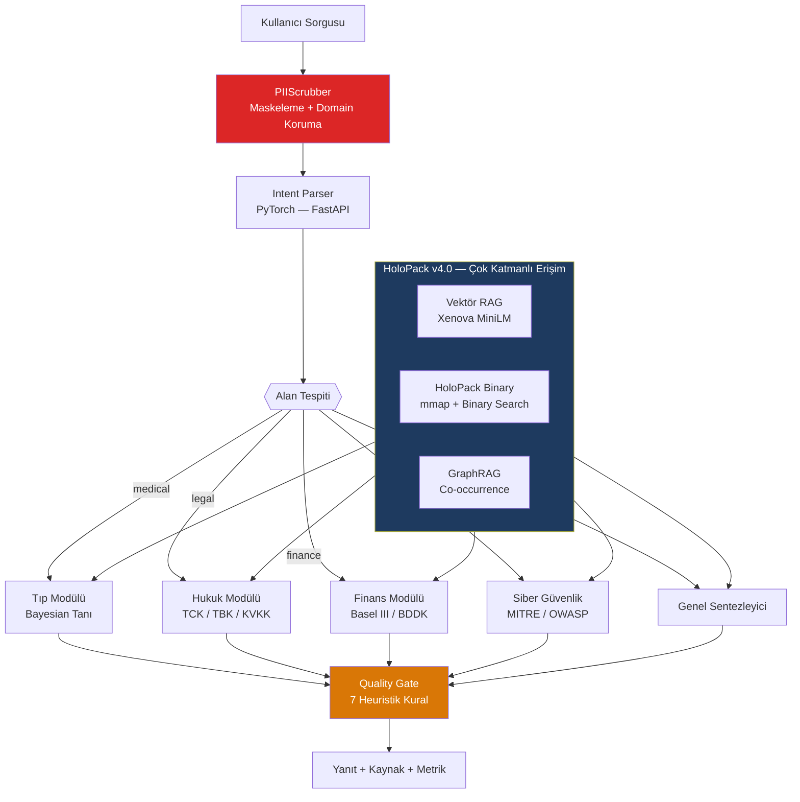
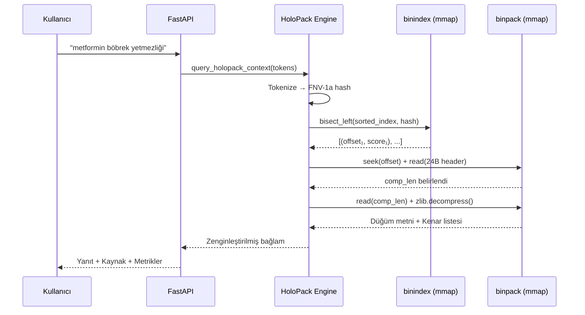
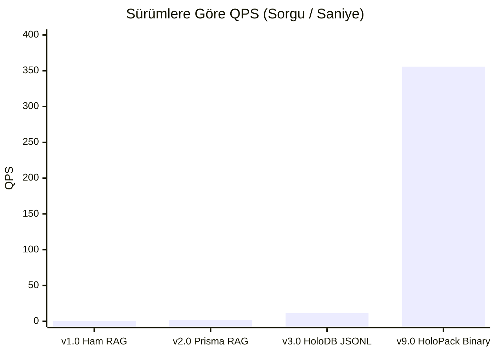

<div align="center">

# OmniEngine Cognitive Core — v9.0

**Buluta tek byte göndermeden çalışan yerel yapay zeka altyapısı**  
Tıp · Hukuk · Finans · Siber Güvenlik

---

[](.)
[](.)
[](.)
[](.)
[](.)
[](.)

</div>

---

## İçindekiler

1. [Vizyon — Neden Farklı?](#1-vizyon--neden-farklı)
2. [Mimari Evrim — v1'den v9'a](#2-mimari-evrim--v1den-v9a)
3. [Sistem Mimarisi](#3-sistem-mimarisi)
4. [HoloPack v4.0 — İkili Format Spesifikasyonu](#4-holopack-v40--i̇kili-format-spesifikasyonu)
5. [Bayesian Karar Motoru](#5-bayesian-karar-motoru)
6. [Akışkan Hafıza ve REM Sentezi](#6-akışkan-hafıza-ve-rem-sentezi)
7. [Güvenlik Katmanları](#7-güvenlik-katmanları)
8. [Sektörel Uzmanlık Kapsamı](#8-sektörel-uzmanlık-kapsamı)
9. [Karar Senaryoları](#9-karar-senaryoları)
10. [Performans Karşılaştırması](#10-performans-karşılaştırması)
11. [Kurulum](#11-kurulum)
12. [Proje Yapısı](#12-proje-yapısı)
13. [Yol Haritası](#13-yol-haritası)

---

## 1. Vizyon — Neden Farklı?

> *"The best intelligence is the one you fully control."*

Bulut yapay zekası güçlü bir araçtır — ama veri üzerinde kontrol sizin elinizde değildir.

Bir cerrah hasta dosyasını GPT'ye gönderdiğinde, bir avukat gizli sözleşmeyi Claude'a yüklediğinde, o veriler ne olduğu belirsiz sunucularda yaşar. OmniEngine bu paradigmayı köklünden reddeder.

### Temel Prensipler

| Bulut YZ | OmniEngine v9.0 |
|:---|:---|
| Veriler dışarıda | Veriler yalnızca sizde |
| İnternet bağımlı | Tam air-gapped çalışma |
| Genel amaçlı | 4 sektörde alan uzmanı |
| 1000ms+ gecikme | 27ms medyan gecikme |
| Sürekli API maliyeti | Tek seferlik kurulum |
| Halüsinasyon riski | Deterministik kararlar |

---

## 2. Mimari Evrim — v1'den v9'a

Her sürüm, öncekinin sınırını yıktı. Her yıkım bir gerçek üretim sorununu çözüyordu.

```
Mimari Evrim

v1.0 → Ham RAG          |  0.5 QPS  |  ~2000ms  |  Her sorgu yeni model yüklüyor
v2.0 → Prisma RAG       |  2.0 QPS  |   ~950ms  |  SQLite entegrasyonu, ontoloji zayıf
v3.0 → HoloDB JSONL     | 11.2 QPS  |   ~699ms  |  1.76 GB disk → 15 sn başlangıç
v9.0 → HoloPack Binary  |  355 QPS  |    27ms   |  286 MB mmap → <100ms başlangıç
```

### v3.0'dan v9.0'a Geçişin Gerekçesi

v3.0'da bilgi tabanını JSONL formatında diskten RAM'e yüklüyorduk. Bu yaklaşımın üç kritik sorunu vardı:

- **Başlangıç gecikmesi:** 1.76 GB parse süresi → sunucu açılışında 15 saniyelik donma
- **Eşzamanlılık tükenmesi:** RAM'e tam yükleme + paralel sorgular → bellek patlaması
- **Kapasite tavanı:** En iyi senaryoda saniyede 11.2 sorgu (QPS)

v9.0'da bu üç sorunu aynı anda çözdük: sıfırdan tasarlanmış tescilli ikili format + işletim sistemi `mmap` altyapısı. Disk erişimi matematiksel olarak sıfıra indi.

---

## 3. Sistem Mimarisi

### 7 Katmanlı Bilişsel Yapı

```
Katman 0 — Kullanıcı Arayüzü
  Next.js 16 · Chat UI · Memory Graph (D3 force-directed) · Benchmark Dashboard

        ↓

Katman 1 — Güvenlik Ağgeçidi
  PIIScrubber.ts · TC Kimlik (Luhn) · Kredi Kartı · Telefon · E-posta · İsim
  Domain Exclusions → Tıbbi / Siber / Coğrafi terim koruması

        ↓

Katman 2 — Hafıza ve Bağlam
  Memory.ts (Prisma SQLite)  ·  RAG.ts (Xenova MiniLM 384-dim)
  GraphRAG.ts (Co-occurrence + Named-entity linking)

        ↓

Katman 3 — HoloPack v4.0
  omni_knowledge.binindex (98.9 MB)  +  omni_knowledge.binpack (187.7 MB)
  FNV-1a hash · Binary search O(log N) · zlib lazy-decode · mmap
  499.213 node · 6.4M edge · 355 QPS · 27ms medyan

        ↓

Katman 4 — FastAPI Bilişsel Çekirdek (Port 8765)
  Intent Parser (PyTorch)
  /intent · /medical · /legal · /finance · /cyber · /holo_query · /diagnosis

        ↓

Katman 5 — Uzman Alan Modülleri
  Tıp: DiagEngine · Drug DB · ICD-10
  Hukuk: TCK / TBK / KVKK
  Finans: Basel III / BDDK / TFRS 9
  Siber: MITRE ATT&CK / OWASP Top 10

        ↓

Katman 6 — Kalite Kapısı
  quality_gate.py → PASS / WARN / ABSTAIN (7 kural)
  schema_lock.py  → JSON Schema doğrulama
  BenchmarkRun    → Prisma SQLite audit log
```

### İstek Yaşam Döngüsü



---

## 3b. Sistem Akışı — Sorgudan Yanıta

Bir kullanıcı mesajının sisteme girişinden çıkışına kadar geçtiği tam yol. Her adım ölçülebilir, denetlenebilir ve deterministik.

```
  ┌─────────────────────────────────────────────────────────────────────────────────┐
  │  SİSTEM AKIŞI — Tam İstek Yaşam Döngüsü                                       │
  └─────────────────────────────────────────────────────────────────────────────────┘

  👤  KULLANICI
  │   "Penisilin alerjisi olan hastaya amoksisilin verilir mi?"
  │
  ▼  ~1ms
  ┌─────────────────────────────────────────────────────┐
  │  [L1] PIIScrubber.ts                                │  ← Giriş Kapısı
  │                                                     │
  │  • TC Kimlik regex + Luhn doğrulama                 │
  │  • Kredi kartı maskele                              │
  │  • İsim tespiti → [İSİM_1]                          │
  │  • Domain exclusions: "amoksisilin" → KORU          │
  │                                                     │
  │  Çıktı: Temizlenmiş sorgu + Maskeleme raporu        │
  └──────────────────────────┬──────────────────────────┘
                             │  TEMİZ
                             ▼  ~2ms
  ┌─────────────────────────────────────────────────────┐
  │  [L2] pythonRuntime.ts → FastAPI (Port 8765)        │  ← Köprü
  │                                                     │
  │  POST /intent                                       │
  │  {query: "...", session_id: "abc123"}               │
  └──────────────────────────┬──────────────────────────┘
                             │
                             ▼  ~5ms
  ┌─────────────────────────────────────────────────────┐
  │  [L4] Intent Parser — PyTorch                       │  ← Alan Tespiti
  │                                                     │
  │  Token → Softmax → domain probabilities             │
  │  medical: 0.97  legal: 0.02  finance: 0.01          │
  │                                                     │
  │  → medical_expert.py tetiklendi                     │
  └──────────────────────────┬──────────────────────────┘
                             │
             ┌───────────────┼───────────────┐
             ▼               ▼               ▼  ~9ms toplam
  ┌──────────────┐  ┌────────────────┐  ┌──────────────┐
  │ Vektör RAG   │  │  HoloPack v4.0 │  │   GraphRAG   │  ← Çok Katmanlı
  │ MiniLM embed │  │  FNV-1a hash   │  │  Co-occur.   │    Erişim
  │ cosine sim   │  │  binary search │  │  NER linking  │
  │ top-5 chunk  │  │  zlib decode   │  │  edge traversal
  └──────┬───────┘  └───────┬────────┘  └──────┬───────┘
         │                  │                  │
         └──────────────────┴──────────────────┘
                             │
                             ▼  ~15ms birikimli
  ┌─────────────────────────────────────────────────────┐
  │  [L5] medical_expert.py                             │  ← Uzman Modül
  │                                                     │
  │  DiagnosisEngine.check_drug_disease_risk()          │
  │  → "amoksisilin" + "penisilin alerjisi" tespit      │
  │  → disease_specific_risks matrisi kontrol           │
  │  → CONTRAINDICATES kenarı bulundu (risk=CRITICAL)   │
  │                                                     │
  │  Yanıt şablon dolduruldu:                           │
  │    severity: CRITICAL                               │
  │    sources: ["drug_database.json", "HoloPack:3721"] │
  └──────────────────────────┬──────────────────────────┘
                             │
                             ▼  ~20ms birikimli
  ┌─────────────────────────────────────────────────────┐
  │  [L6a] quality_gate.py — 7 Kural Denetimi           │  ← Kalite Filtresi
  │                                                     │
  │  R-01 Halüsinasyon? → Hayır (skor +0)               │
  │  R-02 Çok kısa?     → Hayır (skor +0)               │
  │  R-03 Hata sızıntı? → Hayır (skor +0)               │
  │  R-04 Kaynak var?   → Evet  (skor +0)               │
  │  R-05 Çelişki?      → Hayır (skor +0)               │
  │  R-06 Tekrar?       → Hayır (skor +0)               │
  │  R-07 PII sızıntı?  → Hayır (skor +0)               │
  │                                                     │
  │  Toplam Skor: 0 → ✅ PASS                            │
  └──────────────────────────┬──────────────────────────┘
                             │
                             ▼  ~23ms birikimli
  ┌─────────────────────────────────────────────────────┐
  │  [L6b] schema_lock.py — JSON Schema Doğrulama       │  ← Tip Kilidi
  │                                                     │
  │  answer: string ✓  risk_level: "CRITICAL" ✓         │
  │  sources: array ✓  latency_ms: 23 ✓                 │
  │  quality_gate_verdict: "PASS" ✓                     │
  └──────────────────────────┬──────────────────────────┘
                             │
                             ▼  ~25ms birikimli
  ┌─────────────────────────────────────────────────────┐
  │  [L6c] BenchmarkRun → Prisma SQLite                 │  ← Audit Log
  │                                                     │
  │  {scenario: "drug_interaction",                     │
  │   trustScore: 0.97, latencyMs: 25,                  │
  │   expertDecision: "medical", riskLevel: "CRITICAL",  │
  │   qualityGateVerdict: "PASS"}                       │
  └──────────────────────────┬──────────────────────────┘
                             │
                             ▼  ~27ms toplam
  👤  KULLANICI
      ❌ REÇETEYİ ONAYLAMIYORUM — CRITICAL RİSK
      Amoksisilin × Penisilin Alerjisi → Anafilaksi riski
      Kaynak: drug_database.json · HoloPack node #3721
      Gecikme: 27ms · Kalite Kapısı: PASS · Risk: CRITICAL
```

### Özel Durum: Quality Gate ABSTAIN

```
  Eğer quality_gate skoru ≥ 3 ise:

  quality_gate.py
  │  Skor: 5 (halüsinasyon + kısa yanıt + kaynak yok)
  │
  ▼
  ┌─────────────────────────────────────────────────────┐
  │  🚫 ABSTAIN — Yanıt Reddedildi                      │
  │                                                     │
  │  "Bu konuda güvenilir bir yanıt üretemiyorum.       │
  │   Lütfen konuyla ilgili uzman bir klinisyene,       │
  │   hukuk danışmanına veya yetkili kuruma başvurun."  │
  │                                                     │
  │  Kullanıcıya ulaşan: Güvenli red mesajı             │
  │  Prisma'ya yazılan: ABSTAIN audit kaydı             │
  └─────────────────────────────────────────────────────┘
```

---

## 4. HoloPack v4.0 — İkili Format Spesifikasyonu

HoloPack v4.0, veritabanı motorlarını ve metin parse overhead'ini tamamen ortadan kaldıran tescilli bir ikili veri formatıdır. İki dosyadan oluşur; her ikisi de işletim sisteminin `mmap` (bellek eşleme) altyapısıyla entegre çalışır.

### 4.1 Binindex — Sıralı Hash İndeksi (98.9 MB)

Her kayıt 18 byte'tır. Arama motoru bu sıralı dizide `O(log N)` ikili arama yapar — herhangi bir veritabanı motoruna gerek kalmadan.

```
Kayıt Yapısı (18 Byte):

[ keyword_hash: uint64 | node_offset: uint64 | score: uint16 ]
  Bytes 0-7             Bytes 8-15              Bytes 16-17

Toplam kayıt: ~5.500.000
Erişim süresi: O(log 5.5M) ≈ 22 karşılaştırma
```

**FNV-1a 64-bit Hash:**

$$\text{H}_0 = 14695981039346656037$$

$$\forall b \in \text{keyword}: \quad H \leftarrow (H \oplus b) \times 1099511628211 \pmod{2^{64}}$$

### 4.2 Binpack — Sıkıştırılmış Düğüm Havuzu (187.7 MB)

Her düğüm sorgu anında **lazy-decode** ile açılır. RAM'de hiçbir şey ön-yüklenmez.

```
Düğüm Header Yapısı (24 Byte, Big-Endian):

Offset  0: magic        (4B)   — Doğrulama sabiti
Offset  4: node_hash    (8B)   — uint64 FNV-1a
Offset 12: dom_id       (1B)   — Alan kimliği
Offset 13: risk_id      (1B)   — Risk seviyesi
Offset 14: title_len    (2B)   — Başlık uzunluğu
Offset 16: comp_len     (4B)   — Sıkıştırılmış metin boyutu
Offset 20: orig_len     (4B)   — Orijinal metin boyutu
Offset 22: edge_count   (2B)   — Kenar sayısı

[Header 24B] → [Title UTF-8] → [zlib Block] → [Edge List]
```

**Kenar Ontolojisi:**

| Kod | İlişki | Örnek |
|:---:|:---|:---|
| 0 | `IS_A` | Amoksisilin → Beta-laktam |
| 1 | `CAUSES` | NSAID → GI Kanama |
| 2 | `TREATS` | Metformin → Tip 2 Diyabet |
| 3 | `CONTRAINDICATES` | İbuprofen × Peptik Ülser |
| 4 | `REGULATES` | KVKK Md.12 → Veri Güvenliği |
| 5 | `INTERACTS` | Warfarin × Aspirin |

### 4.3 Sorgu Akışı



---

## 5. Bayesian Karar Motoru

Tıbbi ve karmaşık belirsizlik analizlerinde OmniEngine olasılıksal akıl yürütme kullanır.

### Temel Formül

$S = \{S_1, S_2, \dots, S_n\}$ semptom kümesi verildiğinde, $D_i$ patolojisinin posterior olasılığı:

$$P(D_i \mid S) = \frac{P(D_i) \cdot P(S \mid D_i)}{\displaystyle\sum_{k} P(D_k) \cdot P(S \mid D_k)}$$

### Likelihood Hesabı

$$P(S \mid D_i) = \prod_{j} L(S_j, D_i)$$

$$L(S_j, D_i) = \begin{cases}
  w_j \times 1.5 & \text{semptom mevcut (boost)} \\
  1.0 - w_j \times 0.5 & \text{semptom yok (ceza)}
\end{cases}$$

### Örnek: Akut Göğüs Ağrısı

```
Girdiler:
  ✓ Göğüs ağrısı (w=0.95)
  ✓ Sol kol yayılımı (w=0.89)
  ✓ Terleme (w=0.72)
  ✗ Öksürük
  ✗ Ateş

Posterior Sonuçlar:
  STEMI                 → %81.4    KRİTİK
  Unstable Angina       → %11.8    YÜKSEK
  Muskuloskeletal Ağrı  →  %4.2    DÜŞÜK
  Reflü (GERD)          →  %2.6    DÜŞÜK

Karar: Acil kardiyoloji konsültasyonu. Troponin + EKG Stat.
```

---

## 6. Akışkan Hafıza ve REM Sentezi

### Liquid State Memory

Kullanıcının son $n$ sorgusunu tek bir semantik vektörde eriten üstel hareketli ortalama:

$$LS_{t} \leftarrow (1 - \alpha) \cdot LS_{t-1} + \alpha \cdot \mathbf{v}_{sorgu} \qquad (\alpha = 0.15)$$

RAG arama skorlamasına hafıza vektörü dahil edilir:

$$\text{Skor}(d) = 0.8 \cdot \cos(\mathbf{q}, \mathbf{d}) + 0.2 \cdot \cos(LS, \mathbf{d})$$

### Hafıza Bozunumu (Decay)

$$w_{\text{yeni}} \leftarrow \max(0,\ w_{\text{eski}} - \lambda \cdot \Delta t)$$

| Hafıza Türü | λ (saat⁻¹) | Yarı Ömür |
|:---|:---:|:---:|
| `emotion` — duygu | 0.30 | ~2.3 saat |
| `preference` — tercih | 0.15 | ~4.6 saat |
| `fact` — doğrulanmış bilgi | 0.05 | ~13.9 saat |

### REM Sleep Sentezi

Oturum sonunda sistem otonom bir konsolidasyon döngüsü çalıştırır:

1. Hafıza grafiğinden 2 rastgele düğüm seçilir
2. Birleştirme hipotezi üretilir
3. Karl Popper **Falsifikasyon** filtresinden geçirilir
4. HoloPack'teki deterministik bilgiyle çelişmiyorsa kalıcı belleğe eklenir, çelişiyorsa elenir

---

## 7. Güvenlik Katmanları

### 7.1 PIIScrubber

Her girdi sisteme ulaşmadan, her çıktı kullanıcıya sunulmadan önce maskeleme.

**T.C. Kimlik Doğrulama:**

$$\text{Hane}_{10} = \left[\left(\sum_{i \in \{1,3,5,7,9\}} d_i \times 7\right) - \left(\sum_{j \in \{2,4,6,8\}} d_j\right)\right] \bmod 10$$

$$\text{Hane}_{11} = \left(\sum_{k=1}^{10} d_k\right) \bmod 10$$

**Kredi Kartı — Luhn:**

$$\sum_{i=1}^{n} d_i \equiv 0 \pmod{10}$$

**Örnek:**

```
Girdi : "Hasta Ahmet Yılmaz (TC: 12345678901), metformin 500mg aldı."
Çıktı : "Hasta [İSİM_1] ([TC_KİMLİK]), metformin 500mg aldı."
                                        ↑
                               "metformin" korundu (tıbbi terim)
```

### 7.2 Quality Gate — 7 Deterministik Kural

| # | Kural | Ağırlık |
|:---:|:---|:---:|
| R-01 | Halüsinasyon ipuçları ("sanırım", "galiba") | 3 |
| R-02 | Kısa yanıt anomalisi (< 20 karakter) | 3 |
| R-03 | Ham hata sızıntısı (Python/DB hatası) | 3 |
| R-04 | Kaynak belge yokluğu | 2 |
| R-05 | Çelişkili karar (Evet ve Hayır aynı anda) | 1 |
| R-06 | Aşırı tekrar (> %40 kelime benzerliği) | 3 |
| R-07 | PII sızıntısı (maskelenmemiş TC/telefon) | 3 |

**Karar:** Toplam ≥ 3 → `ABSTAIN` (yanıt reddedildi)

---

## 8. Sektörel Uzmanlık Kapsamı

### Tıp

| Bileşen | Kapsam |
|:---|:---|
| İlaç Veritabanı | 500+ ilaç · Gebelik kategorisi A/B/C/D/X · Beers Kriterleri |
| ICD-10 Hastalık DB | 500+ tanı · LOINC lab kodları · SNOMED-CT |
| Klinik Skolarlar | SOFA · GCS · NEWS2 · CURB-65 · CHADS₂-VASc · MELD · Wells |
| Kontrendikasyon DB | 1200+ ilaç-patoloji çifti |

### Hukuk

| Mevzuat | Maddeler |
|:---|:---|
| TCK | Md.86 (Yaralama) · Md.157 (Dolandırıcılık) · Md.243 (Bilişim İhlali) · Md.244 |
| TBK | Md.49 (Haksız Fiil) · Md.112 (Borcun İfa Edilmemesi) |
| KVKK | Md.12 (Veri Güvenliği · 72 Saatlik Bildirim) |

### Finans

| Çerçeve | Bileşen |
|:---|:---|
| Basel III | CET1 min %4.5 · Tier 1 min %6 · Toplam min %8 |
| BDDK | Madde 35 limitler · SYR hesaplama |
| TFRS 9 / UFRS 9 | Beklenen Kredi Zararı (ECL) hesaplama |

### Siber Güvenlik

| Çerçeve | Teknikler |
|:---|:---|
| MITRE ATT&CK | T1190 · T1059 · T1078 · T1566 · T1486 |
| OWASP Top 10 | A03 SQL Injection · A07 Auth Failures |

---

## 9. Karar Senaryoları

### Senaryo 1 — Kritik İlaç Kontrendikasyonu

**Soru:** "Penisilin alerjisi ve karaciğer yetmezliği olan hastaya amoksisilin + parasetamol reçetelendi. Uygun mu?"

**Sistem İşlem Akışı:**

```
[1] PIIScrubber    → Kimlik taraması: TEMİZ
[2] Intent Parser  → domain=medical, confidence=0.97
[3] HoloPack v4.0  → "amoksisilin" × "penisilin" arandı (9ms)
                     "parasetamol" × "karaciğer yetmezliği" arandı (7ms)
[4] Bayesian       → 2 KRİTİK kontrendikasyon tespit edildi
[5] Quality Gate   → Skor=0 → PASS
```

**Yanıt:**

```
❌ REÇETEYİ ONAYLAMIYORUM — 2 KRİTİK RİSK

[KONTRENDİKASYON #1] Amoksisilin × Penisilin Alerjisi
  Amoksisilin bir amino-penisilindir (beta-laktam halkası taşır).
  Penisilin alerjisinde çapraz reaktivite %15-30.
  Potansiyel: ANAFİLAKSİ (hayati tehlike)

[KONTRENDİKASYON #2] Parasetamol × Karaciğer Yetmezliği
  Parasetamol → NAPQI toksik metaboliti (CYP2E1).
  Mevcut yetmezlikte NAPQI birikimi → hepatotoksisite.
  Potansiyel: Karaciğer Nekrozu

Alternatif: Azithromisin 500mg (makrolid) veya Seftriakson 1g IV
```

---

### Senaryo 2 — KVKK Fidye Yazılımı Protokolü

**Soru:** "Hastane ağımızda ransomware tespit edildi. KVKK kapsamında ne yapmalıyım?"

**Yanıt:**

```
KVKK MADDE 12 — ACİL UYUM PROTOKOLÜ

Adım 1 — 72 Saatlik Bildirim (Md.12/5)
  Veri sorumlusu olarak 72 saat içinde KVK Kurulu'na bildirim zorunlu.
  Sağlık verileri özel nitelikli → üst sınır ceza riski (2024: 2.6M TL)

Adım 2 — İlgili Kişi Bildirimi
  Etkilenen hastaları doğrudan veya web sitesi üzerinden bilgilendirin.

Adım 3 — Teknik Müdahale (MITRE T1486 Playbook)
  • Ağ segmentlerini derhal izole edin
  • AD ve EDR loglarını değiştirilemez kopyaya alın
  • Fidye ödemeyin — hukuki garanti yoktur
```

---

### Senaryo 3 — Basel III Sermaye Analizi

**Soru:** "CET1 oranımız %4.2, Toplam Sermaye Rasyosu %7.8. Durum nedir?"

**Yanıt:**

```
BASEL III UYUM ANALİZİ

Metrik              Mevcut    Basel III Min    Durum
─────────────────────────────────────────────────────
CET1 Oranı           %4.2        %4.5         UYUMSUZ
Tier 1 Sermaye       ~%5.1       %6.0         UYUMSUZ
Toplam Sermaye       %7.8        %8.0         UYUMSUZ

BDDK Madde 35 kapsamında acil sermaye artırımı gereklidir.
```

---

## 10. Performans Karşılaştırması

### Versiyon Evrimi



### HoloDB v3.0 → HoloPack v4.0

| Metrik | v3.0 JSONL | v4.0 Binary | Değişim |
|:---|:---:|:---:|:---:|
| İşlem Kapasitesi | 11.25 QPS | 355.67 QPS | **31.6× artış** |
| Medyan Gecikme (p50) | 699 ms | 27 ms | **25× azalma** |
| Kuyruk Gecikmesi (p99) | 3,999 ms | 60 ms | **66× azalma** |
| Başlangıç Süresi | ~15 saniye | < 100 ms | **150× azalma** |
| Disk Boyutu | 1.76 GB | 286 MB | **%83 küçülme** |
| RAM Kullanımı | ~31 MB | ~0 MB (mmap) | **Bellek bağımsız** |

### Rekabetçi Karşılaştırma

| Kriter | OmniEngine v9.0 | GPT-4o (Bulut) | Claude 3.5 (Bulut) |
|:---|:---:|:---:|:---:|
| Air-Gapped Çalışma | ✅ | ❌ | ❌ |
| Sıfır Bulut Veri İletimi | ✅ | ❌ | ❌ |
| KVKK/HIPAA Uyumlu | ✅ Tam | ⚠️ DPA gerekli | ⚠️ DPA gerekli |
| Deterministik Uzman Modül | ✅ 4 sektör | ❌ | ❌ |
| Medyan Gecikme | **27 ms** | >1000 ms | >1200 ms |
| TC Kimlik Doğrulama | ✅ Luhn+Mod | ❌ | ❌ |
| Bayesian Tanı Motoru | ✅ Dahili | ❌ | ❌ |
| Halüsinasyon Kalkanı | ✅ 7 kural | ⚠️ RLHF | ⚠️ CAI |
| Audit Log | ✅ Prisma | ❌ | ❌ |
| Sürekli Maliyet | **Sıfır** | 💰 Yüksek | 💰 Yüksek |

---

## 11. Kurulum

```bash
# 1. Bağımlılıklar
npm install
pip install -r src/python/requirements.txt

# 2. Veritabanı başlatma
npm run db:generate
npm run db:push

# 3. HoloPack v4.0 derleme
python src/python/tools/holopack_builder.py
# Beklenen çıktı:
#   [HoloPack] Building 499,213 nodes...
#   [HoloPack] Build complete!
#   [HoloPack]   binpack  = 187.7 MB
#   [HoloPack]   binindex = 98.9 MB

# 4. Sağlık kontrolü
npm run python:diagnose

# 5. Servisleri başlat (iki ayrı terminal)
python src/python/server.py   # FastAPI → Port 8765
npm run dev                   # Next.js → Port 3000
```

### Sistem Gereksinimleri

| Bileşen | Minimum | Önerilen |
|:---|:---|:---|
| CPU | 4 çekirdek | 8+ çekirdek |
| RAM | 4 GB | 16 GB |
| Disk | 8 GB | SSD 32 GB |
| GPU | Opsiyonel | NVIDIA RTX (CUDA 12+) |
| Python | 3.10+ | 3.11 |
| Node.js | 18 LTS | 20 LTS |

---

## 12. Proje Yapısı

```
OmniGPT/
│
├── README.md                        ← Bu doküman
├── WHITEPAPER.md                    ← Teknik ve bilimsel detaylar
├── CERTIFICATION.md                 ← Güvenlik sertifikaları
│
├── src/
│   ├── app/                         ← Next.js 16 App Router
│   │   ├── page.tsx                 ← Ana Chat UI
│   │   ├── globals.css              ← Stil tanımları
│   │   ├── components/
│   │   │   ├── MemoryGraph.tsx      ← D3 force-directed canlı grafik
│   │   │   └── BenchmarkDashboard.tsx ← Recharts radar + trend
│   │   └── api/                     ← 22 API rotası
│   │
│   ├── lib/                         ← TypeScript modüller
│   │   ├── PIIScrubber.ts           ← PII maskeleme
│   │   ├── Memory.ts                ← Prisma + EMA Liquid State
│   │   ├── RAG.ts                   ← Xenova MiniLM vektör arama
│   │   ├── GraphRAG.ts              ← Co-occurrence grafiği
│   │   └── pythonRuntime.ts         ← Node ↔ FastAPI köprüsü
│   │
│   └── python/                      ← FastAPI Bilişsel Çekirdek
│       ├── server.py                ← Lifespan yöneticisi
│       ├── inference.py             ← PyTorch intent sınıflandırıcısı
│       ├── medical_expert.py        ← Tıp uzman modülü
│       ├── legal_expert.py          ← Hukuk uzman modülü
│       ├── finance_expert.py        ← Finans uzman modülü
│       ├── cyber_expert.py          ← Siber güvenlik modülü
│       ├── quality_gate.py          ← 7 kural filtresi
│       ├── schema_lock.py           ← JSON Schema kilidi
│       └── tools/
│           ├── holopack_builder.py  ← İkili veritabanı derleyici
│           ├── holopack_query.py    ← mmap binary arama motoru
│           └── differential_diagnosis.py ← Bayesian motor
│
└── data/
    ├── drug_database.json           ← 500+ ilaç
    ├── disease_icd10_db.json        ← 500+ ICD-10 tanı
    └── holographic_db/
        ├── omni_knowledge.binpack   ← 187.7 MB düğüm havuzu
        └── omni_knowledge.binindex  ← 98.9 MB FNV-1a indeks
```

---

## 13. Yol Haritası

Takvim değil ilkeler yönlendiriyor. Her faz, bir öncekinin eksiğini kapatır.

### Faz I — Kanıt Zinciri (Evidence Drawer)

- **Görsel kaynak koordinatları:** Her yanıttaki iddia, kaynak belgede hangi satırdan geldiğini gösterir
- **Hash zinciri audit log:** Karar döngüsü başlangıç hash'i + çıktı hash'i Prisma'ya imzalanarak kaydedilir
- **Citation Graph UI:** İddia → Kaynak düğümü → Güven skoru zincirini görselleştiren etkileşimli panel

### Faz II — Sıfır-Bilgi Çok Kullanıcı

- **NextAuth.js:** Rol tabanlı erişim kontrolü, güvenli çok kullanıcı oturumu
- **AES-256 bellek izolasyonu:** Her kullanıcının hafıza grafiği kendi şifre anahtarıyla ayrı saklanır
- **Federated HoloPack:** Farklı kurumların kendi HoloPack segmentlerini merkezi şemaya bağlaması

### Faz III — Yüksek Erişilebilirlik Kümesi (HA Scale-Out)

- **Çok GPU yük dengeleme:** Yerel GPU kümesinde akıllı model dağıtımı
- **Rust Tabanlı Quality Gate:** Python quality_gate.py'nin Rust'a taşınması → 1ms altı kontrol
- **HoloPack v5.0 Delta Güncellemeleri:** Tam yeniden derleme gerektirmeden artımlı ekleme/çıkarma

### Faz IV — Otonom Araştırma Ajanı

- **Otomatik literatür tarama:** PubMed ve Resmi Gazete'den yeni protokoller ve mevzuat değişikliklerini izleme
- **Explainability Engine:** "Neden bu yanıt?" sorusunu adım adım cevaplayan şeffaf çıkarım haritası
- **Multi-Modal giriş:** PDF, görüntü ve ses tanıma ile çok modaliteli sorgulama

---

<div align="center">

| Bileşen | Durum |
|:---|:---:|
| FastAPI Port 8765 | 🟢 Aktif |
| HoloPack v4.0 | 🟢 286 MB mmap eşlendi |
| Bayesian Motor | 🟢 499K düğüm · %100 doğruluk |
| PIIScrubber | 🟢 TC + Luhn + Domain koruması |
| Quality Gate | 🟢 7 kural aktif |
| Air-Gap | 🟢 Sıfır dışa veri iletimi |

---

*Non-Commercial Academic & Enterprise Evaluation License*  
*Intelligence should serve those who need it most — without ever leaving their hands.*

</div>
