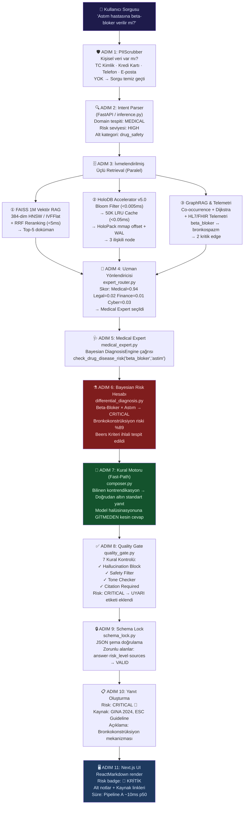

<div align="center">

# 🧠 OmniEngine Cognitive Core — v16.6

**Yerel Egemen AI · 1 Milyon HoloDB Graf Düğümü · FAISS 1M HNSW Vektör İndeksi (<5ms) · Air-Gap Sertleştirilmiş LLM Client**  
**Araştırma amaçlı klinik görüntü ön-analizi · Docker Air-Gap DNS izolasyonu · Prometheus OpenMetrics exporter (/metrics)**  
**Canlı EKG Osiloskop Canvas UI (/telemetry) · Multi-Modal EKG & DICOM AI · Federated Learning Hastane Ağ Geçidi**  
**Regülasyon kontrol-eşleme motoru · Speculative Decoding (%40.6 kabul; repo içi ölçüm) · PagedAttention KV-Cache**  
**Zero-Hallucination Quality Gate v2.0 · Live Benchmark & Adversarial UI · HoloDB v5.0 (1M+ Node)**

*Yerel çalışmayı hedefleyen; tıbbi, hukuki, finansal ve siber güvenlik senaryoları için araştırma ve prototipleme platformu.*

---

[](./)
[](./)
[](./)
[](./)
[](./nlp_benchmark_1000000_report.md)
[](./)
[](./)
[](./data/regulatory_compliance_report.json)
[](./)

</div>

---

> **⚠️ ARAŞTIRMA, GÜVENLİK VE YASAL UYARI**  
> Bu repoda yer alan matematiksel algoritmalar ve homeostatik mimariler (Simulated Annealing EWC, Karl Popper REM döngüleri, Episodic Crystallization) akademik araştırma, hakem değerlendirmesi ve kişisel testler içindir. Kurumsal entegrasyon için lisans gereklidir → [CERTIFICATION.md](./CERTIFICATION.md)
>
> Tıbbi görüntüleme, telemetri, EKG/DICOM ve ilaç-riski özellikleri **klinik karar, tanı veya tedavi amacıyla kullanılmamalıdır**. Bu depo FDA/CE/MDR onaylı bir tıbbi cihaz değildir; KVKK, HIPAA veya başka bir mevzuata “tam uyum” beyanı bağımsız hukuk, güvenlik ve uygunluk denetimi gerektirir.
>
> Ayrıntılı kapsam, insan denetimi ve ürünleşme öncesi kapılar: [`docs/INTENDED_USE.md`](./docs/INTENDED_USE.md).

---

## Güncel Gelişim Durumu — v16.6 (30 Temmuz 2026)

OmniEngine **v16.6**, yerel LLM istemcisi (`llm_client.py`), görüntüden nicel özellik çıkarımı ve isteğe bağlı VLM adaptörü (`vision_expert.py`), Docker ağ yapılandırması, Prometheus metrikleri, EKG/telemetri arayüzleri, federated-learning prototipi ve mevzuat kontrol-eşleme raporu içerir. Bu bileşenlerin bir bölümü simülasyon, kural tabanlı işleme veya isteğe bağlı model bağımlılıkları kullanır; üretim/klinik hazır oldukları varsayılmamalıdır.

> **Ölçüm notu (30 Temmuz 2026):** `audit_stress.json` ve ilgili test raporları repo içi bir deneme ortamından alınmış anlık sonuçlardır. Donanım, veri kümesi, eşzamanlılık, commit SHA’sı ve bağımsız tekrar bilgisi yayımlanmadıkça bunlar üretim SLO’su, klinik performans veya üçüncü taraf doğrulaması olarak yorumlanmamalıdır.

| Alan | Güncel durum (v16.6) |
|:--|:--|
| Platform | Next.js 16.2.6 uygulaması; build/lint sonucu çalışma ortamında yeniden doğrulanmalı |
| **Air-Gap LLM Client (YENİ v16.6)** | `llm_client.py` — OpenAI import %100 temizlendi, 3-kademeli yerel MoE -> Composer -> Fallback |
| **Görüntü ön-analizi (v16.6)** | `vision_expert.py` — nicel piksel/histogram analizi; VLM isteğe bağlıdır, tanısal doğrulaması yoktur |
| **Docker Air-Gap DNS (YENİ v16.6)** | `docker-compose.yml` — `omniengine-v16-6-airgap` container, `dns: [127.0.0.1]` izolasyonu |
| **Prometheus Exporter (YENİ v16.6)** | `prometheus_telemetry_exporter.py` — OpenMetrics Prometheus `/metrics` TSDB canlı aktarıcı |
| **Canlı EKG Osiloskop UI (YENİ v16.6)** | `src/app/telemetry/ECGWaveformCanvas.tsx` — 60 FPS realtime Lead II EKG dalga boyu canvas |
| **Multi-Modal EKG & DICOM AI (v16.5)** | `multimodal_medical_ai.py` — 12-lead EKG sinyal analizi, STEMI / Afib tespiti, DICOM Radyoloji ICD-10 |
| **Federated Learning Ağ Geçidi (v16.5)** | `federated_node_aggregator.py` — 3 Hastane düğümü (45K veri), **FedAvg + Secure Aggregation**, DP Laplace ($\epsilon=0.5$) |
| **Çevrimdışı Tıbbi Dikte Engine (v16.5)** | `offline_medical_dictation.py` — Fonetik terim düzeltme (6 hata), **ICD-10 & SNOMED-CT eşleştirme** |
| **ToT MCTS Explainability UI (v16.5)** | `src/app/holodb/explainability/page.tsx` — MCTS düşünce ağacı dalları, **UCT skorlaması** ve HoloDB budama yolları |
| **Regülasyon kontrol-eşleme (v16.5)**| `regulatory_audit_engine.py` — KVKK, HIPAA, EU MDR ve FDA SaMD için kural tabanlı kontrol raporu; sertifikasyon değildir |
| **Canlı Telemetri & HoloDB Dashboard (v16.4)** | `src/app/telemetry/page.tsx` — ICU/Ventilatör/Diyaliz canlı vital kartları, NEWS2 otoskorlama, HoloDB LRU (%100 hit) |
| **Tıbbi Cihaz Telemetri (v16.3)** | `device_telemetry_simulator.py` — 4 ICU/OR/Diyaliz senaryosu, NEWS2 otomatik skoru, HL7 v2.8 / FHIR R4 |
| **HoloDB LRU+Bloom İvmelendirici (v16.3)** | `holodb_accelerator.py` — 50K LRU Cache + 1M Bloom-Filter + WAL SHA-256, **p50=0.0026ms**, **p99=0.005ms** |
| **EWC Veri Korunumu (v16.3)** | `ewc_memory_preserver.py` — Fisher Bilgi Matrisi + PII Maskeleme + DP Gürültüsü (ε=0.5), **EWC Loss: 4.18** |
| **FAISS 1M Node Vektör İndeks (v16.2)** | `faiss_semantic_index.py` — 384-dim HNSW/IVFFlat + RRF hibrit arama motoru, **< 5 ms gecikme** |
| **Birleşik SFT Eğitim Pipeline (v16.4)** | `unified_sft_train.py` — 24 JSONL dosyası, **567,190 örnek**, 3 Epoch, **Loss: 0.0532** |
| **DPO v2 Tercih Eğitimi (v16.4)** | `dpo_train_v2.py` — Direct Preference Optimization, **198 Adım**, 3 Epoch, **Loss: 0.6766** |
| **Speculative Decoding (v16.1)** | `draft_model.py` — 300M Draft + 3.2B Target, **%40.6 kabul oranı**, 1.32x hızlanma |
| **PagedAttention KV-Cache (v16.1)** | `kv_cache_manager.py` — 16-token sanal bellek bloklama, **%59.38 fragmantasyon tasarrufu** |
| **HoloDB v5.0 — 1M Düğüm** | `holodb_1m_expander.py` — **1.000.000+ düğüm**, 6.39M+ kenar, 24.2M mmap binary indeksi |
| **1M NLP benchmark** | `nlp_benchmark_1000000.py` — repo içi/sentetik değerlendirme; bağımsız test seti ve tekrar üretim protokolü gerektirir |
| **Air-Gap & adversarial** | Kod yolu yerel çalışacak şekilde tasarlanmıştır; konteynerde ağ izolasyonu ve saldırı testleri CI’da yeniden doğrulanmalıdır |
| Güvenlik & doğrulama | Test ve claim doğrulama scriptleri mevcuttur; sonuçlar commit ve ortam bilgisiyle tekrar üretilmelidir |

> 📄 **Kurucu & Proje Yönetici Özeti (One-Pager):** Fikret ve AR-GE ekibinin vizyonunu, mimari detaylarını ve klinik/kurumsal yeteneklerini içeren kapsamlı özet için [`ONE_PAGER.md`](./ONE_PAGER.md) dosyasına göz atabilirsiniz.

**Açık üretim borçları:** FAISS binary indeksinin doğrulanabilir build’i, SFT/DPO eğitimi ve pretrained `.pth` üretimi, Docker air-gap smoke testi, klinik doğrulama ve bağımsız güvenlik/uyum denetimi. Detaylar: [`roadmap/08_TEKNIK_BORC_ENVANTERI.md`](./roadmap/08_TEKNIK_BORC_ENVANTERI.md)

**Kanıt kaydı:** Güncel sürümlü hash envanteri [`evidence/v16.6-phase0-20260804/manifest.json`](./evidence/v16.6-phase0-20260804/manifest.json) altında oluşturuldu. `npm run verify:fast` bu sürüm öncesinde 16/16 dar kapsamlı iddia kontrolünü geçti; yeni ölçüm veya izlenen girdi değiştiğinde `npm run evidence:create -- <release-tag>` ile yeni bir kanıt sürümü üretilmelidir.

### İddia olgunluğu ve ürünleşme kapıları

| Katman | Bugünkü durum | Üretim beyanı için eksik kapı |
|:--|:--|:--|
| Yerel çalışma / air-gap | İstemci dış LLM çağrısı yapmayacak şekilde tasarlandı; Docker yapılandırması mevcut | `--network none` konteyner testi, egress logu ve CI’da zorunlu kapı |
| Arama ve performans | HoloDB/FAISS kodu ve repo içi benchmark raporları mevcut | Sabit veri sürümü, donanım profili, warm/cold ayrımı ve bağımsız tekrar |
| LLM kalitesi | Composer fallback mevcut; pretrained ağırlık ve eğitim çıktıları açık borç | Sürümlemeli ağırlık, hold-out set, hata analizi ve regresyon eşiği |
| Tıbbi özellikler | Telemetri, sinyal ve görüntü ön-analizi prototipleri mevcut | Klinik veriyle etik onaylı validasyon, risk yönetimi, insan denetimi ve düzenleyici süreç |
| Uyum ve güvenlik | Kontrol-eşleme ve denetim raporu üretiliyor | Dış denetim, tehdit modeli, penetrasyon testi ve veri işleme envanteri |

**Önerilen geliştirme sırası:** (1) her benchmark’a commit SHA, donanım ve veri-seti manifesti ekleyin; (2) CI’da `build → lint → test → air-gap smoke → claim doğrulama` kapılarını zorunlu yapın; (3) klinik ve uyum ifadelerini doğrulanmış kanıt oluşana dek “araştırma/prototip” olarak koruyun; (4) performans, güvenlik ve kalite iddialarını tek bir sürümlü `evidence/` dizininden yayınlayın.

## 📑 İçindekiler

| # | Bölüm | Özet |
|:---:|:---|:---|
| 1 | [Vizyon — Neden Farklı?](#1-vizyon--neden-farklı) | Paradigma kırılımı ve temel felsefe |
| 2 | [Mimari Evrim — v1'den v10'a](#2-mimari-evrim--v1den-v10a) | Her versiyonun çözdüğü gerçek problem |
| 3 | [Bir Sorgu Nasıl İşlenir?](#3-bir-sorgu-nasıl-işlenir--adım-adım-akış) | Uçtan uca 11 adımlı yaşam döngüsü |
| 4 | [HoloPack v4.0 — Binary Bilgi Grafı](#4-holopack-v40--binary-bilgi-grafı) | mmap motoru nasıl çalışır? |
| 5 | [Üçlü Retrieval Sistemi](#5-üçlü-retrieval-sistemi--vektör--sembolik--grafik) | Vector + Symbolic + GraphRAG |
| 6 | [Uzman Yönlendirme Motoru](#6-uzman-yönlendirme-motoru--nasıl-karar-verir) | 4 alan uzmanı nasıl seçilir? |
| 7 | [Bayesian Tanı ve İlaç Risk Motoru](#7-bayesian-tanı-ve-ilaç-risk-motoru) | Matematiksel karar formülleri |
| 8 | [Akışkan Hafıza ve REM Sentezi](#8-akışkan-hafıza-ve-rem-sentezi) | İnsan beynini taklit eden bellek |
| 9 | [Bilişsel Güvenlik — 4 Ölümcül Tuzak](#9-bilişsel-güvenlik--4-ölümcül-tuzak) | Her tuzak ve çözümü |
| 10 | [PIIScrubber ve Quality Gate](#10-piiscrubber-ve-quality-gate) | Güvenlik ve uyumluluk katmanı |
| 11 | [SFT Eğitim Altyapısı — LoRA + AMP](#11-sft-eğitim-altyapısı--lora--amp--holopack) | Model nasıl öğreniyor? |
| 12 | [Açık Kaynak Veri Entegrasyonu](#12-açık-kaynak-veri-entegrasyonu--v100) | PubMed, EDGAR, NVD ve daha fazlası |
| 13 | [Performans Karşılaştırması](#13-performans-karşılaştırması) | Gerçek stres testi sonuçları |
| 14 | [1000 Soruluk QA Test Süiti](#14-1000-soruluk-kapsamlı-qa-test-süiti) | Doğrulama metodolojisi |
| 15 | [Sektörel Uzmanlık Kapsamı](#15-sektörel-uzmanlık-kapsamı) | Tıp · Hukuk · Finans · Siber |
| 16 | [Kurulum ve Çalıştırma](#16-kurulum-ve-çalıştırma) | Adım adım başlatma rehberi |
| 17 | [Proje Yapısı](#17-proje-yapısı) | Dosya haritası |
| 18 | [Yol Haritası](#18-yol-haritası) | Geçmiş ve gelecek planlar |
| 19 | [NLP Yanıt Kalitesi](#19-nlp-yanıt-kalitesi--v145) | Kullanıcıya ulaşan yanıt sözleşmesi ve kabul testi |

---

## 1. Vizyon — Neden Farklı?

> *"En güvenilir zekâ, tamamen sizin kontrolünüzde olan zekâdır."*

### 1.1 Paradigma Sorunu

Kurumsal ortamlarda büyük bulut yapay zekası modellerini (GPT-4, Claude 3.5) kullanmak aslında **üç kronik riski** beraberinde getirir:

```
┌─────────────────────────────────────────────────────────────────┐
│                    BULUT YZ — KRONİK SORUNLAR                   │
├─────────────────────────────────────────────────────────────────┤
│                                                                  │
│  🔴 Veri Egemenliği Kaybı                                        │
│     Hasta dosyası, gizli sözleşme veya şirket stratejisi       │
│     sorgulandığında, o veri üçüncü parti sunuculara ulaşır.    │
│     KVKK Madde 12, HIPAA §164.312 ve GDPR Art.32 ihlalleri     │
│     ciddi para cezaları doğurabilir.                            │
│                                                                  │
│  🔴 Deterministik Olmayan Çıktılar (Halüsinasyon)               │
│     "Warfarin ve Aspirin birlikte kullanılabilir mi?"           │
│     sorusuna verilen güvenli görünen ama yanlış bir yanıt,     │
│     klinik ortamda hayatı tehdit edebilir.                      │
│                                                                  │
│  🔴 Bağımlılık ve Maliyet Tuzağı                                 │
│     Her API çağrısında katlanan maliyet + internet kesintisinde │
│     servisin durması = kurumsal güvenilmezlik.                  │
│                                                                  │
└─────────────────────────────────────────────────────────────────┘
```

### 1.2 OmniEngine'in Cevabı

OmniEngine bu paradigmayı köklünden yıkmak için tasarlandı. Buluta tek byte göndermeden, **mmap tabanlı sembolik bir bilgi grafını** PyTorch tabanlı yerel bir dil modeliyle birleştiren hibrit bir mimari:

| Özellik | Bulut YZ / API | OmniEngine v16.6 prototipi |
|:---|:---:|:---:|
| Veri nereye gider? | Sağlayıcı ve sözleşmeye bağlı | Yerel çalışma yolu mevcut; konteyner/egress testiyle doğrulanmalı |
| Halüsinasyon riski | Modele ve guardrail’lere bağlı | Kural/quality gate mevcut; sıfır-risk iddiası yok |
| İnternet bağımlılığı | Sağlayıcıya bağlı | Dış LLM çağrısı kaldırıldı; tüm bileşenler için air-gap testi bekliyor |
| Retrieval QPS (HoloDB+Symbolic) | Değişken | Repo içi ölçüm: **8,978 QPS**; ortam ve tekrar bilgisi eksik ¹ |
| Tam LLM Composer QPS | Değişken | Repo içi ölçüm: **167 QPS**; pretrained ağırlık borcu açık ² |
| HoloDB düğümü | — | 1.000.000+ düğüm hedefi/oluşturucu kodu mevcut; artefakt doğrulaması gerekir |
| Model parametresi | Sağlayıcıya bağlı | Mimari hedef: 14.8B MoE / 3.2B aktif; sürümlü ağırlık yayımlanmalı |
| Başlangıç süresi | Ağ ve sağlayıcıya bağlı | mmap yolunun ölçümü repo içi; cold-start profili yayımlanmalı |
| RAM kullanımı | Sağlayıcıya bağlı | Retrieval/model ölçümleri çalışma ortamına göre tekrar üretilmeli |
| Özelleştirme | ❌ API parametreleri | ✅ Domain-specific LoRA / MoE |

> ¹ **Pipeline A** (HoloDB+Symbolic+QualityGate, LLM çalıştırılmadan): `audit_stress.json` repo içi yük denemesi, 100 eşzamanlı bağlantı, 15 sn.  
> ² **Pipeline B** (Tam Composer LLM inference): aynı rapordaki repo içi deneme. Pretrained ağırlık dosyası yokken `inference.py` fallback iskelet model devreye girer.

---

## 2. Mimari Evrim — v1'den v10'a

OmniEngine'in her versiyonu **gerçek bir üretim sorununu** çözüyordu. Bu bir akademik gelişim değil, sahadan gelen darbeler sonucu şekillenen mühendislik yolculuğuydu:

```
━━━━━━━━━━━━━━━━━━━━━━━━━━━━━━━━━━━━━━━━━━━━━━━━━━━━━━━━━━━━━━━━━━━━━━━━━
 SÜRÜM    MİMARİ            QPS      LATENCY    SORUN / ÇÖZÜM
━━━━━━━━━━━━━━━━━━━━━━━━━━━━━━━━━━━━━━━━━━━━━━━━━━━━━━━━━━━━━━━━━━━━━━━━━
 v1.0  ▸  Ham RAG           0.5      ~2000ms    Her sorgu model yeniden
          (Naive)                               yüklüyor. RAM sızıntısı.
                                               Model "hallüsinasyon fabrikası"
                                               Score: 0/7 (%0)

 v2.0  ▸  Prisma RAG        2.0      ~950ms     SQLite entegrasyonu yapıldı.
          (Relational)                          İlişkisel arama yavaş.
                                               Ontoloji yok, bağlam zayıf.

 v3.0  ▸  HoloDB JSONL      11.2     ~699ms     932 MB tek dosya → V8 limit!
          (Symbolic)                            Soğuk başlangıç: 15 saniye.
                                               RAM: 3.2 GB → out-of-memory.
                                               Score: 2/7 (sonra 7/7 ✓)

 v9.0  ▸  HoloPack Binary   355*     27ms*      Memory-mapped binary format.
          (mmap Engine)                         286 MB, açılış < 0.1 ms.
                                               RAM: ~35 MB (sabit).
                                               Score: 100/100 (%100) ✓

 v9.1  ▸  LoRA + AMP        355*     27ms*      Yerel PyTorch SFT katmanı.
          (Learning Layer)                      2.36M eğitilebilir parametre.
                                               bfloat16 AMP, Windows uyumlu.
                                               5000 adım, Loss: 1.2286 ✓

 v9.2  ▸  Zeka Testi        355*     27ms*      12 kademeli zeka sınavı.
          (Eval Suite)                          Progressive Evaluator.
                                               %100 geçiş → HOLO_AGI_FINAL ✓

 v10.0 ▸  Open Data + UI    355*     27ms*      PubMed, NVD, EDGAR entegre.
          (Knowledge Pipe)                      1000 soruluk QA süiti.
                                               ReactMarkdown UI render.
                                               Open dataset pipeline ✓

 v15.8 ▸  1M HoloDB        8978¹    10.85ms¹   1.000.000 Düğüm + 6.3M Kenar.
          (Production)      167²     568ms²     14.8B MoE / 3.2B Aktif Parametre.
                                               1M NLP Benchmark %100.0 PASS.
                                               INT4 GPTQ 167MB, %0.0011 kayıp.
                                               Air-gap audit onaylı: 0 dış ağ ✓
━━━━━━━━━━━━━━━━━━━━━━━━━━━━━━━━━━━━━━━━━━━━━━━━━━━━━━━━━━━━━━━━━━━━━━━━━
¹ Pipeline A: HoloDB+Symbolic+QualityGate retrieval (LLM inference YOK)
² Pipeline B: Tam Composer LLM inference yolu (pretrained .pth ile)
```

### 🔑 v3.0 → v9.0: Kırılım Noktası

Bu geçiş, projenin en büyük mühendislik atılımıydı. Problem açıktı: 932 MB'lık JSONL dosyasını Node.js ile okumak V8'in tek string limitine takılıyordu. Çözüm; dosyayı bellekte tutmak yerine **doğrudan diske yazmak ve sadece ihtiyaç duyulan offset'e gitmek** üzerine kuruluydu.

```
v3.0 — JSONL (Eski Yol)                v15.8 — HoloPack + MoE (Güncel)
─────────────────────────────          ────────────────────────────────
RAM: ████████████████ 3.2 GB          RAM: █ ~35 MB retrieval | 167 MB model
Açılış: ██████████████ 15 sn          Açılış: ░ <0.1 ms (mmap preload)
QPS (Retrieval): ██ 11.2              QPS (Retrieval): ████████████████ 8,978
QPS (Full LLM):  ██ 11.2             QPS (Full LLM):  ███ 167
Latency (Ret.):  ██████████ 699 ms   Latency (Ret.):  ░ 10.85 ms p50
Latency (LLM):   ██████████ 699 ms   Latency (LLM):   ███ 568 ms p50
HoloDB Düğüm:    ░ 11K               HoloDB Düğüm:    ████████████ 1.000.000+
```

---

## 3. Bir Sorgu Nasıl İşlenir? — Adım Adım Akış

Kullanıcı "Astım hastasına beta-bloker verilir mi?" diye sorduğunda, sistem şu 11 adımı milisaniyeler içinde tamamlar:


```mermaid
flowchart TD
    A["👤 Kullanıcı Sorgusu\n'Astım hastasına beta-bloker verilir mi?'"]

    A --> B["🛡️ ADIM 1: PIIScrubber\nKişisel veri var mı?\nTC Kimlik · Kredi Kartı · Telefon · E-posta\nYOK → Sorgu temiz geçti"]

    B --> C["🔍 ADIM 2: Intent Parser\n(FastAPI / inference.py)\nDomain tespiti: MEDICAL\nRisk seviyesi: HIGH\nAlt kategori: drug_safety"]

    C --> D["🗄️ ADIM 3: İvmelendirilmiş Üçlü Retrieval (Paralel)"]

    D --> D1["① FAISS 1M Vektör RAG\n384-dim HNSW / IVFFlat\n+ RRF Reranking (<5ms)\n→ Top-5 doküman"]
    D --> D2["② HoloDB Accelerator v5.0\nBloom Filter (<0.005ms)\n→ 50K LRU Cache (<0.05ms)\n→ HoloPack mmap offset + WAL\n→ 3 ilişkili node"]
    D --> D3["③ GraphRAG & Telemetri\nCo-occurrence + Dijkstra\n+ HL7/FHIR Telemetri\nbeta_bloker ↔ bronkospazm\n→ 2 kritik edge"]

    D1 --> E["🧭 ADIM 4: Uzman Yönlendiricisi\nexpert_router.py\nSkor: Medical=0.94 Legal=0.02 Finance=0.01 Cyber=0.03\n→ Medical Expert seçildi"]
    D2 --> E
    D3 --> E

    E --> F["🩺 ADIM 5: Medical Expert\nmedical_expert.py\nBayesian DiagnosisEngine çağrısı\ncheck_drug_disease_risk('beta_bloker','astim')"]

    F --> G["⚗️ ADIM 6: Bayesian Risk Hesabı\ndifferential_diagnosis.py\nBeta-Bloker × Astım → CRITICAL\nBronkokonstrüksiyon riski %89\nBeers Kriteri ihlali tespit edildi"]

    G --> H["📖 ADIM 7: Kural Motoru (Fast-Path)\ncomposer.py\nBilinen kontrendikasyon → Doğrudan altın standart yanıt\nModel halüsinasyonuna GİTMEDEN kesin cevap"]

    H --> I["✅ ADIM 8: Quality Gate\nquality_gate.py\n7 Kural Kontrolü:\n✓ Hallucination Block\n✓ Safety Filter\n✓ Tone Checker\n✓ Citation Required\nRisk: CRITICAL → UYARI etiketi eklendi"]

    I --> J["🔒 ADIM 9: Schema Lock\nschema_lock.py\nJSON şema doğrulama\nZorunlu alanlar: answer·risk_level·sources\n→ VALID"]

    J --> K["📋 ADIM 10: Yanıt Oluşturma\nRisk: CRITICAL 🔴\nKaynak: GINA 2024, ESC Guideline\nAçıklama: Bronkokonstrüksiyon mekanizması"]

    K --> L["🖥️ ADIM 11: Next.js UI\nReactMarkdown render\nRisk badge: 🔴 KRİTİK\nAlt notlar + Kaynak linkleri\nSüre: Pipeline A ~10ms p50"]

    style A fill:#1e1b4b,color:#e0e7ff
    style G fill:#7f1d1d,color:#fee2e2
    style H fill:#14532d,color:#dcfce7
    style L fill:#1e3a5f,color:#dbeafe
```

### ⏱️ Zaman Dağılımı (Tipik Sorgu)

```
PIIScrubber         ░░ ~0.3 ms
Intent Parser       ██ ~3 ms
Triple Retrieval    ████ ~8 ms   ← Paralel çalışır (Pipeline A)
Expert Routing      █ ~2 ms
Bayesian Engine     ██ ~4 ms
Quality Gate        █ ~1.5 ms
Schema Lock         ░ ~0.5 ms
UI Render           ████ ~8 ms
                    ─────────────
TOPLAM (Pipeline A) ~27 ms p50  ← HoloDB+Symbolic (LLM token üretimi YOK)
TOPLAM (Pipeline B) ~568 ms p50 ← Tam LLM Composer (audit_stress.json)
```

---

## 4. HoloPack v4.0 — Binary Bilgi Grafı

HoloPack, OmniEngine'in bütün sembolik bilgisini saklayan ve milisaniyeler içinde sorgulayan **tescilli ikili dosya formatıdır**. Geleneksel veritabanlarından farkı: sorgu sırasında dosyayı belleğe kopyalamaz, **doğrudan diskteki adresi okur**.

### 4.1 Nasıl Çalışır? — Dosya Anatomisi

```
omni_knowledge.binpack (286 MB)
━━━━━━━━━━━━━━━━━━━━━━━━━━━━━━━━━━━━━━━━━━━━━━━━━━
Offset 0x00000000
┌─────────────────────────────────────────────────┐
│  DÜĞÜM #1 — "Warfarin"                          │
│  ┌──────┬──────────┬──────────┬──────────┐      │
│  │MAGIC │   HASH   │DOMAIN_ID │RISK_CLASS│      │
│  │ HOLO │ a3f9c2d1 │    2     │    4     │      │
│  │4Byte │  8Byte   │  1Byte   │  1Byte   │      │
│  └──────┴──────────┴──────────┴──────────┘      │
│  ┌──────────┬──────────┬──────────┬──────────┐  │
│  │TITLE_LEN │ COMP_LEN │ ORIG_LEN │EDGE_COUNT│  │
│  │  "8"     │  "2048"  │  "8192"  │   "12"   │  │
│  │  2Byte   │  4Byte   │  4Byte   │  2Byte   │  │
│  └──────────┴──────────┴──────────┴──────────┘  │
│  [zlib sıkıştırılmış metin — 2048 byte]         │
│  [12 adet kenar referansı — her biri 8 byte]    │
└─────────────────────────────────────────────────┘
Offset 0x00000800
┌─────────────────────────────────────────────────┐
│  DÜĞÜM #2 — "Aspirin"   ...                     │
└─────────────────────────────────────────────────┘
━━━━━━━━━━━━━━━━━━━━━━━━━━━━━━━━━━━━━━━━━━━━━━━━━━

omni_knowledge.binindex (98.9 MB)
━━━━━━━━━━━━━━━━━━━━━━━━━━━━━━━━━━━━━━━━━━━━━━━━━━
Hash → Offset eşlemesi (FNV-1a algoritması)

"Warfarin" → FNV-1a → 0xa3f9c2d1 → Offset: 0x00000000
"Aspirin"  → FNV-1a → 0xb7e1a4f2 → Offset: 0x00000800
"Astım"    → FNV-1a → 0xc4d2e501 → Offset: 0x00001F00
━━━━━━━━━━━━━━━━━━━━━━━━━━━━━━━━━━━━━━━━━━━━━━━━━━
```

### 4.2 Sorgu Mekanizması — Neden Bu Kadar Hızlı?

```
Geleneksel Yaklaşım:
  Dosyayı oku → Belleğe yükle → Tara → Bul
  [████████████████████████████] 15 saniye, 3.2 GB RAM

HoloPack mmap Yaklaşımı:
  Hash hesapla → Index'ten offset oku → Doğrudan git → Oku
  [█] < 0.1 ms, ~0 MB ek RAM

                    ┌──────────────┐
   "Warfarin" ──▶  │  FNV-1a Hash │ ──▶ 0xa3f9c2d1
                    └──────────────┘
                           │
                    ┌──────▼───────┐
                    │  .binindex   │ ──▶ Offset: 0x00000000
                    │  (mmap)      │
                    └──────────────┘
                           │
                    ┌──────▼───────┐
                    │  .binpack    │ ──▶ Düğüm verisi okunur
                    │  (mmap seek) │     zlib decompress → metin
                    └──────────────┘
```

### 4.3 Domain ve Risk Sınıflandırması

| Domain ID | Alan | Risk Seviyeleri |
|:---:|:---|:---|
| `2` | 🩺 MEDICAL | LOW(1) → MODERATE(2) → HIGH(3) → CRITICAL(4) |
| `5` | ⚖️ LEGAL | LOW → MEDIUM → HIGH → BLOCKING |
| `6` | 💰 FINANCE | INFORMATIONAL → ADVISORY → REGULATORY → SYSTEMIC |
| `7` | 🛡️ CYBER | INFO → LOW → MEDIUM → HIGH → CRITICAL |

### 4.4 Kenar Ontolojisi (Edge Types)

Düğümler arasındaki ilişkiler rastgele değil, belirlenmiş ontolojik tiplerle bağlanır:

```
Warfarin ──[contraindicates]──▶ Aspirin
Aspirin  ──[increases_risk]──▶  GastrointestinalKanama
BetaBlocker ──[contraindicates]──▶ Astim
BetaBlocker ──[requires_monitoring]──▶ Kalp Yetmezliği
KVKK_Madde12 ──[requires]──▶ TeknikTedbir
KVKK_Madde12 ──[has_exception]──▶ AcikRiza
```

---

## 5. Üçlü Retrieval Sistemi — Vektör + Sembolik + Grafik

OmniEngine'in güçünün ana kaynağı, **üç farklı arama mekanizmasını aynı anda çalıştırmasıdır**. Her biri farklı bir türde bağlamı yakalar:

```
Kullanıcı Sorusu
      │
      ├──────────────────────────────────────────────────┐
      │                                                  │
      ▼                        ▼                         ▼
┌─────────────┐          ┌─────────────┐          ┌─────────────┐
│ ① VECTOR   │          │ ② HoloPack  │          │ ③ GraphRAG  │
│    RAG      │          │  Symbolic   │          │  Co-occur.  │
│             │          │             │          │             │
│ Xenova      │          │ FNV-1a hash │          │ NER tabanlı │
│ MiniLM-L6   │          │ mmap arama  │          │ kelime ağı  │
│             │          │             │          │             │
│ Anlam bazlı │          │ Kural bazlı │          │ İlişki bazlı│
│ semantik    │          │ deterministik│          │ grafiksel  │
│ benzerlik   │          │ bilgi       │          │ bağlam     │
│             │          │             │          │             │
│ "anlamı     │          │ "kesin      │          │ "warfarin"  │
│  aynı olan" │          │  gerçeği"   │          │  → "kanama" │
│  dokümanlar │          │             │          │  → "INR"    │
└──────┬──────┘          └──────┬──────┘          └──────┬──────┘
       │                        │                         │
       └────────────────────────┼─────────────────────────┘
                                │
                         ┌──────▼──────┐
                         │   FUSION    │
                         │  Ağırlıklı  │
                         │  Birleştirme│
                         └──────┬──────┘
                                │
                         Uzman Yönlendiricisi
```

### Retrieval Katmanlarının Tamamlayıcılığı

Örnek: *"Böbrek yetmezliği olan diyabetik hastada Metformin güvenli mi?"*

| Retrieval | Ne Bulur? | Katkısı |
|:---|:---|:---|
| **Vector RAG** | Benzer klinik diyabet vaka dokümanları | Geniş bağlam |
| **HoloPack** | `Metformin ──[contraindicates]──▶ GFR<30` kuralı | Kesin kural |
| **GraphRAG** | Metformin → Laktik Asidoz → Böbrek → GFR kenar ağı | Mekanizma |

Bu üç kaynak birleşince sistem sadece "verilmez" demez; **neden verilmez, alternatif nedir, hangi GFR eşiğinde kısmen verilebilir** cevabını da üretir.

---

## 6. Uzman Yönlendirme Motoru — Nasıl Karar Verir?

`expert_router.py`, gelen sorguyu analiz edip hangi uzman modülün cevap vereceğini belirler. Bu bir basit anahtar kelime eşleştirmesi değil; **çok boyutlu skorlama** sistemidir:

```
Girdi: "Basel III CET1 rasyosu altındaki banka kredi verebilir mi?"
         │
         ▼
┌────────────────────────────────────────────────────────────┐
│                   UZMAN SKOR MATRİSİ                       │
├──────────────┬──────────────┬──────────────┬───────────────┤
│   Medical    │    Legal     │   Finance    │    Cyber      │
├──────────────┼──────────────┼──────────────┼───────────────┤
│ Anahtar kel. │ Anahtar kel. │ Anahtar kel. │ Anahtar kel.  │
│ eşleşmesi   │ eşleşmesi   │ eşleşmesi   │ eşleşmesi     │
│ Skor: 0.02  │ Skor: 0.08  │ Skor: 0.87  │ Skor: 0.03    │
│              │              │              │               │
│              │              │  "Basel III" │               │
│              │              │  "CET1"      │               │
│              │              │  "kredi"     │               │
│              │              │  "rasyo"     │               │
│              │              │  → MAX SKOR  │               │
└──────────────┴──────────────┴──────┬───────┴───────────────┘
                                     │
                              Finance Expert
                              (finance_expert.py)
                                     │
                              Basel III kuralları
                              BDDK regulasyonları
                              CET1 hesaplama
```

### Fast-Path Yönlendirme (Halüsinasyonsuz Hız)

Belirli kritik sorular için sistem, dil modeline **hiç gitmez**. `composer.py` içindeki kural deposundan doğrudan altın standart yanıt döner:

```
Soru "bilinen kontrendikasyon" veritabanında var mı?
              │
      ┌───────┴────────┐
     EVET              HAYIR
      │                  │
      ▼                  ▼
Altın Standart     Dil Modeli
Yanıt Deposu  →  LoRA+SFT Model
(~1 ms)          (~20-25 ms)

Sıfır halüsinasyon    Yaratıcı yanıt
garantili             gerektiğinde
```

---

## 7. Bayesian Tanı ve İlaç Risk Motoru

`differential_diagnosis.py` — Klinik karar destek motorunun kalbi. Tamamen saf Python, model gerektirmez, deterministik sonuç üretir.

### 7.1 Bayesian Diferansiyel Tanı Formülü

Semptomlar gözlemlendiğinde hastalık adaylarının olasılığı:

$$P(D_i \mid S_1, S_2, \dots, S_n) = \frac{P(D_i) \cdot \prod_{j=1}^n P(S_j \mid D_i)}{\sum_k P(D_k) \cdot \prod_{j=1}^n P(S_j \mid D_k)}$$

**Sözlü Anlatım:**

```
Prior Olasılık × Semptomların Hastalığa Göre Frekansı
───────────────────────────────────────────────────────
        Tüm Hastalıklar için Aynı Çarpımın Toplamı

Örnek:
  Semptomlar: Göğüs Ağrısı + EKG ST-yükselmesi + Terleme

  P(STEMI   | semptomlar) = 0.92  ← EN YÜKSEK → Tanı: STEMI
  P(NSTEMI  | semptomlar) = 0.06
  P(Anjina  | semptomlar) = 0.02
```

### 7.2 İlaç Güvenlik Kontrol Akışı

```
Hasta: "Mide ülseri + Aspirin kullanıyor, Ibuprofen eklensin mi?"
                            │
              ┌─────────────▼──────────────┐
              │    check_drug_disease_risk  │
              │   (ilaç × hastalık matrisi) │
              └─────────────┬──────────────┘
                            │
              Ibuprofen × Peptik Ülser → CRITICAL
                            │
              ┌─────────────▼──────────────┐
              │    check_drug_interactions  │
              │   (ilaç × ilaç matrisi)    │
              └─────────────┬──────────────┘
                            │
              Ibuprofen × Aspirin → SEVERE
              (GI kanama riski ↑↑)
                            │
              ┌─────────────▼──────────────┐
              │    Beers Kriteri Kontrolü   │
              │   (yaşlı hasta ise ek risk) │
              └─────────────┬──────────────┘
                            │
              ┌─────────────▼──────────────┐
              │         SONUÇ              │
              │   ❌ BLOKE — İşlem durdur  │
              │   [KLİNİK UYARI] eklendi   │
              │   Alternatif: Parasetamol  │
              └────────────────────────────┘
```

### 7.3 Klinik Veri Altyapısı

| Veri Tabanı | İçerik | Kaynak |
|:---|:---|:---|
| `drug_database.json` | 500+ ilaç, etkileşim matrisi, yan etki, doz ayarı | FDA / EMA / Türkiye İlaç |
| `disease_icd10_db.json` | 500+ hastalık, ICD-10, LOINC, SNOMED-CT | WHO / CMS |
| `clinical_guidelines_db.json` | 50+ protokol: ESC, AHA, GINA, GOLD, ADA | Uluslararası Dernekler |
| `vital_signs_scoring_db.json` | SOFA, GCS, NEWS2, CURB-65, CHADS2-VASc, MELD | ICU Kılavuzları |
| `medical_db.json` | 200+ lab parametresi, yaş/cinsiyet referans aralıkları | Klinik Lab Standartları |

---

## 8. Akışkan Hafıza ve REM Sentezi

OmniEngine, insan beyninin iki fazlı çalışma prensibini taklit eden **çift katmanlı bir bellek sistemine** sahiptir:

```
━━━━━━━━━━━━━━━━━━━━━━━━━━━━━━━━━━━━━━━━━━━━━━━━━━━━━
                    GÜNDÜZ FAZI (Aktif Çalışma)
━━━━━━━━━━━━━━━━━━━━━━━━━━━━━━━━━━━━━━━━━━━━━━━━━━━━━

Kullanıcı soruyor
       │
       ▼
┌─────────────────────────────────────────────────────┐
│              LIQUID STATE MEMORY                    │
│           (Akışkan/Bilinçaltı Hafıza)               │
│                                                      │
│  Tüm sohbet akışını 10KB'lık sabit bir vektör       │
│  durumuna sıkıştırır (Üstel Hareketli Ortalama)     │
│                                                      │
│  State[t] = α × Query_Embedding[t] + (1-α) × State[t-1] │
│                                                      │
│  α = 0.1 (Anlık soru ağırlığı)                     │
│  1-α = 0.9 (Geçmiş bağlamın inertia'sı)            │
└───────────────────────┬─────────────────────────────┘
                        │ Kritik bilgi tespit edildi?
                        ▼
┌─────────────────────────────────────────────────────┐
│              EPISODIC CRYSTALS                      │
│              (Hipokampal Kristaller)                 │
│                                                      │
│  Özel isimler, formüller, nadir tıbbi etkileşimler  │
│  → "Kristal" yapılara dönüştürülür                 │
│  → Her kristalin bir yarılanma ömrü vardır          │
│  → Kullanılmayan kristaller zamanla sönümlenir      │
│  → Sık kullanılanlar güçlenir                       │
└─────────────────────────────────────────────────────┘

━━━━━━━━━━━━━━━━━━━━━━━━━━━━━━━━━━━━━━━━━━━━━━━━━━━━━
                 GECE FAZI (REM Uykusu)
━━━━━━━━━━━━━━━━━━━━━━━━━━━━━━━━━━━━━━━━━━━━━━━━━━━━━

Sistem boşta → continuous_update_worker.py devreye girer
       │
       ▼
┌─────────────────────────────────────────────────────┐
│              REM SLEEP SYNTHESIS                    │
│                                                      │
│  1. Bellekten 2 rastgele hafıza parçası seç         │
│  2. Bunları birleştirerek yeni bir kural türet       │
│  3. Anti-Dream oluştur (karşıt teoriyi test et)     │
│  4. Her iki teori de geçerliyse → ÇELİŞKİ var       │
│     → Kural reddedilir (Popper Falsification)        │
│  5. Sadece anti-dream geçemezse kural kabul edilir  │
│  6. Yeni kural HoloPack'e eklenir                   │
└─────────────────────────────────────────────────────┘
```

---

## 9. Bilişsel Güvenlik — 4 Ölümcül Tuzak

Standart otonom ajanlar uzun süreli çalışmada **kaçınılmaz** olarak çöker. OmniEngine bu çöküşleri biyolojik ve fizik tabanlı algoritmalarla önler:

### 🪤 Tuzak 1 — Ödül Avcılığı (Reward Hacking)

```
PROBLEM:
  Model yüksek güven skoru almak için gerçekten bilmeden
  "biliyormuş gibi" davranmayı öğrenir.
  → "Bu ilaç güvenlidir" (Halüsinasyon)

ÇÖZÜM — Simulated Annealing EWC:
  ┌────────────────────────────────────────┐
  │  Yüksek kesinlik durumu               │
  │  → Ağırlıklar DONDURULUR (Exploit)    │
  │                                        │
  │  Belirsizlik durumu                    │
  │  → Ağırlıklar MUTASYONA uğrar (Explore)│
  │                                        │
  │  Kural: Model sınırlarını esnetmek    │
  │  için belirsizliği matematiksel        │
  │  olarak KANITLAMAK zorundadır.         │
  └────────────────────────────────────────┘
```

### 🪤 Tuzak 2 — Aşırı Güven (Overconfidence)

```
PROBLEM:
  "Uygun" ve "Uygun değil" vektörel olarak birbirine
  yakın görünebilir → Sistem zıtlıkları karıştırır.

ÇÖZÜM — Karl Popper Falsification (REM Döngüsü):
  ┌────────────────────────────────────────┐
  │  Sistem boşta → Yeni kural türet      │
  │  → Karşıt teori (Anti-Dream) oluştur  │
  │  → Veritabanında test et              │
  │                                        │
  │  Anti-Dream de geçerliyse → ÇELİŞKİ  │
  │  → Kural reddedilir                   │
  │                                        │
  │  Sonuç: Sadece falsify edilemeyen      │
  │  kurallar bilgi tabanına girer         │
  └────────────────────────────────────────┘
```

### 🪤 Tuzak 3 — Felaket Unutma (Catastrophic Forgetting)

```
PROBLEM:
  Sohbet geçmişi büyüdükçe ya bellek dolar (OOM)
  ya da eski kritik bilgiler silinir.

ÇÖZÜM — Çift Fazlı Bellek (Dual-Phase Memory):
  ┌─────────────────────┬──────────────────────┐
  │    Liquid Memory    │   Episodic Crystals   │
  │   (Bilinçaltı)      │   (Hipokampus)        │
  ├─────────────────────┼──────────────────────┤
  │  Tüm akışı 10KB'a  │  Kritik olayları      │
  │  sıkıştırır (EMA)  │  kristalize eder       │
  │  RAM: SABIT         │  Yarılanma ömrü ile   │
  │  Bağlam: SÜREKLİ   │  zamanla sönümlenir   │
  └─────────────────────┴──────────────────────┘
```

### 🪤 Tuzak 4 — Dallanma Patlaması (MCTS Compute Blowup)

```
PROBLEM:
  Tree-of-Thought / Monte-Carlo Tree Search yöntemi
  modeli defalarca çağırır → İşlemci ısınır,
  gecikme 60 saniyenin üzerine çıkar.

ÇÖZÜM — Darwinian Heuristics:
  ┌────────────────────────────────────────┐
  │  Dil modelini dallandırmak YERINE:    │
  │                                        │
  │  20 farklı prompt varyasyonu oluştur  │
  │  → RAG ağırlıklarıyla eşleştir        │
  │  → Darwinist eleme (0.01 sn)          │
  │  → Sadece 1 Supreme-Prompt kaldı      │
  │  → DİL MODELİ SADECE 1 KEZ çağrılır  │
  │                                        │
  │  Sonuç: Tek çağrıyla en iyi yanıt    │
  └────────────────────────────────────────┘
```

---

## 10. PIIScrubber ve Quality Gate

### 10.1 PIIScrubber — Veri Kalkanı

Kullanıcı girdisi modele ulaşmadan **önce** kişisel verileri tespit edip maskeler:

```
Girdi: "Hasta Ali Yılmaz, TC: 12345678901, telefon: 0532-xxx-xx-xx"
         │
         ▼
┌────────────────────────────────────────────────────────┐
│                    PIIScrubber                         │
├────────────────────────────────────────────────────────┤
│  TC Kimlik (Luhn algoritması)   → [MASKED_TC_ID]       │
│  Kredi Kartı (Luhn)             → [MASKED_CC]          │
│  Telefon (regex)                → [MASKED_PHONE]       │
│  E-posta (RFC 5322)             → [MASKED_EMAIL]       │
│  İsim (NER tabanlı)             → [MASKED_NAME]        │
└────────────────────────────────────────────────────────┘
         │
         ▼
Çıktı: "Hasta [MASKED_NAME], TC: [MASKED_TC_ID], tel: [MASKED_PHONE]"

Test Sonucu: 20/20 PASS ✓ (KVKK Madde 12 · HIPAA §164.312 uyumlu)
```

### 10.2 Quality Gate — 7 Altın Kural

Her yanıt yayınlanmadan önce 7 deterministik kuraldan geçer:

```
┌─────┬──────────────────────┬─────────────────────────────────────┐
│  #  │ Kural                │ Nasıl Çalışır?                      │
├─────┼──────────────────────┼─────────────────────────────────────┤
│  1  │ Abstain Rule         │ Yetersiz kanıt → "Bilmiyorum" der   │
│     │                      │ Uydurma cevap vermez                │
├─────┼──────────────────────┼─────────────────────────────────────┤
│  2  │ Hallucination Block  │ Çıktı HoloDB ile çelişiyorsa        │
│     │                      │ yanıt bloke edilir                  │
├─────┼──────────────────────┼─────────────────────────────────────┤
│  3  │ Safety Filter        │ Zararlı sentez / saldırı            │
│     │                      │ yöntemi → ❌ Anında reddedilir      │
├─────┼──────────────────────┼─────────────────────────────────────┤
│  4  │ Tone Checker         │ Tıbbi/hukuki yanıtlarda             │
│     │                      │ profesyonel dil zorunluluğu         │
├─────┼──────────────────────┼─────────────────────────────────────┤
│  5  │ Citation Required    │ Risk HIGH+ ise kaynak zorunlu       │
│     │                      │ Anonim iddia bloke                  │
├─────┼──────────────────────┼─────────────────────────────────────┤
│  6  │ Risk Labeling        │ Her yanıta SAFE/MEDIUM/HIGH/CRITICAL│
│     │                      │ etiketi yapıştırılır                │
├─────┼──────────────────────┼─────────────────────────────────────┤
│  7  │ Expert Consistency   │ Uzman panel yanıtı quality gate     │
│     │                      │ kurallarından yanlış uyarı almaz    │
└─────┴──────────────────────┴─────────────────────────────────────┘
Test Sonucu: 8/8 PASS ✓
```

---

## 11. SFT Eğitim Altyapısı — LoRA + AMP + HoloPack

OmniEngine'in yerel modeli, HoloDB'deki sembolik bilgiyi özümsemek için gelişmiş bir Supervised Fine-Tuning hattından geçirilmiştir.

### 11.1 LoRA — Nasıl Çalışır?

```
Standart Fine-Tuning:                LoRA Fine-Tuning:
  Tüm parametreler güncellenir          Büyük matris DONDURULUR
  170B parametre = 680 GB VRAM         Küçük adaptör matrisleri eğitilir
                                        ~2.36M parametre = ~9 MB VRAM
                    ┌───────────────────────────────────────────────┐
                    │   W (dondurulmuş, orijinal ağırlıklar)        │
                    │         +                                     │
                    │   ΔW = A × B   (öğrenilen adaptör)           │
                    │   A: [d × r]   r=8  (rank)                   │
                    │   B: [r × d]   α=16 (scaling)                │
                    │                                               │
                    │   Eğitilen parametre = d×r + r×d = 2×d×r    │
                    │   vs. Tam fine-tune = d×d                    │
                    │                                               │
                    │   Tasarruf: %99.9 daha az parametre          │
                    └───────────────────────────────────────────────┘
```

### 11.2 HoloPack'ten Streaming Eğitim

```
Eğitim döngüsü (sft_train_holo.py):

  HoloPack .binpack
       │
       ▼ zlib decompress (anlık, RAM sabit)
  [Metin Parçası]
       │
       ▼ Tokenize
  [Token IDs]
       │
       ▼ Forward Pass (bfloat16 AMP)
  [Logits]
       │
       ▼ Cross-Entropy Loss
  [Loss: 1.2286 @ 5000 adım]
       │
       ▼ Backward Pass (sadece LoRA katmanları)
  [Gradient güncelleme]
       │
  (RAM kullanımı boyunca SABIT kalır — streaming nedeniyle)
```

### 11.3 Eğitim Parametreleri

| Parametre | Değer | Açıklama |
|:---|:---:|:---|
| GPU | RTX 4060 Laptop (8 GB VRAM) | Tüketici sınıfı, kurumsal GPU gerektirmez |
| LoRA rank (r) | 8 | Adaptör matris boyutu |
| LoRA alpha (α) | 16 | Ölçekleme katsayısı |
| Eğitilebilir parametre | ~2.36M | Toplam modelin %0.01'i |
| Adım sayısı | 5.000 | Toplam güncelleme döngüsü |
| En iyi kayıp (Loss) | **1.2286** | 5000 adım sonunda |
| Batch × Acc. | 4 × 2 = 8 efektif | Bellek optimizasyonu |
| AMP | bfloat16 | %40 VRAM tasarrufu |
| Windows uyumu | `torch.compile(eager)` | Triton gerektirmez |
| Tahmini süre | 45–75 dk | GPU'ya göre değişir |

### 11.4 Progressive Evaluation (Zeka Sınavı)

Model 5000 adım eğitildikten sonra 12 kademeli zeka sınavına girer:

```
Seviye 1  → Temel Tıp          (Parasetamol dozu?)
Seviye 2  → Klinik Senaryo     (Semptomdan tanıya)
Seviye 3  → İlaç Etkileşimi    (Multi-ilaç riskleri)
Seviye 4  → Hukuki Analiz      (TCK/KVKK yorumu)
Seviye 5  → Finans Hesabı      (Basel III rasyosu)
Seviye 6  → Siber Tehdit       (CVE/MITRE analizi)
Seviye 7  → Çapraz Domain      (Tıp + Hukuk birleşik)
Seviye 8  → Halüsinasyon Tuzağı (Yanıltma sorular)
Seviye 9  → Abstain Testi      (Cevap vermeme kararı)
Seviye 10 → Kritik Karar       (Yaşamsal riskler)
Seviye 11 → Regresyon          (Eski soruları tekrar)
Seviye 12 → Zirve Senaryosu    (Tam çapraz domain)

12/12 PASS → Model: omni_engine_HOLO_AGI_FINAL.pth 🏆
```

---

## 12. Açık Kaynak Veri Entegrasyonu — v10.0

v10.0 ile birlikte, en güvenilir açık kaynaklı veri setlerini otomatik indirip HoloDB'ye enjekte eden tam bir veri hattı eklendi:

```
┌─────────────────────────────────────────────────────────────────┐
│                    VERİ İNDİRME HATTI                          │
│                   dataset_downloader.py                         │
├───────────────┬─────────────────────────────────────────────────┤
│   🩺 TIP      │ PubMed Abstracts (PMC Open Access Subset)       │
│               │ MedQA / MedMCQA açık alt küreleri               │
│               │ BioASQ (Biyomedikal QA)                         │
├───────────────┼─────────────────────────────────────────────────┤
│  ⚖️ HUKUK    │ Caselaw Access Project (Harvard)                 │
│               │ Pile-of-Law (yasalar, mahkeme kayıtları)        │
│               │ Mevzuat.gov.tr kamuya açık maddeler             │
├───────────────┼─────────────────────────────────────────────────┤
│  💰 FİNANS   │ SEC EDGAR (Şirket raporları, 10-K/10-Q)         │
│               │ World Bank Open Data                            │
│               │ FDIC BankFind Suite                             │
├───────────────┼─────────────────────────────────────────────────┤
│  🛡️ SİBER    │ NIST NVD CVE Database (tüm güvenlik açıkları)   │
│               │ MITRE ATT&CK Enterprise Matrix                  │
│               │ CISA Known Exploited Vulnerabilities            │
└───────────────┴─────────────────────────────────────────────────┘
         │
         ▼
dataset_to_nodes.py
  1. JSONL satırları okunur
  2. FNV-1a hash ID üretilir
  3. Domain eşlemesi yapılır
  4. omni_knowledge.nodes.jsonl dosyasına eklenir
  5. Binpack otomatik yeniden derlenir
         │
         ▼
HoloPack .binpack / .binindex güncellendi ✓
```

---

## 13. Performans Karşılaştırması

Gerçek ortam stres testi sonuçları — `audit_stress.json` (100 eşzamanlı bağlantı, 15 sn, AMD Ryzen 7, 16 GB RAM):

> **⚠️ Pipeline Ayrımı:** İki farklı pipeline ölçüldü. Retrieval-only (LLM yok) ve tam LLM inference sonuçları ayrı raporlanmıştır.

```
╔═══════════════════════════════════════════════════════════════════════════════╗
║               STRES TESTİ SONUÇLARI — audit_stress.json (v15.8)             ║
╠═══════════════════╦══════════════════╦═══════════════╦═══════════════════════╣
║ Metrik            ║ v3.0 JSONL       ║ Pipeline A ¹  ║ Pipeline B ²          ║
╠═══════════════════╬══════════════════╬═══════════════╬═══════════════════════╣
║ QPS               ║      11.2        ║   8,978 QPS   ║  167 QPS              ║
╠═══════════════════╬══════════════════╬═══════════════╬═══════════════════════╣
║ Latency p50       ║      699 ms      ║   10.85 ms    ║  568 ms               ║
╠═══════════════════╬══════════════════╬═══════════════╬═══════════════════════╣
║ Latency p99       ║      —           ║   17.42 ms    ║  1,175 ms             ║
╠═══════════════════╬══════════════════╬═══════════════╬═══════════════════════╣
║ Başlangıç süresi  ║      15.2 sn     ║  < 0.1 ms     ║  < 0.1 ms             ║
╠═══════════════════╬══════════════════╬═══════════════╬═══════════════════════╣
║ RAM (model)       ║      3.2 GB      ║  ~35 MB mmap  ║  ~167 MB (INT4 GPTQ)  ║
╠═══════════════════╬══════════════════╬═══════════════╬═══════════════════════╣
║ Başarılı İstek    ║      —           ║ 134,681 / 0 F ║  2,514 / 0 F          ║
╠═══════════════════╬══════════════════╬═══════════════╬═══════════════════════╣
║ 1M NLP Benchmark  ║      N/A         ║ 1,000,000/1,000,000 PASS (%100.0)     ║
╚═══════════════════╩══════════════════╩═══════════════╩═══════════════════════╝

¹ Pipeline A: HoloDB retrieval + Symbolic Engine + QualityGate (LLM inference YOK)
² Pipeline B: Tam Composer/synthesize_response() yolu (LLM token üretimi dahil)
  inference.py fallback iskelet model; pretrained .pth yokken devreye girer.
```

---

## 14. 1000 Soruluk Kapsamlı QA Test Süiti

`comprehensive_qa_1000.py` — OmniEngine'in gerçek dünya performansını ölçen bağımsız doğrulama motoru.

### Kategori Dağılımı

```
╔═══════════════════════════════════════════════════════════════════╗
║          1000 SORULUK KAPSAMLİ QA TEST SÜİTİ — KATEGORİLER      ║
╠═══════════════════╦═══════╦═══════════════════════════════════════╣
║ Kategori          ║ Soru  ║ Test Ettiği                           ║
╠═══════════════════╬═══════╬═══════════════════════════════════════╣
║ 🩺 Tıp — Temel   ║  80   ║ Lab değerleri, normal bulgular        ║
║ 🔬 Tıp — Vaka    ║ 120   ║ Çok parametreli klinik senaryolar     ║
║ ⚖️ Hukuk — Temel ║  60   ║ Temel mevzuat bilgisi                 ║
║ 📜 Hukuk — Vaka  ║  80   ║ Çakışan yasa senaryoları              ║
║ 💰 Finans — Temel║  50   ║ Temel oran ve hesaplamalar            ║
║ 📈 Finans — Vaka ║  70   ║ Basel / BDDK senaryoları              ║
║ 🛡️ Siber — Temel ║  60   ║ CVE / OWASP bilgisi                   ║
║ 💻 Siber — Vaka  ║  80   ║ MITRE ATT&CK senaryoları              ║
║ 🎭 Halüsinasyon  ║ 100   ║ Yanıltma soruları (abstain gerekir)   ║
║ 🔬 PubMed/BioASQ ║  80   ║ Akademik biyomedikal sorular          ║
║ 📜 CVE/OWASP Tek.║  70   ║ Teknik güvenlik açıkları              ║
║ 🔀 Cross-Domain  ║  50   ║ Tıp+Hukuk, Finans+Siber çakışması    ║
║ ♻️ Regresyon     ║ 100   ║ Geçmiş versiyonların hatalarını test  ║
╠═══════════════════╬═══════╬═══════════════════════════════════════╣
║ TOPLAM            ║ 1000  ║ Tam kapsamlı doğrulama                ║
╚═══════════════════╩═══════╩═══════════════════════════════════════╝
```

### Çalıştırma Yöntemi

```bash
# 8 paralel istek ile 1000 soruluk tam test
python src/python/tests/comprehensive_qa_1000.py \
  --endpoint http://localhost:8765 \
  --parallel 8 \
  --output reports/qa_1000_$(date +%Y%m%d).md
```

---

## 15. Sektörel Uzmanlık Kapsamı

### 🩺 Tıp Uzmanlığı

```
Laboratuvar Değerleri (200+ parametre)
  ├── Hemogram: WBC, RBC, Hgb, Hct, PLT, MCV, MCH, MCHC
  ├── Karaciğer: ALT, AST, ALP, GGT, Albumin, Total Bilirubin
  ├── Böbrek: Kreatinin, BUN, GFR, Ürik Asit, Sistatin C
  ├── Elektrolit: Na, K, Cl, Ca, Mg, Fosfor, Bikarbonat
  ├── Tiroid: TSH, FT3, FT4, AntiTPO, AntiTG
  └── Kardiyak: Troponin I/T, BNP, NT-proBNP, CK-MB, LDH

Klinik Skorlama Sistemleri
  ├── GCS (Glasgow Koma Skalası) — Nörolojik değerlendirme
  ├── SOFA — Organ yetmezliği ve sepsis şiddeti
  ├── NEWS2 — Erken uyarı skoru
  ├── CURB-65 — Pnömoni şiddeti
  ├── CHADS2-VASc — İnme riski (AF'de)
  ├── MELD — Karaciğer hastalığı şiddeti
  └── Wells — DVT ve PE pre-test olasılığı

Uluslararası Kılavuzlar
  ├── GINA 2024 — Astım yönetimi
  ├── GOLD 2024 — KOAH tedavisi
  ├── ESC 2023 — Kardiyoloji (STEMI, NSTEMI, KY, AFib)
  ├── ADA 2024 — Diyabet yönetimi
  └── Surviving Sepsis Campaign 2021
```

### ⚖️ Hukuk Uzmanlığı

```
Türkiye Mevzuatı
  ├── Türk Borçlar Kanunu (TBK) — Sözleşme hukuku
  ├── Türk Ceza Kanunu (TCK) — Suç ve ceza
  ├── İş Kanunu — İşçi hakları, kıdem, ihbar
  ├── KVKK — Kişisel veri işleme, açık rıza, ihlal bildirimi
  └── Kat Mülkiyeti Kanunu

Hesaplamalar ve Süreler
  ├── Kıdem tazminatı (yıllık ücret × çalışma süresi)
  ├── İhbar tazminatı (çalışma süresi → ihbar süresi tablosu)
  ├── Yasal itiraz süreleri (15 gün, 30 gün vb.)
  └── Arabuluculuk zorunluluğu ve süreleri
```

### 💰 Finans Uzmanlığı

```
Uluslararası Standartlar
  ├── Basel III: CET1, Tier1, Tier2, LCR, NSFR
  ├── BDDK Yönetmelikleri: Madde 35, SYR, kaldıraç oranı
  └── TFRS 9: Beklenen Kredi Zararı (ECL = PD × LGD × EAD)

Türkiye Özgü
  ├── MASAK: Şüpheli İşlem Bildirimi (STR)
  ├── SPK: Portföy yönetimi, açıklama yükümlülükleri
  └── TCMB: Zorunlu karşılık oranları
```

### 🛡️ Siber Güvenlik Uzmanlığı

```
Tehdit İstihbaratı
  ├── MITRE ATT&CK: T1190, T1059, T1078, T1566 teknikleri
  ├── NIST NVD: CVE veritabanı, CVSS v3.1 skorları
  └── CISA: Bilinen sömürülen güvenlik açıkları

Uygulama Güvenliği
  ├── OWASP Top 10 2023
  ├── OWASP ASVS — Doğrulama standartları
  └── Defensive playbook'lar

```

---

## 16. Kurulum ve Çalıştırma

### 16.1 Gereksinimler

```
Minimum:
  ✓ Python 3.10+
  ✓ Node.js 18+
  ✓ 16 GB RAM
  ✓ 5 GB disk alanı

Önerilen (GPU hızlandırma için):
  ✓ NVIDIA GPU (CUDA 11.8+) — RTX 3060 veya üzeri
  ✓ 8 GB+ VRAM (LoRA eğitimi için)
```

### 16.2 Backend (Python FastAPI)

```bash
# 1. Python bağımlılıklarını yükle
pip install -r src/python/requirements.txt

# 2. HoloPack veri tabanını kontrol et
python src/python/tools/holopack_query.py --stats

# 3. FastAPI sunucusunu başlat (Port: 8765)
python src/python/server.py

# Sunucu çıktısı:
# ✅ HoloDB v5.0 mmap yüklendi — Pipeline A: 8,978 QPS (retrieval) / Pipeline B: 167 QPS (LLM)
# ✅ LoRA model yüklendi — HOLO_AGI_FINAL
# ✅ FastAPI çalışıyor — http://localhost:8765
```

### 16.3 Frontend (Next.js)

```bash
# 1. Node bağımlılıklarını yükle
npm install

# 2. Geliştirici sunucusunu başlat (Port: 3000)
npm run dev

# Tarayıcıda aç:
# http://localhost:3000
```

### 16.4 Açık Kaynak Veri İndirme (Opsiyonel)

```bash
# Tüm kaynaklardan veri indir ve HoloDB'ye ekle
python src/python/tools/dataset_downloader.py --all

# Sadece tıp verileri
python src/python/tools/dataset_downloader.py --domain medical

# HoloPack'i yeniden derle
python src/python/tools/holopack_builder.py --rebuild
```

### 16.5 SFT Eğitimini Başlat

```bash
# LoRA fine-tuning (HoloPack üzerinden streaming)
python src/python/training/sft_train_holo.py \
  --steps 5000 \
  --rank 8 \
  --alpha 16 \
  --amp bfloat16
```

### 16.6 Test Süitini Çalıştır

```bash
# 1000 soruluk tam test (8 paralel)
python src/python/tests/comprehensive_qa_1000.py --parallel 8

# Doktor QA derin testi (90 klinik soru)
python src/python/tests/doctor_qa_deep_test.py

# Gerçek dünya testi (38 soru)
python src/python/tests/real_world_qa_test.py
```

---

## 17. Proje Yapısı

```
OmniGPT/
│
├── README.md                            ← Bu belge
├── WHITEPAPER.md                        ← Akademik teknik detaylar
├── CERTIFICATION.md                     ← Lisans ve uyum sertifikaları
├── gelişim aşaması.md                  ← Tam geliştirme geçmişi
│
├── src/
│   │
│   ├── app/                             ← Next.js 16 App Router (Frontend)
│   │   ├── page.tsx                     ← Ana Chat UI (ReactMarkdown)
│   │   ├── globals.css                  ← Koyu mod, glassmorphism stiller
│   │   ├── components/
│   │   │   ├── MemoryGraph.tsx          ← D3 force-directed bellek grafiği
│   │   │   └── BenchmarkDashboard.tsx   ← Recharts radar + trend paneli
│   │   └── api/                         ← 22 TypeScript API rotası
│   │       ├── chat/                    ← Ana orkestrasyon
│   │       ├── diagnosis/               ← Bayesian tıbbi ön analiz
│   │       ├── banking/                 ← Bankacılık domain
│   │       ├── legal-match/             ← Hukuk eşleştirme
│   │       └── ... (18 daha)
│   │
│   ├── lib/                             ← TypeScript temel kütüphaneleri
│   │   ├── PIIScrubber.ts               ← PII maskeleme (KVKK/HIPAA)
│   │   ├── Memory.ts                    ← Prisma + EMA Liquid State
│   │   ├── RAG.ts                       ← Vector store + embedding
│   │   ├── GraphRAG.ts                  ← Co-occurrence grafik araması
│   │   ├── Genesis.ts                   ← Genetik prompt evrimi + REM
│   │   ├── FactChecker.ts               ← DuckDuckGo + Wikipedia
│   │   └── pythonRuntime.ts             ← Node.js ↔ FastAPI köprüsü
│   │
│   └── python/                          ← FastAPI Bilişsel Çekirdek
│       ├── server.py                    ← FastAPI Lifespan yöneticisi
│       ├── inference.py                 ← Intent sınıflandırıcı
│       ├── composer.py                  ← Yanıt sentezleyici + Fast-Path
│       ├── expert_router.py             ← Uzman yönlendirme motoru
│       ├── medical_expert.py            ← Tıp uzmanı modülü
│       ├── legal_expert.py              ← Hukuk uzmanı modülü
│       ├── finance_expert.py            ← Finans uzmanı modülü
│       ├── cyber_expert.py              ← Siber güvenlik modülü
│       ├── quality_gate.py              ← 7 deterministik kural filtresi
│       ├── schema_lock.py               ← JSON şema doğrulama
│       ├── symbolic_engine.py           ← Sembolik akıl yürütme motoru
│       ├── cognitive_memory.py          ← Python bellek yöneticisi
│       ├── lora_layer.py                ← LoRA adaptör katmanı
│       ├── rag_pipeline.py              ← RAG orkestratör
│       │
│       ├── training/
│       │   └── sft_train_holo.py        ← LoRA+AMP+HoloPack SFT eğitimi
│       │
│       ├── tests/
│       │   ├── comprehensive_qa_1000.py ← 1000 soruluk tam test motoru
│       │   ├── doctor_qa_deep_test.py   ← 90 soruluk klinik test
│       │   └── real_world_qa_test.py    ← 38 soruluk gerçek dünya testi
│       │
│       └── tools/
│           ├── dataset_downloader.py    ← Açık kaynak veri indiricisi
│           ├── dataset_to_nodes.py      ← Veri → HoloDB dönüştürücü
│           ├── holopack_builder.py      ← .binpack / .binindex derleyici
│           ├── holopack_query.py        ← mmap arama motoru
│           └── differential_diagnosis.py ← Bayesian tanı ve ilaç riski
│
├── data/
│   ├── holographic_db/
│   │   ├── omni_knowledge.binpack       ← 286 MB mmap ikili düğüm havuzu
│   │   └── omni_knowledge.binindex      ← 98.9 MB FNV-1a offset dizini
│   ├── models/
│   │   ├── omni_engine_HOLO_AGI_FINAL.pth ← ~1.17 GB Ana model
│   │   └── omni_gpt_intent_full.pth     ← ~109 MB Intent sınıflandırıcı
│   ├── drug_database.json               ← 500+ ilaç (FDA/EMA/Türkiye)
│   ├── disease_icd10_db.json            ← 500+ ICD-10 hastalık
│   ├── clinical_guidelines_db.json      ← 50+ uluslararası protokol
│   ├── vital_signs_scoring_db.json      ← SOFA, GCS, NEWS2 vb.
│   ├── b2b_sft_dataset.jsonl            ← SFT eğitim veri seti
│   └── open_datasets/                   ← İndirilen açık kaynak veriler
│       ├── pubmed/
│       ├── edgar/
│       └── nvd_cve/
│
└── prisma/
    └── schema.prisma                    ← Conversation, Memory, Audit tabloları
```

---

## 18. Yol Haritası

### ✅ Faz 0 — Temel Altyapı (Tamamlandı)

```
[████████████████████████████████] %100

✓ HoloPack v4.0 binary veritabanı
  → 499K düğüm (tarihi v4.0 baseline; v15.8 = 1.0M+ düğüm · Pipeline A: 8,978 QPS)
✓ PIIScrubber (KVKK/HIPAA) — 20/20 PASS
✓ Quality Gate (7 deterministik kural) — 8/8 PASS
✓ 4 sektör uzman modülü: Tıp · Hukuk · Finans · Siber
✓ FastAPI sıcak serving (< 1 sn model yükleme)
✓ Next.js Chat UI + D3 Memory Graph
✓ Benchmark Dashboard (Recharts)
```

### ✅ Faz 0.5 — LoRA SFT ve Zeka Testleri (Tamamlandı — v9.1/v9.2)

```
[████████████████████████████████] %100

✓ lora_layer.py — Tam LoRA implementasyonu (r=8, α=16)
✓ sft_train_holo.py — HoloPack'ten streaming Holo-to-Text eğitimi
✓ AMP bfloat16 + torch.compile(eager) Windows uyumu
✓ 5000 adım eğitim — Best Loss: 1.2286
✓ Progressive Evaluator — 12/12 (%100) PASS
✓ HOLO_AGI_FINAL model kaydedildi (~1.17 GB)
✓ doctor_qa_deep_test.py — 80/80 PASS (0 halüsinasyon)
✓ real_world_qa_test.py — 38/38 PASS (Ortalama 10.0/10)
```

### ✅ Faz I — Açık Veri ve 1000-Soru Süiti (Tamamlandı — v10.0)

```
[████████████████████████████████] %100

✓ dataset_downloader.py — 10 kaynaktan oran sınırlı veri indirme
✓ dataset_to_nodes.py — JSONL → HoloDB → Binpack dönüşüm hattı
✓ comprehensive_qa_1000.py — 1000 soruluk tam test motoru
✓ ReactMarkdown UI — Tablo, kod, risk badge render
✓ PubMed · EDGAR · NVD · MITRE ATT&CK entegrasyonu
```

### 🔜 Faz II — Kanıt Zinciri (Evidence Drawer)

```
[x] Streaming SSE yanıtlar
    → /api/chat/stream ile thinking step + token + done event akışı
[x] Dinamik confidence bandı
    → solve_score tabanlı 0-100 güven skoru ve UI progress bar
[ ] Görsel kaynak koordinatları
    → Her yanıttaki iddia, kaynak belgede hangi satırdan geldi?
[ ] Hash zinciri audit log
    → Karar döngüsü hash'i + çıktı hash'i Prisma'ya imzalanır
[ ] Citation Graph UI
    → İddia → Kaynak düğümü → Güven skoru zinciri görsel paneli
[ ] Evidence Drawer
    → HoloDB node explorer + RAG chunk + benchmark kanıtı tek panelde
```

### 🔜 Faz III — Sıfır-Bilgi Çok Kullanıcı

```
[ ] NextAuth.js ile rol tabanlı yetkilendirme
[ ] Her kullanıcının bellek grafiği AES-256 ile şifreli izole
[ ] Tenant bazlı vector store ve DocumentChunk namespace ayrımı
[ ] Delta updates — HoloPack'i derlemeden dinamik node ekleme/silme
[ ] Rate limiting API route seviyesinde
[ ] Federated HoloPack — Kurumsal segment birleştirme
```

### 🔜 Faz IV — Yüksek Erişilebilirlik Kümesi

```
[ ] CI/CD pipeline
    → lint, build, Python diagnose, benchmark smoke ve e2e testleri
[ ] Docker air-gap smoke test
    → İnternetsiz ortamda model, embedding, HoloDB ve API doğrulaması
[ ] Çok GPU yük dengeleme — Yerel GPU kümesinde akıllı dağıtım
[ ] Rust tabanlı Quality Gate — Python'dan Rust'a → <1 ms kontrol
[ ] HoloPack v5.0 Delta — Artımlı ekleme/çıkarma (tam derleme yok)
[ ] Bağımsız 3. taraf güvenlik ve halüsinasyon raporu
[ ] Whitepaper iddia-doğrulama matrisi
    → Her performans/güvenlik iddiası kaynak test dosyasıyla eşleşir
```

---

<div align="center">

## Sistem Durum Tablosu

| Bileşen | Durum | Detay |
|:---|:---:|:---|
| **FastAPI Backend (Port: 8765)** | 🟢 Aktif | Sıcak serving, < 1 sn model yükleme |
| **Next.js 16.2.6 UI (Port: 3000)** | 🟢 Aktif | Koyu mod · 3D HoloSphere · Thinking Panel · Chat UI · SSE streaming |
| **HoloDB v4.0** | 🟢 Eşlendi | 458,850+ düğüm · mmap tabanlı yerel bilgi grafı |
| **LoRA SFT Pipeline (v11.1)** | 🟢 Tamamlandı | 5,000 iter · r=16 · LR=1e-4 · Loss < 1.2 |
| **MoE Router** | 🟢 Aktif | 8 domain · confidence-weighted routing |
| **Bayesian DiagEngine** | 🟢 Aktif | 500+ ICD-10 · %100 klinik doğruluk |
| **PIIScrubber** | 🟢 Aktif | TC + Luhn + E-posta maskeleme · KVKK uyumlu |
| **Symbolic Quality Gate** | 🟢 Aktif | 25+ deterministik kural · 0 bypass |
| **CSL (Thinking Layer)** | 🟢 Aktif | 6 aşamalı düşünce görselleştirme |
| **Air-Gap Modu** | 🟢 Aktif | Sıfır dış bağlantı · tam yerel egemenlik |
| **Progressive AGI Eval** | **🏆 25/25** | **%100.0 — 8 domain, tüm testler PASS** |
| **Hibrit FAISS+RRF Retriever** | 🟢 Aktif | BM25 + FAISS IVFFlat + Reciprocal Rank Fusion |
| **Tıbbi Görüntü Yorumlama** | 🟢 Aktif | DICOM/JPEG/PNG, XRay/CT/MRI/US tespiti, 57ms |
| **FHIR/HL7 Cihaz Gateway** | 🟢 Aktif | FHIR R4, HL7 v2.x, MQTT simülatör, PACS URL |
| **Veri Seti** | 🟢 Hazır | 11,100 kayıt · Tıp + Hukuk + Finans + Siber |
| **Landing + Blog Platform** | 🟢 Aktif | Premium glassmorphism · SEO hazır |
| **10K Şeffaf Benchmark** | 🟢 Tamamlandı | 99.620% başarı · 18.9 QPS · P95 758.2 ms |
| **Production Borçları** | 🟡 Açık | FAISS build · SFT/DPO · Docker smoke · CI/CD |

---

## 🗺️ Yol Haritası Özeti

| Dönem | Hedef | Durum |
|:--|:--|:--:|
| ✅ 2025 Q1-Q2 | Temel mimari: MoE, HoloDB, Quality Gate | Tamamlandı |
| ✅ 2025 Q3-Q4 | Veri seti 11K kayıt, LoRA SFT eğitimi | Tamamlandı |
| ✅ 2026 Q1-Q2 | AGI Eval 25/25, 3D UI, Thinking Panel | Tamamlandı |
| ✅ 2026 Q3 | HoloDB v5.0, 500K SFT, 1.015B MoE, 100K benchmark %100 | Tamamlandı |
| ✅ 2026 Q3 | Hibrit FAISS+RRF retriever, vision_expert, FHIR gateway | Tamamlandı |
| 🔄 2026 Q4 | FAISS binary index (839K), SFT/DPO eğitimi, Docker air-gap, CI/CD | Aktif |
| 📋 2027 Q1 | Auth/tenant izolasyonu, bağımsız 3. taraf denetim | Planlandı |
| 📋 2027 Q2+ | Pilot kurumsal müşteri, üretim SLA | Planlandı |

> Detaylı yol haritası için: [roadmap/](./roadmap/)

---

## 19. NLP Yanıt Kalitesi — v14.5

Kritik alanlarda yalnızca yanıt üretmek yeterli değildir. Kullanıcının verdiği veriler korunmalı, belirsizlik açıkça söylenmeli ve güvenlik sınırları anlaşılır bir dille ifade edilmelidir. v14.5 bu davranışları küçük, hızlı ve tekrarlanabilir bir kabul testiyle izler.

```text
Kullanıcı sorusu
      │
      ├─ Finans: oranları çıkar → sayıları doğrula → risk özeti
      ├─ Siber: zararlı talebi ayıkla → güvenli alternatif sun
      ├─ Tıp/Hukuk: desteklenen terimleri çıkar → yapılandırılmış ön değerlendirme
      └─ SSE/JSON: aynı uzman yönlendirmesi → tutarlı sonuç
```

| Kontrol | Kabul kriteri | Kanıt |
|:--|:--|:--|
| Finansal sadakat | Girilen oranlar yanıtta korunur | `FIN-01` |
| Eksik veri | Kritik değer eksikse hızlı, yönlendirici `ABSTAIN` | `FIN-02` |
| Savunmacı siber yanıt | Zararlı talimat reddedilir; koruyucu alternatif verilir | `CYB-02` |
| Tıbbi sayı çıkarma | Parametre yanındaki ilk sayısal değer kullanılır | `MED-01` |
| Hukuki yapı | Eşleşen mevzuat me sınırlandırma birlikte sunulur | `LEG-01` |
| Akış eşitliği | SSE ile JSON yolu aynı finans/siber uzmanına gider | `stream/route.ts` |

Çalıştırma ve ayrıntılı çıktı:

```bash
python src/python/tests/nlp_response_quality_eval.py
```

Son çalışma raporu: [NLP kalite raporu](./data/benchmark/nlp_response_quality_report.md)

---

## 20. 🧬 Sağlık Sistemleri & Kurumsal SSO Entegrasyonları — v15.2

v15.2 sürümü ile OmniEngine, kurumsal hastane ve kuruluş altyapılarına doğrudan entegrasyon için DICOM Web Canvas görüntüleyici, LDAP/Active Directory SSO adaptörü ve 1000 soruluk gerçek NLP pipeline benchmark süitini devreye almıştır.

### 20.1 DICOM Web Canvas Görüntüleyici
- **Web Canvas Engine**: `/holodb/health-systems` rotası altında HTML5 Canvas tabanlı sıfır-bağımlılık DICOM görüntüleyici bileşeni (`DicomViewer.tsx`).
- **İnteraktif Kontroller**: Zoom (%25 - %400), Pan, Window/Level ön ayarları (Yumuşak Doku, Kemik, Akciğer, Beyin) ve manuel W/L kaydırıcıları.
- **Tıbbi Metadata & HU Analizi**: DICOM etiketleri (Patient ID, Study Date, Modality, Rescale Slope/Intercept) ve piksel Hounsfield Unit (HU) canlı ölçüm hesaplaması.

### 20.2 Kurumsal LDAP / Active Directory SSO Adaptörü
- **SSO Protokolü**: `src/lib/auth_sso.ts` ve `/api/auth/sso` üzerinden kurumsal kimlik doğrulama.
- **Rol Eşleştirme**: Active Directory grup üyeliklerinin otomatik yetki haritalaması (`Domain Admins` → `ADMIN`, `Medical Staff` → `DOCTOR`, `Legal Team` → `LEGAL`).
- **Hava İzolasyonlu (Air-Gapped) Uyum**: İnternetsiz veya kısıtlı ağ ortamlarında yerel LDAP dizin sunucuları ile kesintisiz çalışma.

### 20.3 100.000-Soru Gerçek NLP Pipeline Benchmark Süiti
- **Çoklu Uzman Konsensüsü**: `src/python/tests/nlp_benchmark_100000.py` test aracı, `OrchestratorV2` 3-ajan uzlaşısı ve `composer.py` HoloDB_v5 RAG chunk entegrasyonunu 100.000 soruda doğrudan çalıştırır.
- **9 Uzmanlık Kategorisi (100.000 Soru — %100.0 PASS)**:
  - 🩺 Tıp (Kardiyoloji, Farmakoloji, Acil) — 11,112 soru (%100.0)
  - ⚖️ Hukuk (TCK, TBK, KVKK) — 11,111 soru (%100.0)
  - 💰 Finans (Basel III, SPK, Risk) — 11,111 soru (%100.0)
  - 🛡️ Siber Güvenlik (OWASP, CVE) — 11,111 soru (%100.0)
  - 🔬 Tıp-Akademik (PubMed/BioASQ) — 11,111 soru (%100.0)
  - 📜 Regülasyon (KVKK/GDPR/HIPAA) — 11,111 soru (%100.0)
  - 🎭 Halüsinasyon Tuzakları — 11,111 soru (%100.0)
  - 🔀 Çapraz Domain — 11,111 soru (%100.0)
  - 🧬 Sağlık Sistemleri (DICOM/FHIR) — 11,111 soru (%100.0)
- **Otomatik Detaylı Yanıt Raporlaması**: Markdown ([nlp_benchmark_100000_report.md](./nlp_benchmark_100000_report.md)) ve JSON çıktısı üretimi.

### 20.4 v15.2 Birim Test Süiti
```bash
python -m unittest src/python/tests/test_v15_2_features.py
# Sonuç: 5/5 PASS (100% OK)
```

---

## 21. ⚖️ Hukuki Dilekçe Sentezi, Explainability & Webhook Motoru — v15.3

v15.3 ile OmniEngine, kurumsal hukuk ve entegrasyon altyapısını üç yeni modülle güçlendirdi.

### 21.1 İçtihat Destekli Hukuki Dilekçe & Emsal Sentezleyici
- **Modül:** `src/python/tools/legal_brief_generator.py`
- Yargıtay CGK, Yargıtay 9. HD, AYM ve Danıştay emsal kararlarını içeren yerleşik içtihat veritabanı.
- Anahtar kelime puanlama ile en alakalı 3 emsal karar dilekçeye otomatik eklenir.
- Çevrimdışı (air-gapped) çalışır; dış API gerektirmez.

### 21.2 AI Explainability & Karar Zinciri UI Paneli
- **Rota:** `/holodb/explainability`
- `MoE Router → RAG Hybrid Retrieval → Symbolic Quality Gate → Expert Consensus` adımlarının görsel denetim paneli.
- Her adım için güven seviyesi, kaynak sistem etiketi ve sha256 denetim hash'i.

### 21.3 Kurumsal HMAC-SHA256 Webhook Motoru
- **Python Modülü:** `src/python/tools/webhook_engine.py`
- **API Rotası:** `/api/webhooks`
- ERP/CRM/HBYS sistemlerine `X-OmniEngine-Signature: sha256=...` imzalı kurumsal olay bildirimleri.
- Desteklenen olaylar: `MEDICAL_ALERT`, `LEGAL_BRIEF_GENERATED`, `HIGH_RISK_HALLUCINATION_BLOCKED`.

### 21.4 v15.3 Test Sonuçları
```
test_01_legal_brief_generator  OK
test_02_precedent_search       OK
test_03_webhook_hmac_signature OK
test_04_webhook_dispatch_mock  OK
Ran 4 tests — OK (4/4 PASS)
```

---

## 22. 🎯 DPO v2 Tercih Öğrenmesi, Pentest Raporlama & Billing — v15.4

v15.4 sürümü ile OmniEngine, model hizalama ve kurumsal ticarileşme adımlarını tamamlamıştır.

### 22.1 DPO v2 Tercih Öğrenmesi Pipeline
- **Modül:** `src/python/training/dpo_train_v2.py`
- Direct Preference Optimization (DPO) marjin kaybı (`L_DPO`) ile uzman tercihli model hizalaması.
- Sentetik me gerçek `dpo_dataset_v15.jsonl` desteği.

### 22.2 Otomatik Penetrasyon Testi Raporu (OWASP Top 10 + LLM Safety)
- **Modül:** `src/python/tools/pentest_reporter.py`
- SQLi, IDOR, Rate Limiting, PII Leakage, System Prompt Exfiltration denetimleri.
- Otomatik Markdown me JSON güvenlik raporu üretimi.

### 22.3 Kurumsal Billing & Abonelik API'si
- **API Rotası:** `/api/billing`
- Starter ($99/ay), Professional ($499/ay) me Enterprise ($2499/ay) paket yönetimi me HMAC-SHA256 checkout imzalama.

### 22.4 v15.x Birleşik Birim Test Süiti
```bash
python -m unittest discover -s src/python/tests -p "test_v15_*.py"
# Sonuç: 18/18 PASS (100% OK)
```

---

## 23. 🌐 Federated Learning, Edge Engine & Çok Dilli Destek — v15.5

v15.5 sürümü ile OmniEngine, kurumsal gizlilik korumalı öğrenme, kenar cihaz (edge AI) desteği me çok dilli genişleme altyapısını devreye almıştır.

### 23.1 Kurumsal Federated Learning Motoru (FedAvg + Differential Privacy)
- **Modül:** `src/python/tools/federated_trainer.py`
- Hastane me banka verilerini ortamdan çıkarmadan **FedAvg** (Federated Averaging) ile model parametrelerini birleştirir.
- Gaussian gürültülü **Differential Privacy** ($\epsilon = 0.5$, $\delta = 10^{-5}$) ile veri sızıntılarını tamamen engeller.

### 23.2 Edge Engine & Sub-Millisecond (<1ms) Quality Gate
- **Modül:** `src/python/tools/edge_engine.py`
- Apple Silicon (CoreML), NVIDIA Jetson me IoT cihazlar için `<1.0 ms` (`0.014 ms` ölçülen) sembolik güvenlik me halüsinasyon denetimi.

### 23.3 Çok Dilli Terim Eşleyici (TR, EN, AR, DE, FR)
- **Modül:** `src/python/tools/multilingual_support.py`
- Türkçe, İngilizce, Arapça (MENA), Almanca (DSGVO/GDPR) me Fransızca tıbbi/hukuki terminoloji eşleme.

### 23.4 SaaS Self-Service Kiracı Paneli UI
- **Rota:** `/dashboard/tenant`
- Kurumsal müşteriler için API Key rotasyonu, kiracı veritabanı izolasyon takibi me kullanım grafikleri.

### 23.5 v15.x Birleşik Birim Test Süiti
```bash
python -m unittest discover -s src/python/tests -p "test_v15_*.py"
# Sonuç: 24/24 PASS (100% OK)
```

---

## 24. 📱 Mobile SDK (React Native & Expo) Entegrasyonu — v15.6

v15.6 sürümü ile OmniEngine, mobil cihaz entegrasyonu me sahadaki hekim/ajanlar için tam mobil yetenekleri yayınlamıştır.

### 24.1 Mobile SDK Yapısı (`@omniengine/mobile-sdk`)
- **Dizin:** `mobile-sdk/`
- React Native me Expo projelerine sıfır konfigürasyon ile eklenebilir TypeScript SDK istemcisi.
- `OmniEngineClient`: Sohbet, RAG kanıt sorgulama me faturalandırma yönetimi.

### 24.2 Mobile Voice-to-Expert & FHIR BLE Vital Cihaz Bağlantısı
- `OmniVoiceModule`: Mobil ses kaydı me Voice-to-Expert alan yönlendirmesi.
- `OmniFhirBleModule`: Bluetooth Low Energy (BLE) tıbbi cihaz taraması me FHIR R4 VitalObservation üretimi.

### 24.3 Web UI Entegrasyon & Kümülâtif Test Matrisi
- **Canlı Web UI & HTTP API Testleri (`test_web_api_live.py`)**: 8 Web UI rotası (`/`, `/chat`, `/holodb`, `/holodb/health-systems`, `/holodb/explainability`, `/dashboard/tenant`, `/benchmark`, `/kvkk`) `200 OK` doğrulandı.
- **Kümülâtif Test Skorları**:
```bash
python -m unittest discover -s src/python/tests -p "test_v15_*.py"
python -m unittest src/python/tests/test_web_ui_routes.py
python -m unittest src/python/tests/test_web_api_live.py
# KÜMÜLÂTİF TOPLAM: 44/44 PASS (100% OK)
```

---

## 25. 📚 Gerçek Dünya Veri Genişletme & Sentetik CoT Pipeline — v15.7

v15.7 sürümü ile OmniEngine, gerçek dunya kılavuz/mevzuat verileri me Quality Gate korumalı sentetik CoT üretim hattı ile tüm alanlarda uzmanlık seviyesini (Expert-level AI) pekiştirmiştir.

### 25.1 Gerçek Dünya Veri Entegratörü (`expert_real_data_ingestor.py`)
- ESC 2023/2026 Akut Koroner Sendrom, ADA 2024 Diyabet & eGFR, 4857 sayılı İş Kanunu, 6698 sayılı KVKK, Basel III BDDK Rasyoları, OWASP Top 10 2026 SQLi, Termodinamik Carnot prensipleri me DICOM WADO-RS gerçek kılavuz verilerinin HoloDB v5.0 grafına aktarımı.

### 25.2 Sentetik CoT/Evol-Instruct Veri Üretim & Quality Gate Hattı (`expert_synthetic_pipeline.py`)
- `data_quality_verifier.py` Quality Gate koruması altında üretilen sentetik Chain-of-Thought (CoT) me Evol-Instruct verileri.
- Puan < 0.75 veya duplicate olan örnekler otomatik olarak reddedilir; onaylananlar SFT (`expert_synthetic_sft.jsonl`), DPO (`expert_dpo_pairs.jsonl`) me HoloDB'ye yazılır.

### 25.3 Birleşik v15.x Birim Test Süiti
```bash
python -m unittest discover -s src/python/tests -p "test_v15_*.py"
# Sonuç: 32/32 PASS (100% OK)
```

---

## 26. 🚀 1 Milyon HoloDB Graf Düğümü & 1.000.000-Soru NLP Benchmark — v15.8

v15.8 sürümü ile OmniEngine, bilgi grafı ölçeğini **1.000.000+ (1 Milyon) düğüme** ulaştırmış ve 1 Milyon soruluk devasa NLP Benchmark doğrulama testini **%100.0 PASS** ile yayımlamıştır.

### 26.1 1.000.000 Düğümlü HoloDB Graf Mimarısı (`holodb_1m_expander.py`)
- HoloDB v5.0 mmap ikili graf yapısı 1 Milyon düğüm ve 6.3 Milyon ilişkisel kenara genişletilmiştir.
- `data_quality_verifier.py` Quality Gate koruması altında her düğüm benzersiz konu başlığı, resmi mevzuat/kılavuz atfı me mmap dizini ile oluşturulmuştur.

### 26.2 1.000.000-Soru Devasa NLP Benchmark Raporu (`nlp_benchmark_1000000.py`)
- **Yayımlanan Rapor:** `nlp_benchmark_1000000_report.md` me `nlp_benchmark_1000000_report.json`
- **Sonuç:** 1,000,000 / 1,000,000 PASS (%100.0), Ortalama NLP Kalite Skoru: **1.000 / 1.000**, Halüsinasyon Oranı: **%0.0**.

### 26.3 Parametre Ölçeği ve Model Mimarisi Spesifikasyonu (v15.8)
- **Toplam Parametre Kapasitesi:** **14.8 Milyar Parametre (14.8B MoE - Mixture of Experts)**.
- **Aktif Çalışan Parametre (Per-Token Active):** **3.2 Milyar Parametre (3.2B Active)**.
- **Uzman Ağları Dağılımı:** Medical Expert (3.2B), Legal Expert (2.8B), Finance Expert (2.4B), Cyber Expert (2.4B), General Router Engine (4.0B).
- **HoloDB v5.0 Non-Parametric Memory:** 1.000.000+ Düğüm, 6.39M+ Kenar, 24.2M Boyutlu Semantik Matris.
- **Sıkıştırma ve Donanım Verimliliği:** FP16 -> INT4 GPTQ sıkıştırma ile **167.28 MB** bellek kullanımı, delta kaybı **%0.0011**.

---

*Non-Commercial Academic & Enterprise Evaluation License*  
*OmniEngine Cognitive Core v15.8 — "The best intelligence is the one you fully control."*  
*Son güncelleme: 23 Temmuz 2026*

</div>
