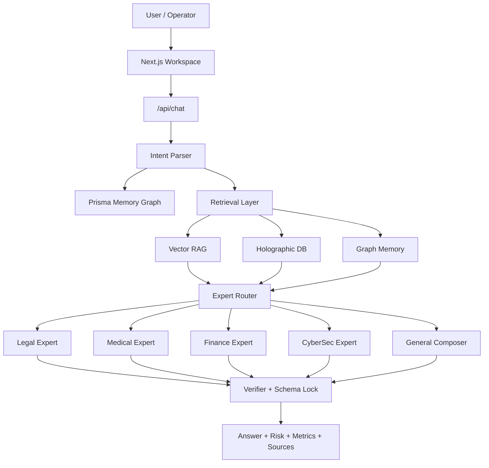
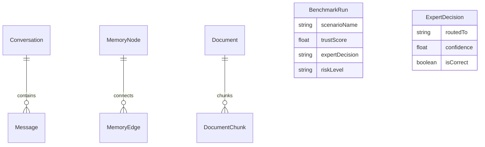
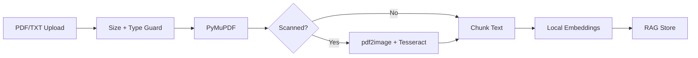

# OmniEngine v7.4 Technical Whitepaper

## Titan Protocol

**TR:** Yerel egemen AI, deterministik uzman yönlendirme ve denetlenebilir bilgi grafiği mimarisi  
**EN:** Local sovereign AI with deterministic expert routing and auditable knowledge-graph retrieval

Date: 2026-05-27

---

## 0. Executive Abstract / Yönetici Özeti

**EN**  
OmniEngine is a local-first enterprise AI architecture designed for regulated and privacy-sensitive workflows. It combines deterministic expert routing, Holographic DB retrieval, Prisma-backed persistent memory, OCR-enabled document ingestion, benchmark reporting, and domain-specific verifier loops.

**TR**  
OmniEngine, regülasyon ve gizlilik hassasiyeti yüksek iş akışları için tasarlanmış yerel-öncelikli bir kurumsal AI mimarisidir. Deterministik uzman yönlendirme, Holographic DB arama, Prisma tabanlı kalıcı hafıza, OCR destekli belge alma, benchmark raporlama ve alan bazlı doğrulayıcı döngülerini birleştirir.

Core claim:

> OmniEngine is not trying to be “another chatbot.” It is a local AI control plane for auditable expert decisions.

---

## 1. Market Problem / Pazar Problemi

Modern LLM platforms are powerful, but enterprise teams still face four recurring problems:

| Problem | Enterprise impact |
|:--|:--|
| Data leaves the private environment | Compliance and confidentiality concerns |
| Hallucination in regulated domains | Legal, medical, finance, and cyber risk |
| Poor answer provenance | Hard to audit why an answer was produced |
| Weak demo observability | Stakeholders cannot see routing, memory, risk, or verification |

OmniEngine addresses these through local orchestration rather than only model prompting.

---

## 2. Product Architecture



---

## 3. Safety Model

### 3.1 Schema Locks

Input and output payloads are expected to follow strict JSON shapes. Invalid payloads are rejected or reduced to safe defaults before they propagate through the system.

### 3.2 Domain Verifiers

| Domain | Verifier behavior |
|:--|:--|
| Legal | Avoid unsupported legal certainty, keep references structured |
| Medical | Pre-analysis only, numeric consistency, no diagnosis |
| Finance | Missing critical metrics trigger abstain, numeric values are verified |
| CyberSec | Harmful instructions are refused, defensive guidance only |

### 3.3 Abstention as a Feature

Abstention is part of the product design. If a safe answer cannot be produced, the correct action is to stop and explain what is missing.

---

## 4. Persistence and Memory

OmniEngine uses Prisma + SQLite for persistent application state.



Implemented Prisma models:

- `Conversation`
- `Message`
- `MemoryNode`
- `MemoryEdge`
- `AuditEvent`
- `Document`
- `DocumentChunk`
- `BenchmarkRun`
- `ExpertDecision`
- `EpisodicCrystal`
- `LiquidState`

The current next step is to migrate all remaining JSON-backed benchmark and RAG metadata into these models.

---

## 5. Holographic DB Architecture

The Holographic DB is the symbolic retrieval layer. Unlike a pure vector store, it preserves node identities, domains, and graph relationships.

### 5.1 Current Retrieval

```text
query
  -> token normalization
  -> index lookup
  -> TF-IDF-like node scoring
  -> title boost
  -> strongest-edge traversal
  -> citation context
```

### 5.2 Why It Matters

| Pure vector RAG | HoloDB-style graph retrieval |
|:--|:--|
| Good semantic recall | Semantic + symbolic recall |
| Harder to cite specific concepts | Node ids are citation-ready |
| Relationship structure often implicit | Edges can express legal, medical, finance, cyber relations |
| Quality depends on embedding behavior | Quality can include source, freshness, verifier pass rate |

### 5.3 Target Node Schema

```json
{
  "id": "cyber:mitre_t1059",
  "title": "Command and Scripting Interpreter",
  "domain": "cyber",
  "subdomain": "mitre_attack",
  "language": "en",
  "jurisdiction": null,
  "source_type": "framework",
  "source_url": "https://attack.mitre.org/",
  "license": "public_reference",
  "valid_from": "2024-01-01",
  "valid_to": null,
  "risk_class": "regulated",
  "confidence": 0.96,
  "keywords": ["MITRE", "T1059", "execution"],
  "text": "..."
}
```

### 5.4 Target Edge Ontology

| Edge | Use case |
|:--|:--|
| `supports` | A source supports a claim |
| `contradicts` | Conflicting legal/medical/technical guidance |
| `requires` | Prerequisite condition |
| `has_exception` | Legal or policy exception |
| `has_threshold` | Numeric medical/finance boundary |
| `mitigates` | Cyber or safety mitigation |
| `contraindicates` | Medical conflict |
| `maps_to_mitre` | Cyber threat mapping |
| `belongs_to_jurisdiction` | Legal jurisdiction |

---

## 6. OCR and Document Intelligence

Document ingestion pipeline:



Runtime requirements:

- `pymupdf`
- `pdf2image`
- `pytesseract`
- `pillow`
- Tesseract OCR binary
- Turkish OCR language pack
- Poppler

---

## 7. Benchmark and Trust Reporting

The benchmark UI is designed to make safety visible.

| Component | Purpose |
|:--|:--|
| Score trend | Longitudinal model quality |
| Capability radar | Balance between accuracy, reasoning, coverage, anti-hallucination |
| Expert usage | Router distribution |
| Weakness map | Domain gaps |
| Router health | Accuracy and entropy |
| PDF export | Shareable trust report |

Next benchmark work:

- Store each run in `BenchmarkRun`.
- Include audit hash and citation ids in exported reports.
- Add batch test runners for all expert domains.
- Separate public benchmark from hidden benchmark.

---

## 8. Comparative Positioning

This is an architectural comparison, not a claim that OmniEngine is more generally intelligent than frontier cloud models.

| Dimension | OmniEngine | OpenAI API / ChatGPT Enterprise | Anthropic Claude API / Enterprise | Google Gemini / Vertex AI |
|:--|:--:|:--:|:--:|:--:|
| Primary deployment | Local / air-gapped target | Managed cloud | Managed cloud | Managed Google Cloud / API |
| Business/API data used for base training by default | No external provider | No, by default | No for commercial/API unless opted in | Vertex AI: no without permission |
| External retention surface | None by design | Limited retention may apply for abuse monitoring | Standard retention and zero-retention options documented | Feature-dependent retention documented |
| Deterministic expert scripts | Built in | Application must add | Application must add | Application must add |
| Local symbolic HoloDB | Built in | External/custom | External/custom | External/custom |
| Persistent local memory graph | Built in | External/custom | External/custom | External/custom |
| OCR + local RAG | Built in target | External/custom | External/custom | External/custom |
| Best use case | Sensitive local workflows and audit-heavy demos | Broad cloud AI capability and ecosystem | Long-context enterprise assistant workflows | Google Cloud-native AI workflows |

Reference points:

- OpenAI states business/API data is not used to train models by default and describes retention/data controls in its official data-control and enterprise privacy docs.
- Anthropic documents commercial/API data training and retention practices, including standard retention and zero-retention options for appropriately configured API usage.
- Google documents Vertex AI data-governance commitments and feature-specific retention behavior for generative AI services.

Sources:

- OpenAI: https://platform.openai.com/docs/guides/your-data
- OpenAI: https://openai.com/policies/api-data-usage-policies/
- OpenAI: https://openai.com/security-and-privacy/
- Anthropic: https://docs.anthropic.com/es/docs/claude-code/data-usage
- Anthropic: https://docs.anthropic.com/en/docs/claude-code/security
- Google Vertex AI: https://cloud.google.com/vertex-ai/generative-ai/docs/data-governance
- Gemini API: https://ai.google.dev/gemini-api/terms_preview
- Gemini API logs: https://ai.google.dev/gemini-api/docs/logs-policy

---

## 9. Dataset Strategy

The next quality jump depends on disciplined data engineering.

### 9.1 Required Dataset Metadata

```json
{
  "id": "legal_tr_0001",
  "domain": "legal",
  "subdomain": "tenant_law",
  "language": "tr",
  "source": "law_reference",
  "license": "public",
  "split": "hidden_test",
  "risk_level": "regulated",
  "expert": "legal",
  "citation_required": true,
  "requires_abstain": false
}
```

### 9.2 Dataset Tracks

| Track | Purpose |
|:--|:--|
| Legal TR/EU/US | Jurisdiction-aware legal matching |
| Medical labs | Numeric reference and safe pre-analysis |
| Finance/banking | Rule-table and ratio verification |
| Cyber/MITRE/OWASP | Defensive security guidance and refusal tests |
| OCR noisy PDFs | Robust document ingestion |
| RAG prompt injection | Retrieval security |
| Abstain set | Teach when not to answer |
| Hidden benchmark | Leakage-resistant evaluation |

---

## 10. Deployment Readiness

Current deployment target includes:

- Next.js production runtime
- Python runtime
- Python requirements
- Tesseract OCR
- Turkish OCR language pack
- Poppler
- Prisma generation
- Xenova embedding model cache

Remaining enterprise checks:

- Fully offline Docker run
- OCR smoke test with scanned Turkish PDF
- `/api/chat` startup smoke test
- Database bootstrap/migration command
- `npm audit` triage
- API E2E test suite

---

## 11. Investment Narrative

### What Investors See

- A working AI control plane, not a landing page.
- Live memory graph that shows system state.
- Trust benchmark dashboard with exportable PDF.
- Local expert modules for regulated domains.
- Clear path to enterprise deployment.

### What Engineers See

- Local orchestration.
- Source-controlled expert modules.
- Prisma persistence.
- HoloDB retrieval.
- Verifier and abstain logic.
- Air-gapped deployment target.

### What Enterprises Care About

- Data control.
- Auditability.
- Explainability.
- Safe refusal.
- Local deployment.
- Domain-specific governance.

---

## 12. Roadmap

| Priority | Work |
|:--:|:--|
| P0 | Remove remaining mojibake artifacts from legacy Python comments and strings |
| P0 | Persist benchmark runs and RAG metadata into Prisma |
| P1 | Merge/federate domain HoloDB files |
| P1 | Add HoloDB eval set and edge-density tooling |
| P1 | Expand Finance/Cyber source databases |
| P2 | Offline Docker validation |
| P2 | CI-style E2E tests |
| P2 | npm audit remediation |

---

## 13. Conclusion

OmniEngine v7.4 has crossed from prototype into a credible demonstrator for local enterprise AI governance. Its strongest differentiator is not raw parameter count; it is the combination of deterministic expert routing, local evidence retrieval, persistent memory, OCR-enabled private document ingestion, benchmark reporting, and verifier-driven abstention.

The next milestone is data maturity: richer HoloDB edges, citation-grounded datasets, hidden benchmarks, and full persistence of audit/reporting events.

