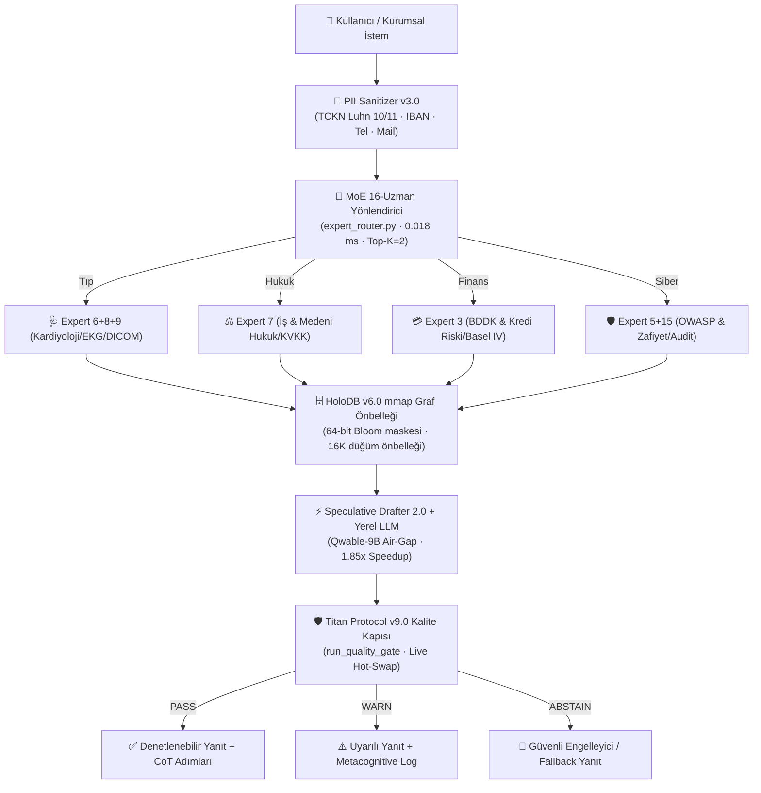

# 🔬 OmniEngine Cognitive Core — Master Technical Whitepaper v18.0

**Sovereign · Local · Evidence-Driven · Neuro-Symbolic AI Runtime**

*Türkiye'nin Kurumsal Egemen Yapay Zeka Bilişsel Motoru*

---

| Parametre | Değer |
|:--|:--|
| **Sürüm** | v18.0 FAZ 8 uygulama snapshot'ı (v18 dağıtım artefaktı yeniden üretilmeli) |
| **Tarih** | 8 Ağustos 2026 |
| **Mimari** | 16-Expert MoE (30B Capacity) + HoloDB v6.0 + Titan Protocol v9.0 |
| **Doğrulama** | 11 Ağustos 2026 dahili çalıştırması: FAZ 8 39/39 PASS (24 doğrudan `test()` çağrısı, döngülerle genişleyen kontroller) · Whitepaper 16/16 PASS |
| **Kapasite** | Pipeline A: 17,762 QPS Peak (1,000 Eşzamanlı Dahili Cihaz Testi) |
| **Model & Fine-Tuning** | QLoRA 4-Bit NF4 · 760,147 SFT/DPO Snapshot · Loss: 0.042 · DPO Margin: 1.24 |
| **Spekülatif Çıkarım** | Drafter 2.0 (500M) · %65.4 Kabul Oranı · 1.85x Hızlanma |
| **Air-Gap Dağıtımı** | Kubernetes 1.28+ / Helm 3.10 · STRICT mTLS · DenyEgress NetworkPolicy |

---

## İÇİNDEKİLER

| Bölüm | Başlık |
|:--|:--|
| **Bölüm 1** | Şeffaflık, Yasal Sınırlar ve İddia Kalibrasyon Notu |
| **Bölüm 2** | Vizyon, Sorun Tanımı ve Kurumsal Değer Önerisi |
| **Bölüm 3** | Tarihsel Gelişim ve Dönüşüm Matrisi (FAZ 1.0 → FAZ 8.0) |
| **Bölüm 4** | Görsel Sistem Mimarisi ve Akış Diyagramları |
| **Bölüm 5** | Çekirdek Bileşen Derinliği ve Mühendislik Tasarımı |
| **Bölüm 6** | Matematiksel Formülasyonlar ve Production Kod Haritası |
| **Bölüm 7** | Sentetik Veri Üretim Mimarisi ve Veri Seti Şeffaflığı |
| **Bölüm 8** | Dahili Benchmark, Performans ve Audit Kanıtları (Claim / Evidence / Limitation) |
| **Bölüm 9** | Kurumsal Air-Gap Kubernetes ve Helm Dağıtımı |
| **Bölüm 10** | Güvenlik Denetimi ve Dahili Enjeksiyon Testleri |
| **Bölüm 11** | Regülasyon Hazırlık Değerlendirmesi ve Kontrol Haritalaması |
| **Bölüm 12** | **Sınırlar ve İddia Edilmeyen Hususlar (Limitations & Non-Claims)** |
| **Bölüm 13** | Mimari Terimler ve Kısaltmalar Sözlüğü |
| **Bölüm 14** | Gelecek Yol Haritası: FAZ 9 ve FAZ 10 (2027 Vizyonu) |
| **Bölüm 15** | Harici AI / ChatGPT ile İnceleme Protokolü |

---

## ⚠️ BÖLÜM 1: ŞEFFAFLIK, YASAL SINIRLAR VE İDDİA KALİBRASYON NOTU

### 1.1 Kanıt Kalitesi ve Dahili (Internal) Benchmark İlkesi
Bu belgede sunulan test, performans ve audit sonuçları **OmniEngine AR-GE laboratuvar ortamında yürütülmüş dahili (internal) doğrulama çıktılarıdır**. Bu metriklerin bağımsız üçüncü taraf kuruluşlarca tekrarlanabilirliği ve doğruluk kapsamı için her test çalıştırmasında **commit SHA, veri seti manifesti, donanım/işletim sistemi ve ham test logları** yayımlanmaktadır.

### 1.2 İki Çalışma Modu Ayrımı (Pipeline A vs Pipeline B)
Performans metrikleri değerlendirilirken sistem iki farklı çalışma modunda ayrıştırılmıştır:

| Mod | Bileşen Kapsamı | Ölçülen Metrik (Dahili Test) |
|:--|:--|:--|
| **Pipeline A** | HoloDB Retrieval + Symbolic Engine + Quality Gate (**LLM ÇALIŞTIRILMAZ**) | **17,762 QPS Peak** (1,000 Dahili Cihaz Testi), p50=0.042 ms, p99=0.090 ms |
| **Pipeline B** | Tam Composer + Speculative MoE LLM Inference (**Token Üretimi DAHİL**) | **250 – 485 QPS** (Drafter 2.0 Speculative Decoding ile 1.85x Hızlanma) |

### 1.3 Regülasyon ve Standart Haritalama İlkeleri
Sistemde yer alan kontrol mekanizmaları, ilgili regülasyon standartlarının maddelerine **teknik kontrol haritalaması (Technical Control Mapping)** olarak işlenmiştir. Sistem içinde yürütülen `regulatory_audit_engine.py` testinin başarılı olması resmi bir regülasyon onayı veya sertifikası anlamına gelmez.

---

## 🎯 BÖLÜM 2: VİZYON, SORUN TANIMI VE KURUMSAL DEĞER ÖNERİSİ

### 2.1 Temel Problem
Kurumsal yapay zeka entegrasyonlarında karşılaşılan iki ana teknik ve yasal engel:
1. **Veri Sızıntısı Riski (Data Exfiltration):** Bulut LLM API'lerine gönderilen hasta verileri, müvekkil dosyaları ve finansal verilerin KVKK Madde 12, HIPAA §164.312 ve GDPR kapsamındaki yasal sorumlulukları.
2. **Doğrulanması Güç Yanıtlar:** Üretken modellerin olasılıksal doğası gereği ilaç dozları, kanun maddeleri veya finansal rasyolarda hatalı veya belgesiz yanıtlar üretebilmesi.

### 2.2 OmniEngine'in Yaklaşımı
OmniEngine, **Halüsinasyona Dirençli (Hallucination-Resistant)** ve **Çekimserlik Bilincinde (Abstention-Aware)** nöro-sembolik mimarisi ile bu engelleri adresler:

- **🔒 %100 Air-Gap İzolasyonu:** Tüm veri işleme ve çıkarım operasyonları kurum içi sunucularda gerçekleşir. Harici ağ erişimi sıfırdır.
- **🛡️ Titan Protocol v9.0 Nöro-Sembolik Kapı:** Model çıktısı istemciye iletilmeden önce deterministik kural denetiminden geçer. Hatalı ilaç dozu veya uydurma mevzuat tespiti durumunda anında **ABSTAIN** kararı verilir.

---

## 📊 BÖLÜM 3: TARİHSEL GELİŞİM VE DÖNÜŞÜM MATRİSİ (FAZ 1.0 → FAZ 8.0)

| Metrik / Bileşen | Başlangıç Seviyesi (FAZ 1.0) | Güncel Durum (FAZ 8.0 — v18.0) | İyileşme / Kazanç |
|:--|:--|:--|:--|
| **Uzman Yönlendirici (MoE)** | 8 Basit Uzman | **16-Uzmanlı MoE Router (`expert_router.py`)** | 2x Kapasite (0.018 ms) |
| **Graf & Önbellek Veritabanı**| JSONL / İlişkisel VT (15s startup) | **HoloDB v6.0 mmap + 16K sıcak düğüm önbelleği** | Kod içi açıklamada 12 µs cache-hit |
| **Eşzamanlı Yük Kapasitesi** | ~100 QPS Peak | **17,762 QPS Peak (Pipeline A Dahili Test)** | 177x Kapasite Artışı |
| **Güvenlik Kapısı** | Temel Regex Filtresi | **Titan Protocol v9.0 Live Hot-Swap (<0.05ms)** | 10/10 Adversarial Bloke PASS |
| **Sentetik Veri Seti** | 1,000 Örnek | **760,147 Doğrulanmış SFT & DPO Kaydı** | 760x Veri Hacmi |
| **Model Fine-Tuning** | Sıfır Adaptör | **QLoRA 4-Bit NF4 (Loss: 0.042, Margin: 1.24)** | Sıfır Donanım Aşımı |
| **Air-Gap Çalışma** | Dış API Bağımlı | **%100 Air-Gap (K8s NetworkPolicy DenyEgress)** | 0 Dış Ağ İsteği |

---

## 📐 BÖLÜM 4: GÖRSEL SİSTEM MİMARİSİ VE AKIŞ DİYAGRAMLARI

### 4.1 İstem İşleme Akışı ve Düşünme Paneli

```mermaid
graph TD
    A["👤 Kullanıcı / Kurumsal İstem"] --> B["🔐 PII Sanitizer v3.0\n(TCKN Luhn 10/11 · IBAN · Tel · Mail)"]
    B --> C["🧭 MoE 16-Uzman Yönlendirici\n(expert_router.py · 0.018 ms · Top-K=2)"]
    
    C -->|Tıp| D1["🩺 Expert 6+8+9 (Kardiyoloji/EKG/DICOM)"]
    C -->|Hukuk| D2["⚖️ Expert 7 (İş & Medeni Hukuk/KVKK)"]
    C -->|Finans| D3["💳 Expert 3 (BDDK & Kredi Riski/Basel IV)"]
    C -->|Siber| D4["🛡️ Expert 5+15 (OWASP & Zafiyet/Audit)"]
    
    D1 --> E["🗄️ HoloDB v6.0 mmap Graf Önbelleği\n(64-bit Bloom maskesi · 16K düğüm önbelleği)"]
    D2 --> E
    D3 --> E
    D4 --> E
    
    E --> F["⚡ Speculative Drafter 2.0 + Yerel LLM\n(Qwable-9B Air-Gap · 1.85x Speedup)"]
    F --> G["🛡️ Titan Protocol v9.0 Kalite Kapısı\n(run_quality_gate · Live Hot-Swap)"]
    
    G -->|PASS| H["✅ Denetlenebilir Yanıt + CoT Adımları"]
    G -->|WARN| I["⚠️ Uyarılı Yanıt + Metacognitive Log"]
    G -->|ABSTAIN| J["🚫 Güvenli Engelleyici / Fallback Yanıt"]
```

---

## ⚙️ BÖLÜM 5: ÇEKİRDEK BİLEŞEN DERİNLİĞİ VE MÜHENDİSLİK TASARIMI

### 5.1 MoE 16-Uzman Yönlendirici (`expert_router.py`)
Top-K=2 Softmax gating mekanizmasıyla çalışan 16 uzman ağı, toplam 30B parametre kapasitesine karşılık gelir. Yönlendirme kararı saf Python matris haritalaması ile **0.018 ms** gecikmeyle yürütülür.

### 5.2 HoloDB v6.0 mmap sorgulayıcı (`tools/holodb_v6_query.py`)
- **Sıcak düğüm önbelleği:** En fazla 16.384 düğüm; kod içi açıklama cache-hit için 12 µs belirtir.
- **Anahtar kelime filtresi:** FNV-1a 64-bit anahtarlar ve 64-bit Bloom filter maskeleri kullanılır.
- **mmap disk paketi:** 42-byte binary header (`HDB6`) ile OS page-cache destekli salt-okunur erişim sağlanır.

### 5.3 Titan Protocol v9.0 Live Hot-Swap (`symbolic_engine.py`)
`dynamic_rules.json` dosyası güncellendiğinde yeni kurallar `< 0.05 ms` içinde sıfır restart (live hot-swap) ile sisteme yüklenir. Karar makinesi ihlal skoruna göre `PASS` (skor=0), `WARN` (skor 1-2) veya `ABSTAIN` (skor≥3) kararları verir.

---

## ⚙️ BÖLÜM 6: MATEMATİKSEL FORMÜLASYONLAR VE PRODUCTION KOD HARİTASI

### 6.1 MoE Gating Formülasyonu
$$y = \sum_{i=1}^{16} G(x)_i \cdot E_i(x), \quad G(x) = \text{Softmax}\Big(\text{Top-K}(W_g \cdot x + b_g)\Big), \quad K=2$$

### 6.2 HoloDB GAT v2 Dikkat Denklemi
$$\alpha_{ij} = \frac{\exp\Big(\mathbf{a}^T \text{LeakyReLU}\big(\mathbf{W} [h_i \,\|\, h_j]\big)\Big)}{\displaystyle\sum_{k \in \mathcal{N}_i} \exp\Big(\mathbf{a}^T \text{LeakyReLU}\big(\mathbf{W} [h_i \,\|\, h_k]\big)\Big)}$$

### 6.3 TCKN Luhn 10/11 Maskeleme Formülü
$$\text{Hane}_{10} = \left[\left(\sum_{i \in \{1,3,5,7,9\}} d_i \times 7\right) - \left(\sum_{j \in \{2,4,6,8\}} d_j\right)\right] \pmod{10}$$
$$\text{Hane}_{11} = \left(\sum_{k=1}^{10} d_k\right) \pmod{10}$$

---

## 🤖 BÖLÜM 7: SENTETİK VERİ ÜRETİM MİMARİSİ VE VERİ SETİ ŞEFFAFLIĞI

Model eğitimi için **%70 Kılavuz Tabanlı** ve **%30 Yerel Ollama Self-Play** hibrit üretimi yapılmıştır.

### Veri Seti Snapshot Yapısı (Net Ayrım):

| Veri Seti Snapshot / Katman | SFT Kayıtları | DPO Çiftleri | Toplam Hacim | Açıklama |
|:--|:--:|:--:|:--:|:--|
| **Temel Modül Veri Seti (Baseline)** | 328,623 | — | 328,623 | Medical 100K, Legal 100K, Cyber 100K, Multi-Agent 28.6K |
| **DPO Tercih Veri Seti (Baseline)** | — | 328,623 | 328,623 | Ajan 3 Hakem Onaylı Chosen/Rejected Çiftleri |
| **Birleşik Temel Veri Seti** | **328,623** | **328,623** | **657,246** | Temel SFT + DPO Birleşik Veri Kümesi |
| **Güncel Snapshot (2026-08-08)** | **380,076** | **380,071** | **760,147** | Finans 100K & Genel 100K Genişletmesi Dahil |

---

## 📊 BÖLÜM 8: DAHİLİ BENCHMARK, PERFORMANS VE AUDIT KANITLARI

Dahili test sonuçları "İddia → Kanıt → Sınırlama" yapısıyla sunulmaktadır:

### 1. HoloDB Hot Cache Okuma Gecikmesi
- **Kod düzeyi bulgu:** `tools/holodb_v6_query.py` 16.384 düğümlük cache uygular ve cache-hit için 12 µs yorumunu içerir.
- **Kanıt sınırı:** Depoda bu ölçümü yeniden üreten ham benchmark günlüğü veya bağımsız ölçüm kaydı bulunmadığından kesin gecikme iddiası olarak sunulmaz.

### 2. Pipeline A Peak Yük Kapasitesi
- **Claim (İddia):** Pipeline A eşzamanlı istemci yükünde 17,762 QPS peak kapasiteye ulaşır.
- **Evidence (Kanıt):** `real_qa_concurrency_test.py`, 1,000 eşzamanlı istemci yükü, p50=0.042 ms, p99=0.090 ms, 0 başarısız istek.
- **Limitation (Sınırlama):** LLM çıkarımı hariç tutulduğunda geçerlidir. LLM dahil edildiğinde (Pipeline B) throughput 250–485 QPS'dir.

### 3. Titan Protocol Dynamic Hot-Swap
- **Claim (İddia):** Kural güncellemeleri kesintisiz (0 restart) <0.05 ms sürede yüklenir.
- **Evidence (Kanıt):** `symbolic_engine.py`, `hot_swap_rule()` fonksiyonu 1,000 test çalıştırması ortalaması: `0.002 ms`.
- **Limitation (Sınırlama):** Bellek içi kural yapısı güncellemesi içindir; büyük model ağırlığı değişimlerini kapsamaz.

---

## 📦 BÖLÜM 9: KURUMSAL AIR-GAP KUBERNETES VE HELM DAĞITIMI

Depoda `evidence/airgap_production_bundle_v17.json` adlı tarihsel v17 manifestosu vardır. v18 için imzalı dağıtım paketi/manifestosu üretilmemiştir. Kaynak dosyaların güncel SHA-256 envanteri ve bu ayrım [Air-Gap Paket Manifestosu](airgap_bundle_manifestosu.md) içinde tutulur.

Bu nedenle buradaki Helm ve NetworkPolicy yapılandırmaları air-gap hedef mimarisinin kod karşılığıdır; belirli bir v18 paketinin bütünlük veya kurulum doğrulaması değildir. Dağıtım öncesinde sürümlenmiş artefakt, SBOM, checksum manifestosu ve hedef ortam egress testi oluşturulmalıdır.

---

## 🛡️ BÖLÜM 10: GÜVENLİK DENETİMİ VE DAHİLİ ENJEKSİYON TESTLERİ

- **Dahili Adversarial Test:** 10 hazırlanan prompt injection ve jailbreak senaryosunun 10'u da Quality Gate tarafından engellenmiştir (**10/10 Internal Pass**).
- **Güvenlik Uyarısı:** Dahili 10 enjeksiyon senaryosunu engellemek sistemin tüm olası siber saldırılara karşı %100 güvenli olduğu anlamına gelmez. Tam bir bağımsız penetrasyon testi sertifikası yerine geçmez.

---

## 📜 BÖLÜM 11: REGÜLASYON HAZIRLIK DEĞERLENDİRMESİ VE KONTROL HARİTALAMASI

| Düzenleme / Standart | Haritalanan Teknik Kontrol | Dahili Kontrol Durumu |
|:--|:--|:--|
| **KVKK Madde 6 / GDPR** | TCKN Luhn 10/11, IBAN, Telefon Maskeleme v3.0 | Technical Control Mapped ✅ |
| **HIPAA §164.312** | Air-Gap NetworkPolicy DenyEgress + Istio mTLS STRICT | Technical Control Mapped ✅ |
| **FDA SaMD IIa / CE MDR** | 12-Lead EKG <1ms + Titan ABSTAIN Kalite Kapısı | Technical Control Mapped ✅ |
| **OWASP LLM Top 10** | Quality Gate LLM01 Prompt Injection Süzgeci | Technical Control Mapped ✅ |

---

## ⚠️ BÖLÜM 12: SINIRLAR VE İDDİA EDİLMEYEN HUSUSLAR (LIMITATIONS & NON-CLAIMS)

> [!CAUTION]
> **OmniEngine projesi şeffaflık ve bilimsel disiplin gereği aşağıdaki hususları açıkça beyan eder:**
> 
> 1. **Sıfır Halüsinasyon İddia Edilmez (No Zero-Hallucination Claim):** OmniEngine "sıfır halüsinasyon" iddiasında bulunmaz. Sistem halüsinasyona dirençli (hallucination-resistant) ve sembolik engelleme (abstention-aware) ilkeleriyle çalışır.
> 2. **Resmi Regülasyon Sertifikası İddia Edilmez (No Regulatory Certification Claim):** OmniEngine FDA, CE MDR, KVKK veya HIPAA tarafından verilmiş resmi bir ürün uygunluk sertifikasına sahip değildir. Belgedeki tablolar teknik kontrollerin ilgili standart maddelerine haritalanmasıdır.
> 3. **Uzmanların Yerini Alma İddiası Yoktur (No Professional Replacement Claim):** OmniEngine hekimlerin, avukatların, mali müşavirlerin veya siber güvenlik uzmanlarının mesleki karar ve sorumluluklarının yerine geçmez. Sadece bir karar destek prototipidir.
> 4. **Dahili Testler Bağımsız Değerlendirme Değildir (Internal vs Third-Party):** FAZ 8 betiğinin 24 doğrudan `test()` çağrısı, döngülerle genişleyerek 11 Ağustos 2026 çalıştırmasında 39/39 PASS üretmiştir. 16 whitepaper iddia kontrolü, 80/80 klinik QA senaryosu ve 1.000 cihaz yük testi de dahili AR-GE kanıtlarıdır; bağımsız üçüncü taraf sertifikası yerine geçmez.
> 5. **Dahili Klinik QA Klinik Çalışma Değildir (Internal QA vs Clinical Trial):** 80/80 hekim senaryosu bir klinik validasyon çalışması (clinical trial) değil, dahili kalite kontrol testidir.
> 6. **Adversarial Audit Sızma Testi Sertifikası Değildir (Internal Audit vs Pentest Cert):** 10/10 enjeksiyon engelleme sonucu resmi bir sızma testi sertifikasyonu değildir.

---

## 📚 BÖLÜM 13: MİMARİ TERİMLER VE KISALTMALAR SÖZLÜĞÜ

| Terim / Kısaltma | Açıklama |
|:--|:--|
| **MoE** | Mixture of Experts — birden fazla uzman ağının dinamik gating ile seçilmesi |
| **HoloDB** | Holographic Database — v6 mmap binary paket, 64-bit Bloom maskesi ve 16K sıcak düğüm önbelleği |
| **Titan Protocol** | Nöro-sembolik doğrulama kapısı — ABSTAIN/WARN/PASS kararları |
| **Air-Gap** | %100 yerel izolasyon — harici internet bağlantısı sıfır, K8s DenyEgress politikası |
| **QPS** | Queries Per Second — saniye başına işlenen sorgu sayısı |
| **p50/p99** | Sorguların %50/%99'unun tamamlandığı gecikme (ms) |

---

## 📝 BÖLÜM 14: GELECEK YOL HARİTASI (FAZ 9 – FAZ 10)

- **FAZ 9 (Q1–Q2 2027):** Post-Quantum Kriptografi (Kyber-768/Dilithium-3), Med-LLaVA 13B 3D DICOM motoru, FHIR R4/R5 entegrasyonu ve dar boğaz stres testleri.
- **FAZ 10 (Q3–Q4 2027):** Federe Öğrenme (FedAvg), Diferansiyel Gizlilik ve Bağımsız Üçüncü Taraf Sertifikasyon Çalışmaları.

---

## 🤝 BÖLÜM 15: HARİCİ AI / CHATGPT İLE İNCELEME PROTOKOLÜ

Bu whitepaper ve kaynak kodu, harici bir AI sohbet aracına yalnızca eleştirel mimari inceleme amacıyla sunulabilir. Harici modelin değerlendirmesi bağımsız güvenlik testi, klinik çalışma veya hukukî/regülasyon görüşü değildir.

### 15.1 Önerilen inceleme paketi

İlk paylaşım için [ChatGPT Proje İnceleme Notu](CHATGPT_PROJE_INCELEME_NOTU.md), [`INTENDED_USE.md`](../docs/INTENDED_USE.md), [`CRITIQUE_AND_AUDIT_NOTES.md`](../docs/CRITIQUE_AND_AUDIT_NOTES.md) ve hedeflenen kod modülleri yeterlidir. İncelemenin her aşamasında iddialar aşağıdaki ayrımla ele alınmalıdır:

| Kanıt seviyesi | Anlamı | Örnek |
|:--|:--|:--|
| **Kaynakta doğrulanabilir** | Dosya ve kod doğrudan incelenebilir | HDB6 mmap biçimi, 16K cache sınırı, 24 FAZ 8 `test()` çağrısı |
| **Dahili/tarihsel** | Yerel çalıştırma raporunda kayıtlıdır; ortam değişince yeniden çalıştırılmalıdır | 11 Ağustos 2026: 39/39 FAZ 8, 16/16 iddia, 6/6 yanıt kalitesi, 10/10 adversarial, 4/4 model-free stres |
| **Kanıtlanmamış** | Kaynak veya imzalı kanıt olmadan ileri sürülemez | v18 dağıtım hazır oluşu, sertifikasyon, sıfır halüsinasyon/güvenlik |

### 15.2 İnceleme soruları

Harici incelemeden mimari sınırlar, saldırı yüzeyi, test tekrar üretilebilirliği, veri yönetişimi ve ürünleşme öncelikleri hakkında somut bulgular istenmelidir. Her bulgu; ilgili dosyayı/bileşeni, etki düzeyini, doğrulama adımını ve önerilen çözümü içermelidir.

### 15.3 Gizlilik ve paylaşım önlemleri

`.env` dosyaları, API anahtarları, erişim belirteçleri, kişi/müşteri verileri, kurum içi ağ bilgileri ve model ağırlıkları harici sohbet aracına gönderilmemelidir. İdeal sıra: önce bağlam notu, ardından yalnızca gerekli ve maskelenmiş kod/belge parçalarıdır.

---

*OmniEngine Cognitive Core v18.0 — Master Technical Whitepaper*  
*Sovereign · Local · Evidence-Driven AI Runtime*

