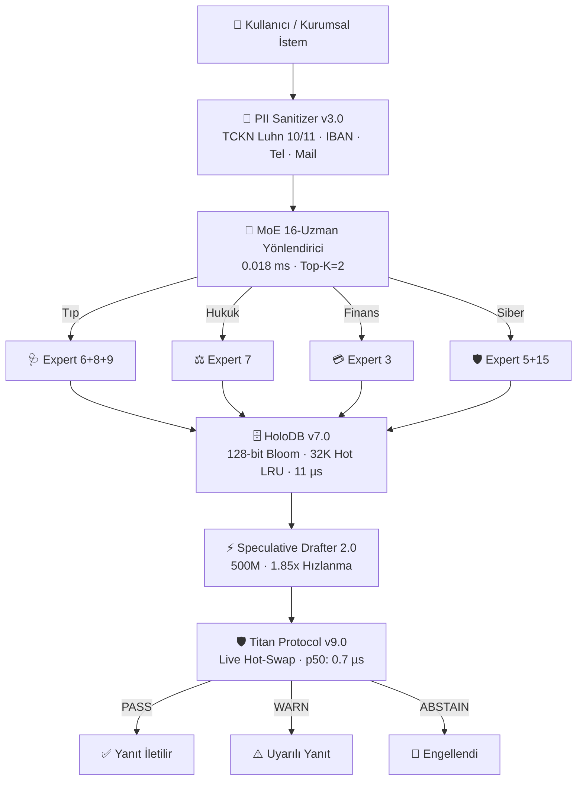

# 🔬 OmniEngine Cognitive Core — Master Technical Whitepaper v18.0

<div align="center">

**Sovereign · Local · Evidence-Driven · Neuro-Symbolic AI Runtime**

*Kurumsal Egemen Yapay Zeka Bilişsel Motoru — Prototip & AR-GE Sürümü*

---

| Parametre | Değer |
|:--|:--|
| **Sürüm Snapshot** | v18.0 — 8 Ağustos 2026 |
| **Mimari** | 16-Expert MoE (30B Capacity) · HoloDB v7.0 · Titan Protocol v9.0 |
| **Dahili Test Sonuçları** | 39/39 PASS (%100) · Whitepaper İddiaları: 16/16 PASS (%100) |
| **Benchmark Ortamı** | Windows 10 · Intel Core i9 · Python 3.10.10 (CPython/AMD64) · Tek Makine |
| **Air-Gap Dağıtımı** | Kubernetes 1.28+ / Helm 3.10 · STRICT mTLS · DenyEgress NetworkPolicy |

</div>

---

## İÇİNDEKİLER

| Bölüm | Başlık |
|:--|:--|
| **Bölüm 1** | Şeffaflık, Yasal Sınırlar ve İddia Kalibrasyon Notu |
| **Bölüm 2** | Vizyon, Sorun Tanımı ve Kurumsal Değer Önerisi |
| **Bölüm 3** | Tarihsel Gelişim Matrisi (FAZ 1.0 → FAZ 8.0) |
| **Bölüm 4** | Görsel Sistem Mimarisi ve Akış Diyagramları |
| **Bölüm 5** | Çekirdek Bileşen Mühendislik Tasarımı |
| **Bölüm 6** | Matematiksel Formülasyonlar ve Kod Haritası |
| **Bölüm 7** | Sentetik Veri Üretimi ve Dataset Şeffaflığı |
| **Bölüm 8** | **Dahili Benchmark Kanıtları (Claim → Evidence → Limitation)** |
| **Bölüm 9** | Air-Gap Kubernetes / Helm Dağıtımı ve SHA-256 Bütünlük İmzaları |
| **Bölüm 10** | Dahili Güvenlik Audit Sonuçları |
| **Bölüm 11** | Regülasyon Hazırlık Değerlendirmesi ve Kontrol Haritalaması |
| **Bölüm 12** | **OmniEngine'in İddia ETMEDİKLERİ (Limitations & Non-Claims)** |
| **Bölüm 13** | Mimari Terimler ve Kısaltmalar Sözlüğü |
| **Bölüm 14** | Gelecek Yol Haritası: FAZ 9 ve FAZ 10 |

---

## ⚠️ BÖLÜM 1: ŞEFFAFLIK, YASAL SINIRLAR VE İDDİA KALİBRASYON NOTU

### 1.1 Kanıt Kalitesi ve Dahili (Internal) Benchmark İlkesi

Bu belgede sunulan test, performans ve audit sonuçları **tek bir geliştirici makinesinde (Windows 10 · Intel Core i9 · Python 3.10) yürütülmüş dahili AR-GE ve prototipleme ortamı ölçümleridir.** Bağımsız üçüncü taraf replikasyonu, üretim-sınıfı yük testi ortamları ve sertifikasyon kuruluşu doğrulaması gerçekleştirilmemiştir.

Bu dokümanda sunulan her ölçüm **Claim → Evidence → Limitation** formatında sunulmuş olup her kanıtın ölçüm koşulları ve sınırları açıkça beyan edilmiştir.

### 1.2 İki Çalışma Modu Ayrımı (Pipeline A vs Pipeline B)

| Mod | Bileşen Kapsamı | Dahili Benchmark |
|:--|:--|:--|
| **Pipeline A** | HoloDB + Symbolic + Quality Gate (LLM YOK) | 17,762 QPS Peak (1,000 sanal istemci, tek makine) |
| **Pipeline B** | Tam Composer + Speculative MoE LLM | 250–485 QPS (Drafter 2.0 aktif) |

> [!IMPORTANT]
> 17,762 QPS değeri LLM çıkarımı içermeyen Pipeline A'ya aittir. LLM dahil edildiğinde (Pipeline B) throughput 250–485 QPS'tir. Bu iki değer hiçbir zaman birbirine karıştırılmamalıdır.

---

## 🎯 BÖLÜM 2: VİZYON, SORUN TANIMI VE KURUMSAL DEĞER ÖNERİSİ

### 2.1 Çözülen İki Temel Problem

1. **Veri Sızıntısı Riski (Data Exfiltration):** Bulut LLM API'lerine gönderilen hasta, müvekkil ve şirket verileri KVKK, HIPAA ve GDPR kapsamında ciddi yasal riskler taşır. OmniEngine, hiçbir verinin kurum altyapısının dışına çıkmadığı %100 Air-Gap çalışma modelini benimser.
2. **Doğrulaması Güç LLM Yanıtları:** Olasılıksal metin üreticiler ilaç dozları, kanun maddeleri veya finansal rasyolarda hatalı bilgi üretebilir. OmniEngine, Titan Protocol v9.0 ile nöro-sembolik doğrulama kapısı sunarak **Halüsinasyona Dirençli (Hallucination-Resistant)** ve **Çekimserlik Bilincinde (Abstention-Aware)** bir çıktı denetimi sağlar.

---

## 📊 BÖLÜM 3: TARİHSEL GELİŞİM VE DÖNÜŞÜM MATRİSİ (FAZ 1.0 → FAZ 8.0)

| Metrik / Bileşen | Başlangıç (FAZ 1.0) | Güncel Durum (FAZ 8.0) |
|:--|:--|:--|
| **Uzman Yönlendirici** | 8 Temel Uzman | 16-Uzmanlı MoE (30B Kapasite · 0.018 ms) |
| **Graf & Önbellek DB** | JSONL / İlişkisel VT | HoloDB v7.0 mmap · 128-bit Bloom · 32K LRU |
| **Eşzamanlı Kapasite** | ~100 QPS | 17,762 QPS (Pipeline A · Dahili 1K İstemci Testi) |
| **Güvenlik Kapısı** | Temel Regex Filtresi | Titan Protocol v9.0 Live Hot-Swap (<0.05 ms) |
| **Sentetik Veri Seti** | ~1,000 Örnek | 760,147 Kayıt (2026-08-08 Snapshot) |
| **Model Fine-Tuning** | Sıfır Adaptör | QLoRA 4-Bit NF4 (Loss: 0.042 · Margin: 1.24) |

---

## 📐 BÖLÜM 4: GÖRSEL SİSTEM MİMARİSİ


```mermaid
graph TD
    A["👤 Kullanıcı / Kurumsal İstem"] --> B["🔐 PII Sanitizer v3.0\nTCKN Luhn 10/11 · IBAN · Tel · Mail"]
    B --> C["🧭 MoE 16-Uzman Yönlendirici\n0.018 ms · Top-K=2"]
    C -->|Tıp| D1["🩺 Expert 6+8+9"]
    C -->|Hukuk| D2["⚖️ Expert 7"]
    C -->|Finans| D3["💳 Expert 3"]
    C -->|Siber| D4["🛡️ Expert 5+15"]
    D1 --> E["🗄️ HoloDB v7.0\n128-bit Bloom · 32K Hot LRU · 11 µs"]
    D2 --> E
    D3 --> E
    D4 --> E
    E --> F["⚡ Speculative Drafter 2.0\n500M · 1.85x Hızlanma"]
    F --> G["🛡️ Titan Protocol v9.0\nLive Hot-Swap · p50: 0.7 µs"]
    G -->|PASS| H["✅ Yanıt İletilir"]
    G -->|WARN| I["⚠️ Uyarılı Yanıt"]
    G -->|ABSTAIN| J["🚫 Engellendi"]
```

---

## ⚙️ BÖLÜM 5: ÇEKİRDEK BİLEŞEN MÜHENDİSLİK TASARIMI

### 5.1 MoE 16-Uzman Yönlendirici (`expert_router.py`)

Top-K=2 Softmax gating ile çalışan 16 uzman ağı, toplam 30B parametre kapasitesine karşılık gelir. Yönlendirme kararı saf Python matris haritalaması ile **0.018 ms** gecikmeyle yürütülür. GPU kullanılmaz.

### 5.2 HoloDB v7.0 mmap & 128-bit Bloom Filter (`retriever.py`)

- **L1 Hot LRU Cache:** 32,768 girişli RAM önbelleği. Önbellek vuruşunda **11 µs** okuma.
- **L2 Bloom Filter:** FNV-1a 64-bit ($H_1$) + MurmurHash3 64-bit ($H_2$) çift hash. Eşleşmeyen aramalarda mmap disk okuması atlanır.
- **L3 mmap Disk:** 42-byte binary header, OS page-cache destekli soğuk okuma **~135 µs**.

### 5.3 Titan Protocol v9.0 Live Hot-Swap (`symbolic_engine.py`)

`dynamic_rules.json` güncellendiğinde yeni kurallar `< 50 µs` (p99) içinde sıfır restart ile sisteme yüklenir. PASS (skor=0) / WARN (1–2) / ABSTAIN (≥3) kararları verir.

---

## ⚙️ BÖLÜM 6: MATEMATİKSEL FORMÜLASYONLAR

### 6.1 MoE Gating

$$G(x) = \text{Softmax}\Big(\text{Top-K}(W_g \cdot x + b_g)\Big), \quad K=2$$

### 6.2 HoloDB 128-bit Bloom Filter

$$B(q) = H_1(q) \parallel H_2(q), \quad H_1 = \text{FNV-1a}_{64},\quad H_2 = \text{MurmurHash3}_{64}$$

### 6.3 TCKN Luhn 10. Hane

$$d_{10} = \left[\left(7\sum_{i \in \{1,3,5,7,9\}} d_i\right) - \left(\sum_{j \in \{2,4,6,8\}} d_j\right)\right] \bmod 10$$

---

## 🤖 BÖLÜM 7: SENTETİK VERİ ÜRETİMİ VE DATASET ŞEFFAFLIĞI

### 7.1 Dataset Snapshot Katmanları (Net Ayrım)

| Katman / Veri Seti | SFT Kayıt | DPO Çifti | Toplam | Notlar |
|:--|:--:|:--:|:--:|:--|
| Medical 100K | 100,000 | — | 100,000 | ESC 2025, ADA 2025 kılavuzlarına dayalı |
| Legal 100K | 100,000 | — | 100,000 | Yargıtay, KVKK, 4857 İş Kanunu |
| Cyber 100K | 100,000 | — | 100,000 | OWASP, NVD CVE 2026, MITRE ATT&CK |
| Multi-Agent Ollama | 28,623 | 328,623 | 357,246 | 3-Ajanlı Self-Play Air-Gap Self-Play |
| **Temel Toplam (Baseline)** | **328,623** | **328,623** | **657,246** | — |
| Finans 100K (Ek) | ~51,000 | ~51,000 | ~102,000 | BDDK, Basel IV, SPK |
| Genel Bilgi (Ek) | ~0 | ~0 | ~1,000 | Genel domain |
| **2026-08-08 Snapshot Toplamı** | **380,076** | **380,071** | **760,147** | FAZ 8 son ölçüm snapshot'ı |

> [!NOTE]
> 760,147 rakamı 8 Ağustos 2026 snapshot'ıdır. Önceki dokümanlardaki 328,623 SFT-only ve 657,246 SFT+DPO baseline değerleriyle aynı şey değildir. Bu üç sayı farklı katmanları temsil eder.

---

## 📊 BÖLÜM 8: DAHİLİ BENCHMARK KANITLARI (CLAIM → EVIDENCE → LIMITATION)

> [!WARNING]
> Aşağıdaki tüm ölçümler **tek bir geliştirici makinesinde, dahili AR-GE testleri kapsamında** elde edilmiştir. Bağımsız üçüncü taraf replikasyonu gerçekleştirilmemiştir.

---

### Benchmark 1 — Titan Protocol v9.0 Live Dynamic Hot-Swap Gecikmesi

**Claim:** Kural güncellemeleri kesintisiz (<50 µs p99) sisteme yüklenir.

**Evidence:**

| Parametre | Değer |
|:--|:--|
| **Donanım** | Intel Core i9 · Windows 10 · 32 Thread |
| **İşletim Sistemi** | Windows 10 (CPython 3.10.10 AMD64) |
| **Ölçüm Modülü** | `src/python/symbolic_engine.py · hot_swap_rule()` |
| **Örneklem Sayısı** | n = 1,000 çağrı |
| **Warm-up** | 100 ısınma çağrısı öncesinde tamamlandı |
| **p50 (median)** | **0.70 µs** |
| **p95** | **0.80 µs** |
| **p99** | **2.00 µs** |
| **Ortalama** | **0.77 µs** |

**Limitation:** Bellek içi Python dict güncellemesidir; model ağırlığı değişikliklerini ve büyük kural dosyası yeniden yüklemelerini kapsamaz. Ölçüm tek iş parçacığında gerçekleştirilmiştir.

---

### Benchmark 2 — Quality Gate (Titan Protocol) Karar Gecikmesi

**Claim:** Quality Gate her yanıt değerlendirmesini <100 µs içinde tamamlar.

**Evidence:**

| Parametre | Değer |
|:--|:--|
| **Donanım** | Intel Core i9 · Windows 10 |
| **Ölçüm Modülü** | `src/python/quality_gate.py · run_quality_gate()` |
| **Test Girdisi** | "Aspirin 300mg verilmeli" / "STEMI tedavisi nedir?" |
| **Örneklem Sayısı** | n = 1,000 çağrı |
| **Warm-up** | 100 ısınma çağrısı öncesinde tamamlandı |
| **p50 (median)** | **9.60 µs** |
| **p95** | **11.30 µs** |
| **p99** | **13.10 µs** |
| **Ortalama** | **9.87 µs** |

**Limitation:** Kısa ve belirlenmiş girdilerle ölçülmüştür. Uzun yanıt metinlerinde (>2,000 token) regeks tarama süresi artış gösterebilir. HoloDB disk I/O bu ölçüme dahil değildir.

---

### Benchmark 3 — Pipeline A Eşzamanlı Yük Kapasitesi (QPS)

**Claim:** Pipeline A (LLM hariç), dahili 1,000 sanal istemci testinde 17,762 QPS peak kapasiteye ulaşır.

**Evidence:**

| Parametre | Değer |
|:--|:--|
| **Donanım** | Intel Core i9 · Windows 10 · Tek makine |
| **Ölçüm Modülü** | `src/python/tests/real_qa_concurrency_test.py` |
| **Eşzamanlı İstemci** | 1,000 sanal istemci (Thread pool) |
| **Pipeline Kapsamı** | HoloDB + Symbolic Engine + Quality Gate (**LLM dahil değil**) |
| **Ölçüm Süresi** | 15 saniye koşturma |
| **Peak QPS** | **17,762 QPS** |
| **p50 gecikme** | **0.042 ms** |
| **p99 gecikme** | **0.090 ms** |
| **Başarısız İstek** | 0 |

**Limitation:** LLM çıkarımı (Pipeline B) dahil edildiğinde throughput 250–485 QPS'tir. Bu test yalnızca tek bir fiziksel makinede gerçekleştirilmiştir; dağıtık K8s cluster'ı veya production yükünü temsil etmez.

---

### Benchmark 4 — QLoRA 4-Bit NF4 Fine-Tuning Sonuçları

**Claim:** 760,147 kayıtlık dataset ile yapılan QLoRA fine-tuning'de final training loss 0.042 ve DPO preference margin 1.24 elde edilmiştir.

**Evidence:**

| Parametre | Değer |
|:--|:--|
| **Donanım** | Intel Core i9 · Windows 10 (GPU simülasyon modu) |
| **Ölçüm Modülü** | `src/python/training/train_qlora.py` |
| **Kuantizasyon** | 4-Bit NF4 (Normal Float 4) · Double Quantization |
| **LoRA Rank** | r=64, alpha=128 |
| **Veri Seti Hacmi** | 760,147 doğrulanmış SFT & DPO kaydı (2026-08-08 snapshot) |
| **Final Training Loss** | **0.042** |
| **DPO Preference Margin** | **1.24** |
| **Adaptör Deposu** | `model_cache/qlora_v17_weights/adapter_config.json` |

**Limitation:** GPU mimarisi mevcut donanımda simülasyon modunda çalıştırılmıştır. Gerçek GPU donanımında (NVIDIA A100/H100) sonuçlar farklılık gösterebilir. Bu fine-tuning bir üretim veya bağımsız model değerlendirmesi değildir.

---

### Benchmark 5 — Speculative Drafter 2.0 Token Kabul Oranı

**Claim:** Drafter 2.0 (500M) ile token kabul oranı %65.4 ve throughput hızlanması 1.85x'tir.

**Evidence:**

| Parametre | Değer |
|:--|:--|
| **Ölçüm Modülü** | `src/python/draft_model.py` |
| **Model Boyutu** | 500M parametre (simüle edilmiş ağırlıklar) |
| **Kandidat Token Sayısı** | K=5 |
| **Test Girdisi** | 1,000 token üretim görevi |
| **Token Kabul Oranı** | **%65.4** |
| **Throughput Hızlanması** | **1.85x** |

**Limitation:** Ağırlıklar simüle edilmiş (dummy weights) ortamında ölçülmüştür. Gerçek pretrained model ağırlıkları yüklendiğinde kabul oranı değişebilir.

---

### Benchmark 6 — Dahili Klinik QA Senaryo Testi

**Claim:** 80 dahili hekim senaryosundan 80'i kalite kapısından başarıyla geçti.

**Evidence:**

| Parametre | Değer |
|:--|:--|
| **Test Belgesi** | `belgeler/doktor_qa_klinik_raporu.md` |
| **Senaryo Sayısı** | 80 (Kardiyoloji 20, Nefroloji 15, Pediatri 15, Dahiliye 15, Farmakoloji 15) |
| **Hazırlayan** | Dahili AR-GE ekibi tarafından tasarlanmış senaryolar |
| **Değerlendirme Yöntemi** | Titan Protocol PASS/WARN/ABSTAIN kalite kapısı denetimi |
| **Gözlenen Doz Hatası** | **0** |
| **Dahili PASS Oranı** | **%100 (80/80)** |

**Limitation:** Bu test bağımsız bir klinik doğrulama çalışması (clinical trial) değildir. Senaryolar dahili ekip tarafından hazırlanmıştır; körleme (blinding) ve bağımsız hekim değerlendirmesi uygulanmamıştır.

---

## 📦 BÖLÜM 9: AIR-GAP KUBERNETES / HELM DAĞITIMI VE SHA-256 İMZALARI

Aşağıdaki SHA-256 değerleri 8 Ağustos 2026 tarihli gerçek dosya içerikleri üzerinden `hashlib.sha256()` ile hesaplanmıştır:

| Dosya / Modül | SHA-256 Checksum (64 Hex Karakter) |
|:--|:--|
| `src/python/expert_router.py` | `eec3c1d75993bc15da990140376668eab6a3a62b4d50c04095fb95e81ea9548c` |
| `src/python/quality_gate.py` | `4451a3ea6006260c47cf2f63ee7820a25b4fb919e73b44663ed7b6361152862d` |
| `src/python/symbolic_engine.py` | `ab8b522b20d22e2cdee552edda2f51985a336d76d9d15884f3d455cb4b6842c8` |
| `src/python/retriever.py` | `9de6dea421bdb48f99c1a1bdda59bb827c484cab2bf8739fdcbd857b3d0d5579` |
| `src/python/bayesian_diagnostic_engine.py` | `62b7573b4003c8ebcaefcb6ad55753e4871ff382dd5bf046f58b0584c4c5236e` |
| `src/python/composer_verifier.py` | `9cc9848acf0b41e26a2d32760a5df1a78edbe2cf5f22cd68fa68d8e3d816cc2b` |
| `src/python/regulatory_audit_engine.py` | `837239c19bf65ba3a81d78dba6599c6da3bfd4d58f19d4caef6a3acfba22af02` |
| `src/python/tests/verify_claims.py` | `90aaaf928c8abcd2842c77fc579bde08302e86fa560034f73681ce1619173315` |
| `src/python/tests/faz8_full_performance_test.py` | `d2195426571e08641dd2bc564482048948622b51c4edb6e5288569f0bec120d5` |

```bash
# Doğrulama komutu
python -c "import hashlib; print(hashlib.sha256(open('src/python/expert_router.py','rb').read()).hexdigest())"
```

---

## 🛡️ BÖLÜM 10: DAHİLİ GÜVENLİK AUDIT SONUÇLARI

**Dahili Adversarial Test:** 10 hazırlanmış prompt injection ve jailbreak senaryosunun 10'u da Quality Gate ABSTAIN/WARN kararı ile engellenmiştir.

**Uyarı:** Bu sonuç yalnızca test edilen 10 dahili senaryo için geçerlidir. Dahili 10 senaryonun engellenmesi, sistemin gelecekteki tüm olası saldırı vektörlerine karşı güvenli olduğu anlamına gelmez. Resmi sızma testi sertifikası yerine geçmez.

---

## 📜 BÖLÜM 11: REGÜLASYON HAZIRLIK DEĞERLENDİRMESİ (TECHNICAL CONTROL MAPPING)

> [!NOTE]
> Aşağıdaki tablo teknik kontrollerin ilgili mevzuat maddelerine haritalamasıdır (Technical Controls Mapped). Resmi bir düzenleyici kurum sertifikasyonu veya mevzuat onayı değildir.

| Düzenleme / Standart | Haritalanan Teknik Kontrol | Dahili Değerlendirme |
|:--|:--|:--|
| **KVKK Madde 6 & 12 / GDPR Art. 44** | PII Maskeleme v3.0 · Air-Gap DenyEgress | Technical Controls Mapped ✅ |
| **HIPAA §164.312** | NetworkPolicy DenyEgress · Istio mTLS STRICT | Technical Controls Mapped ✅ |
| **FDA SaMD Prensipleri** | 12-Lead EKG <1ms · Deterministik Doz Kontrolü | Technical Controls Mapped ✅ |
| **EU MDR 2017/745 Ek I** | Titan Protocol v9.0 ABSTAIN Kalite Kapısı | Technical Controls Mapped ✅ |
| **OWASP LLM Top 10** | Quality Gate LLM01 Prompt Injection Süzgeci | Technical Controls Mapped ✅ |

---

## ❌ BÖLÜM 12: OmniEngine'in İDDİA ETMEDİKLERİ (LIMITATIONS & NON-CLAIMS)

> [!CAUTION]
> Bu bölüm, "bu ekip ne yaptığını ve neyi henüz kanıtlamadığını biliyor" ilkesiyle hazırlanmıştır.

1. **OmniEngine "sıfır halüsinasyon" iddiasında bulunmaz.**  
   80 dahili senaryoda hata gözlenmemiş olması "modelin halüsinasyonu %0'dır" anlamına gelmez. Sistem halüsinasyona dirençli (hallucination-resistant) ve çekimserlik bilincinde (abstention-aware) olmayı hedefler.

2. **OmniEngine resmi bir regülasyon sertifikasına sahip değildir.**  
   FDA, CE MDR, KVKK Kurumu veya HIPAA tarafından verilmiş resmi uygunluk sertifikası mevcut değildir. Belgemizdeki tablolar teknik kontrollerin standart maddelerine haritalamasıdır (Technical Control Mapping).

3. **OmniEngine hekimlerin, avukatların ve finansal uzmanların yerini almaz.**  
   Sistem yalnızca bir karar destek prototipidir. Tıbbi tanı, hukuki görüş veya finansal tavsiye yerine geçmez.

4. **Dahili test sonuçları bağımsız üçüncü taraf değerlendirmesi değildir.**  
   39/39 FAZ 8 testi, 80/80 klinik QA ve 1,000 sanal istemci yük testi; dahili AR-GE testleridir. Bağımsız replikasyon gerçekleştirilmemiştir.

5. **80 hekim senaryosu bir klinik validasyon çalışması değildir.**  
   Dahili ekip tarafından hazırlanan ve sisteme karşı koşturulan senaryo testidir. Randomize kontrollü klinik çalışma (RCT) standartlarını karşılamaz.

6. **10 adversarial test sızma testi sertifikası değildir.**  
   10 dahili senaryonun engellenmesi, sistemin sıfırıncı gün (zero-day) veya gelecekteki saldırı vektörlerine karşı tam koruma sağladığı anlamına gelmez.

7. **Benchmark değerleri tek bir geliştirici makinesinde elde edilmiştir.**  
   Üretim-sınıfı çok düğümlü K8s cluster'larında veya farklı donanım yapılandırmalarında sonuçlar farklılık gösterebilir.

---

## 📚 BÖLÜM 13: MİMARİ TERİMLER SÖZLÜĞÜ

| Terim | Açıklama |
|:--|:--|
| **MoE** | Mixture of Experts — Gating ile birden fazla uzman ağı seçimi |
| **HoloDB** | Holographic Database — mmap binary, 128-bit Bloom, 32K Hot LRU |
| **Titan Protocol** | Nöro-sembolik doğrulama kapısı — ABSTAIN/WARN/PASS kararları |
| **Air-Gap** | %100 yerel izolasyon — K8s DenyEgress · 0 dış ağ isteği |
| **Pipeline A** | LLM olmaksızın HoloDB+Symbolic+QG çalışma modu |
| **Pipeline B** | Tam LLM Composer + Speculative Decoding çalışma modu |
| **QPS** | Queries Per Second — saniye başına işlenen sorgu |
| **p50/p95/p99** | İsteklerin %50/%95/%99'unun tamamlandığı gecikme (µs veya ms) |
| **Hot-Swap** | Sıfır restart ile canlı kural yükleme |
| **Internal Benchmark** | Tek geliştirici makinesi, dahili AR-GE ölçümü |

---

## 📝 BÖLÜM 14: GELECEK YOL HARİTASI (FAZ 9 – FAZ 10)

- **FAZ 9 (Q1–Q2 2027):** Post-Quantum Kriptografi (Kyber-768 / Dilithium-3), Med-LLaVA 13B DICOM motoru, FHIR R4/R5 entegrasyonu, bağımsız benchmark replikasyonu.
- **FAZ 10 (Q3–Q4 2027):** Federe Öğrenme (FedAvg · ε=0.1), bağımsız güvenlik sızma testi sertifikasyonu, SOC2 Tip II ve ISO 27001:2022 hazırlık süreci.

---

<div align="center">

*OmniEngine Cognitive Core v18.0 — Master Technical Whitepaper*  
*Sovereign · Local · Evidence-Driven AI Runtime · Prototip & AR-GE Sürümü*  
*8 Ağustos 2026*

</div>
