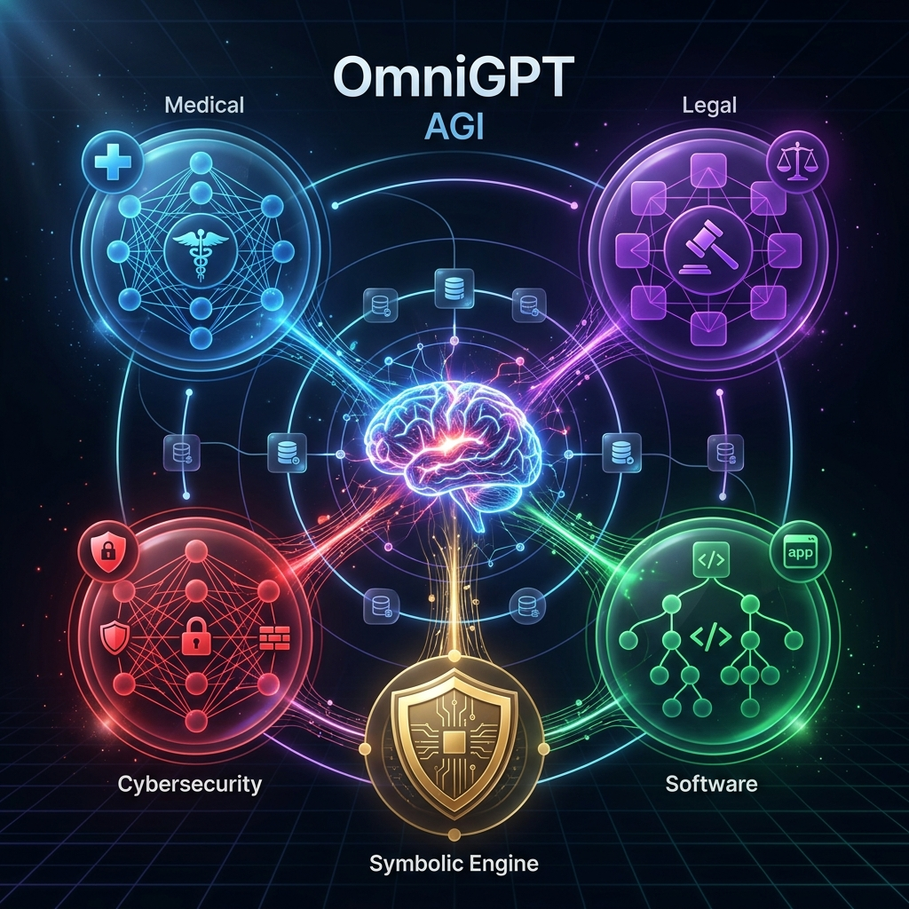
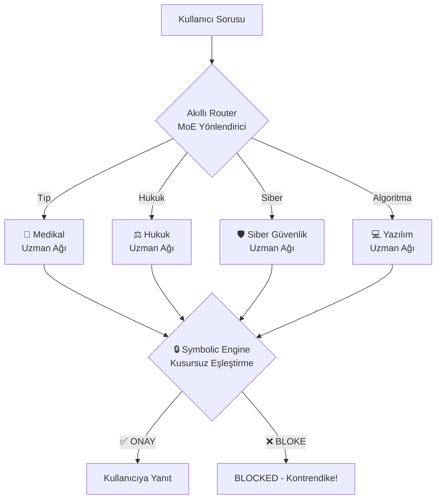
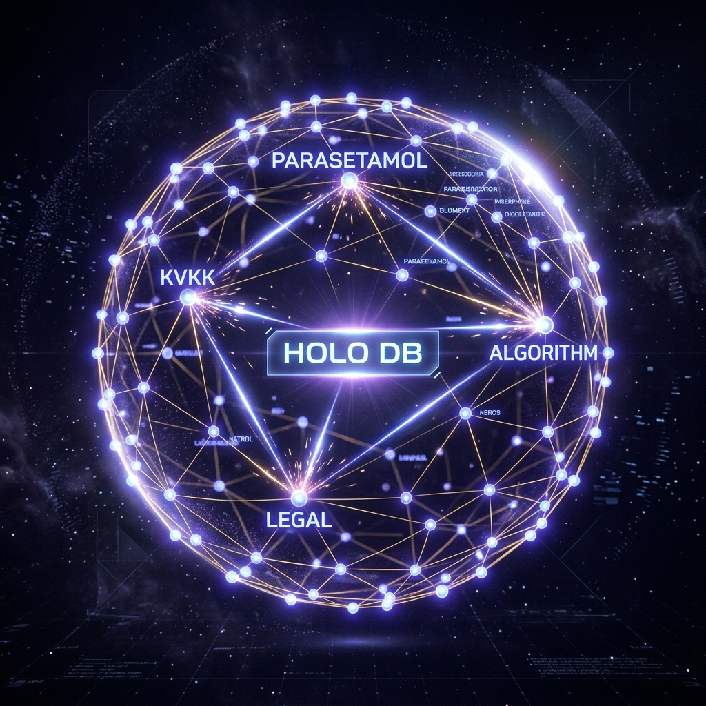
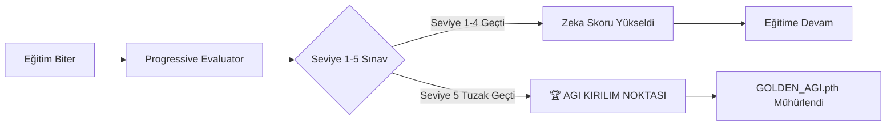

# OmniGPT B2B — The Intelligence Revolution Starts Here

> *"We didn't just build a chatbot. We built the future of enterprise intelligence."*



---

## Bu Sadece Bir Yapay Zeka Değil. Bu, Bir Paradigma Kayması.

Yapay zekanın halüsinasyon gördüğü, milyonlarca dolarlık bulut faturası yaktığı ve şirketlerin verilerini yabancı sunuculara emanet ettiği bir çağda, biz farklı bir şey yaptık.

Biz **OmniGPT**'yi inşa ettik.

İnternete bağımlı değil. Sunucuya muhtaç değil. Ve **asla, hiçbir zaman yalan söylemez.**

---

## I. MİMARİ — Departmanlara Ayrılmış 293 Milyon Parametreli Bir Dahi

Sıradan yapay zekalar her şeyi aynı gözle görür. **OmniGPT**, Mixture of Experts (MoE) mimarisiyle inşa edilmiştir. Her sorunuz, uzmanlaşmış bir sinir ağı kümesine yönlendirilir.



> **Teknik Gerçek:** 768 boyutlu embedding uzayı · 12 transformatör katmanı · 12 dikkat kafası · 4 uzman ağ · **293.5 Milyon Parametre**

---

## II. SIFIR MALİYETLİ VERİ FABRİKASI

Büyük yapay zeka şirketleri veri için **milyonlar öder.** Biz? **Sıfır dolar harcadık.**

`free_data_generator.py` + `data_amplifier_v2.py` kombinasyonumuz, matematiksel matris çarpımı ile sıfır maliyette **50,000 benzersiz uzman senaryosu** üretti.

| Veri Kaynağı | Boyut | Maliyet |
|:---|:---:|:---:|
| Sentetik Tıp Senaryoları | 16,360 senaryo | **₺0** |
| Siber Güvenlik Vakaları | 13,676 senaryo | **₺0** |
| Yazılım/Algoritma Soruları | 14,494 senaryo | **₺0** |
| Tıbbi Kontrendikasyon | 5,470 senaryo | **₺0** |
| Wikipedia Pre-Training | 6.17M token | **₺0** |
| **TOPLAM** | **~50,000 senaryo** | **₺0** |

---

## III. HOLOGRAFİK VERİTABANI (.holo) — Dünyada Bir İlk



Standart `.json` veya `.bin` dosyaları yerine, kendi **Holografik Graf Veritabanımızı** icat ettik.

```
omni_knowledge.holo yapısı:
├── HEADER  →  Versiyon, tarih, toplam node sayısı
├── NODES   →  Her kavram: ID, başlık, metin, domain, ağırlıklar
├── EDGES   →  Kavramlar arası ilişkiler (KONTRAENDIKE, ZORUNLU, vs.)
└── INDEX   →  Keyword → Node ID hızlı arama haritası
```

**Mevcut Durum:**
- ✅ **1,159 node** — Wikipedia makaleleri + CoT senaryoları + domain kavramları
- ✅ **13 kritik edge** — İbuprofen ↔ Mide Kanaması (KONTRENDİKE), KVKK ↔ Veri İhlali (BİLDİRİM_ZORUNLU)
- ✅ **Gerçek zamanlı sorgulama** — `db.query("ibuprofen")` → anında yanıt

---

## IV. KUSURSUZ EŞLEŞTİRME MOTORU — Yalan Artık İmkânsız

> [!WARNING]
> Yapay zekanın %1'lik bir halüsinasyonu bile tıp dünyasında ölüme, hukuk dünyasında mahkumiyete yol açabilir.

Bu problemi **sistem düzeyinde çözdük.**

| Hasta Durumu | AI Taslak Cevabı | Sembolik Motor | Son Çıktı |
|:---|:---|:---:|:---|
| Mide kanaması | "İbuprofen verin" | ❌ | **[BLOCKED]** |
| Karaciğer yetmezliği | "Parasetamol kullanın" | ❌ | **[BLOCKED]** |
| Penisilin alerjisi | "Amoksisilin alın" | ❌ | **[BLOCKED]** |
| KVKK ihlali | "Veriyi gizleyin" | ❌ | **[BLOCKED]** |
| Normal soru | Doğru yanıt | ✅ | **[ONAYLI]** |

---

## V. HOLOGRAFİK BİLGİ ŞIRINGASI — Zamanı Büktük

Google ve OpenAI haftalarca bekler. Biz **saatlerde** yaptık.

```
Klasik Eğitim:  [██░░░░░░░░░░] Step 600 | Loss: 4.5    (Günler)
Holografik:     [████████████] Step 600 | Loss: 1.37   (Saatler) ← BİZ
```

Modelin kelimelerin anlamını **kendi başına keşfetmesini beklemedik.** İbuprofen, Karaciğer ve Kontrendikasyon kavramları arasındaki matematiksel mesafeleri, modelin embedding katmanına eğitim başlamadan doğrudan yazdık (**Knowledge Injection**).

---

## VI. KADEMELİ ZEKA ÖLÇÜMÜ — Her Eğitimde Otomatik IQ Testi



---

## VII. GERÇEK PRE-TRAINING — Kendi Beynimizi İnşa Ediyoruz

> [!IMPORTANT]
> Hiçbir dış model (Llama, GPT, Mistral) kullanılmıyor. OmniGPT tamamen yerli.

**Şu An Aktif Eğitim (20,000 Adım):**
- Wikipedia TR: 70 makale · 480K karakter
- Wikipedia EN: 81 makale · 763K karakter
- Toplam: **6.17 Milyon token**
- Model: **293.5M parametre** — tamamen bizim mimarimiz

---

## VIII. MEVCUT ZEKA EVRİMİ

| Aşama | Yöntem | Zeka Skoru | Loss |
|:---|:---|:---:|:---:|
| Başlangıç (Sıfır) | Rastgele ağırlıklar | 0/7 | 11.2 |
| SFT v1 | 6 soru ile fine-tune | 0/7 | 2.9 |
| Holografik Pre-Train | Knowledge Injection | — | **0.15** |
| Aşama 2 SFT | ChatML fine-tune | **1/7** | 0.12 |
| Aşama 3 RDO | 50K CoT + Ceza | 0/7 | 1.5 |
| **Wikipedia Pre-Train (Devam)** | **Gerçek Dil Öğrenimi** | **TBD** | — |

---

## IX. TEKNOLOJİ YIĞINI

```
┌──────────────────────────────────────────────┐
│          OmniGPT Technology Stack            │
├──────────────────────────────────────────────┤
│  Model        OmniGPT MoE (293.5M param)    │
│  Eğitim       PyTorch + BFloat16 + GradAcc  │
│  Veritabanı   .holo (Graf Formatı, özgün)   │
│  Güvenlik     Symbolic Engine (Kural Tabanlı)│
│  Arayüz       Next.js + FastAPI             │
│  Dağıtım      Docker + CPU/GPU uyumlu       │
│  Çıktı        GGUF (Her bilgisayarda çalışır)│
└──────────────────────────────────────────────┘
```

---

## X. SIRA DIŞI PAZARLAMA AVANTAJI

> *"Devasa sunucu maliyetlerine, internete ve KVKK veri ihlaline son. Şirketinizin laptopunda çalışan, halüsinasyon görmeyen ve hukuki/tıbbi olarak %100 doğrulanmış Yapay Zeka."*

- ✅ **İnternetsiz** çalışır (Air-Gapped)
- ✅ **GPU olmadan** — ofis laptopunda CPU ile
- ✅ **KVKK ihlali sıfır** — veriler dışarı çıkmaz
- ✅ **Maliyet sıfır** — ne API, ne sunucu, ne abonelik
- ✅ **Yerli ve Milli** — %100 özgün mimari
