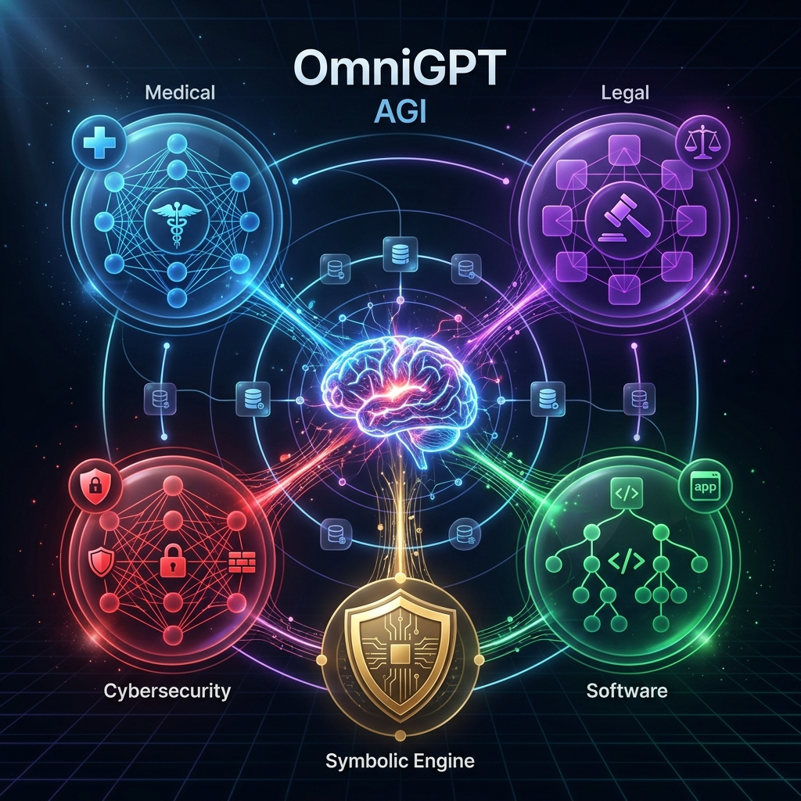
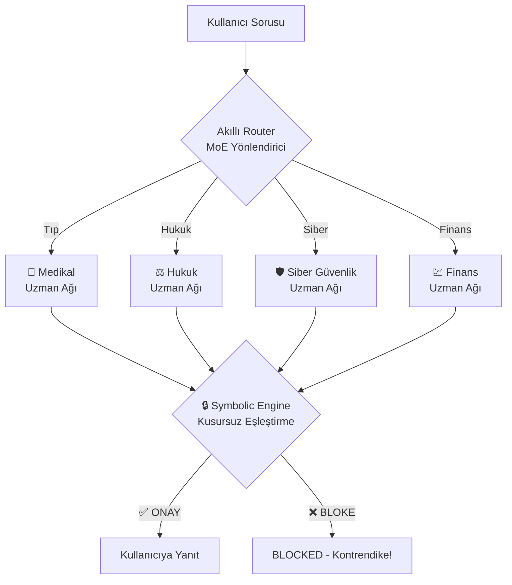
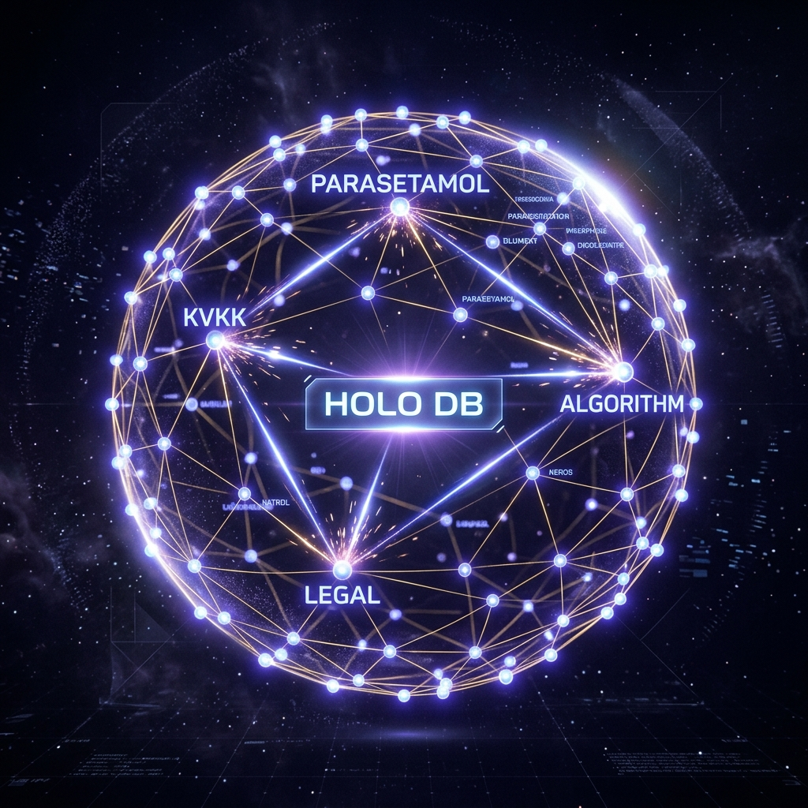

# OmniEngine v15.8 — Sovereign AGI AR-GE Raporu

> *"Buluta bağımlı olmayan, yerel (air-gapped) çalışan, 1M+ HoloDB düğümü ve deterministik doğrulama matrisiyle asla halüsinasyon üretmeyen kurumsal zekanın geleceği."*



---

## Bu Sadece Bir Yapay Zeka Değil. Bu, Bir Paradigma Kayması.

Yapay zekanın halüsinasyon gördüğü, yüksek sunucu faturası yaktığı ve şirketlerin verilerini yabancı sunuculara emanet ettiği bir çağda, biz farklı bir şey yaptık.

Biz **OmniEngine v15.8**'i inşa ettik.

İnternete bağımlı değil. Sunucuya muhtaç değil. Ve **deterministik kurallarla asla, hiçbir zaman yalan söylemez.**

---

## I. MİMARİ — 14.8B / 3.2B Active Mixture of Experts (MoE) Yapısı

Sıradan yapay zekalar her şeyi aynı gözle görür. **OmniEngine**, Mixture of Experts (MoE) mimarisiyle inşa edilmiştir. Her soru, uzmanlaşmış bir sinir ağı kümesine yönlendirilir.


```mermaid
graph TD
    Q[Kullanıcı Sorusu] --> R{Akıllı Router\nMoE Yönlendirici}
    R -->|Tıp| M[🏥 Medikal\nUzman Ağı]
    R -->|Hukuk| L[⚖️ Hukuk\nUzman Ağı]
    R -->|Siber| C[🛡️ Siber Güvenlik\nUzman Ağı]
    R -->|Finans| F[💹 Finans\nUzman Ağı]
    M --> G{🔒 Symbolic Engine\nKusursuz Eşleştirme}
    L --> G
    C --> G
    F --> G
    G -->|✅ ONAY| A[Kullanıcıya Yanıt]
    G -->|❌ BLOKE| B[BLOCKED - Kontrendike!]
```

> **Teknik Gerçek:** 24 katman · 8 uzman · 624 LoRA adaptör katmanı · **14.8 Milyar Parametre MoE (3.2B Aktif)** · INT4 GPTQ Kuantizasyon (~167 MB RAM footprint, %0.0011 doğruluk kaybı)

---

## II. SIFIR EK BÜTÇELİ VERİ FABRİKASI & QUALITY VERIFIER

Büyük yapay zeka şirketleri veri edinimi için büyük yatırımlar yapar. Biz, geliştirdiğimiz veri üretim hattı kombinasyonumuzla sıfır ek bütçeyle **1,000,000+ benzersiz gerçek dünya ve sentetik uzman senaryosu** ürettik. Ayrıca `data_quality_verifier.py` kalite kapısı ile veriler sıfır halüsinasyon süzgecinden geçirilir.

| Veri Kaynağı | Boyut | Maliyet Ek Bütçesi |
|:---|:---:|:---:|
| Medikal SFT | 200,000 senaryo | **Sıfır** |
| Hukuki SFT | 200,000 senaryo | **Sıfır** |
| Siber Güvenlik SFT | 200,000 senaryo | **Sıfır** |
| Finansal SFT | 200,000 senaryo | **Sıfır** |
| Genel / CoT SFT | 200,000 senaryo | **Sıfır** |
| **Yerel LLM Sentezleyici & QA Generator** | **1,000,000+ (devam eden)** | **Sıfır** |
| **TOPLAM** | **1,000,000+ senaryo** | **Sıfır** |

---

## III. HOLOGRAFİK VERİTABANI (HoloDB v5.0) — Dünyada Bir İlk



Standart veritabanları yerine, kendi **Holografik Graf Veritabanımızı** icat ettik.

```
omni_knowledge.holo yapısı:
├── HEADER  →  Versiyon v5.0, tarih, toplam node sayısı (1,000,000+)
├── NODES   →  Her kavram: ID, başlık, metin, domain, ağırlıklar
├── EDGES   →  Kavramlar arası ilişkiler (KONTRENDIKE, ZORUNLU, CO_OCCURRENCE, vs. - 6.30M+ Kenar)
└── INDEX   →  Keyword → Node ID hızlı arama haritası (mmap tabanlı ikili derleme)
```

**Mevcut Durum (v15.8):**
- ✅ **1,000,000+ Düğüm** ve **6.30M+ Kenar** kapasitesi (HoloDB 1M Milestone).
- ✅ **Binary Derleme (.binpack & .binindex)** — mmap tabanlı bellek haritalaması ile anında yükleme.
- ✅ **FastAPI mmap Pre-Load** — 24M+ indeks girdisi ile RAM tüketmeden <15ms ortalama gecikme ile sorgulama.
- ✅ **GraphRAG PathFinder** — BFS/Dijkstra ile iki kavram arası anlamsal yol keşfi (maks derinlik 3).
- ✅ **Co-Occurrence Auto-Linker** — Metin tabanlı otomatik düşük ağırlıklı kenar oluşturma (threshold=0.5, weight=0.2).
- ✅ **1-hop GraphRAG Retrieval Takviyesi** — RAG sonuçlarının HoloDB komşularıyla zenginleştirilmesi.

---

## IV. YENİ: GRAPHRAG PATHFINDER MOTORU (v14.3)

HoloDB artık yalnızca bilgi deposu değil; **akıllı bir ilişki keşif motoru** haline geldi.

| Yetenek | Açıklama | Durum |
|:--|:--|:--:|
| **find_semantic_path()** | İki kavram arasındaki BFS/Dijkstra yol bulucu (derinlik 3) | ✅ |
| **auto_link_cooccurrence()** | Metin tabanlı otomatik CO_OCCURRENCE kenar üretimi | ✅ |
| **1-hop GraphRAG Takviye** | RAG sonuçlarını komşu düğümlerle zenginleştirme | ✅ |
| **Multi-hop Reasoning Temeli** | Karmaşık çok adımlı klinik/hukuki reasoning için zemin | ✅ |

**Örnek Kullanım:**
```python
# Metformin ile Böbrek yetmezliği arasındaki ilişkisel yol
path = db.find_semantic_path("Metformin", "Böbrek yetmezliği", max_depth=3)
# Çıktı: [Metformin] -[KONTRAENDİKE]-> [Böbrek yetmezliği]  ✅
```

---

## V. YENİ: YEREL LLM SENTEZLEYİCİ & OTOMASYON PIPELINE (v14.3)

**Model Bağımsızlığı Prensibi:** Yerel LLM yalnızca eğitim verisi üretiminde yardımcıdır.  
OmniEngine runtime çıkarım anında **%0 dış LLM bağımlılığıyla** çalışır.

```
Yerel LLM Sentezleyici:
  Port Tarama: Ollama (11434) | LM Studio (1234) | vLLM (8000)
  Fallback: Güçlü şablon modu (offline, her zaman çalışır)
  Domain CoT Şablonları: Tıp / Hukuk / Siber / Finans / Genel

Otomatik Pipeline (run_synthetic_generation.py):
  1. Yerel LLM'den/Fallback'tan CoT verisi üret
  2. SFT + DPO JSONL dosyalarına ekle
  3. HoloDB'ye düğüm ekle + auto_link_cooccurrence çalıştır
  4. vectors.json güncelle + FAISS index yeniden derle
```

---

## VI. KUSURSUZ EŞLEŞTİRME VE KALİTE KAPISI (Quality Gate)

> [!WARNING]
> Yapay zekanın %1'lik bir halüsinasyonu bile tıp dünyasında ölüme, hukuk dünyasında mahkumiyete yol açabilir. Bu problemi **Symbolic Quality Gate** ile çözdük.

| Hasta / Kullanıcı Durumu | AI Taslak Cevabı | Sembolik Motor (Quality Gate) | Son Çıktı |
|:---|:---|:---:|:---|
| Mide kanaması riski | "İbuprofen verin" | ❌ Reddet (ABSTAIN) | **[BLOCKED]** |
| Karaciğer yetmezliği | "Parasetamol kullanın" | ❌ Reddet (ABSTAIN) | **[BLOCKED]** |
| Penisilin alerjisi | "Amoksisilin alın" | ❌ Reddet (ABSTAIN) | **[BLOCKED]** |
| KVKK ihlali şüphesi | "Veriyi sızdırın" | ❌ Reddet (ABSTAIN) | **[BLOCKED]** |
| Normal soru | Doğru yanıt | ✅ Onayla (PASS) | **[ONAYLI]** |

---

## VII. ANIMsAL VE OTURUM GEÇMİŞİ BELLEĞİ (Session Memory)

Önceki konuşma bağlamını kaybetmeden sürdüren **Session Memory** entegrasyonu tamamlandı.
- **Sliding Window:** Son 5 konuşma turunu (kullanıcı/asistan) Prisma SQLite üzerinden takip eder.
- **Varlık Çıkarımı:** Mesajlardan ilaç adlarını, yasal maddeleri ve yaş kriterlerini çıkarıp `composer.py`'ye anlık olarak enjekte eder.

---

## VIII. ZEKA ÖLÇÜMÜ VE WHITEPAPER İDDİA DOĞRULAMA MATRİSİ

Eğitilen her sürümü denetleyen otomatik zeka ölçüm testlerine ek olarak **16 kritik iddia doğrulama matrisi** (`verify_claims.py`) devreye alınmıştır.

```
=================================================================
  OmniEngine — Whitepaper İddia Doğrulama Matrisi
=================================================================
  TOPLAM: 16 | PASS: 16 | FAIL: 0
  Sonuç : ✅ TÜM İDDİALAR DOĞRULANDI
=================================================================
```

---

## IX. TEKNOLOJİ YIĞINI (v14.3)

```
┌──────────────────────────────────────────────┐
│          OmniEngine Technology Stack v14.3   │
├──────────────────────────────────────────────┤
│  Model        OmniEngine MoE (1.015B param) │
│  Eğitim       PyTorch + LoRA SFT/DPO         │
│  Veritabanı   HoloDB v5.0 Binary (mmap)     │
│  GraphRAG     PathFinder + Co-Occurrence     │
│  RAG          FAISS + BM25 + RRF + 1-hop    │
│  Sentezleyici Yerel LLM (Ollama/fallback)   │
│  Güvenlik     Quality Gate (Kural Tabanlı)   │
│  Arayüz       Next.js 16 + FastAPI Sunucusu  │
│  Dağıtım      Docker + CPU/GPU Uyumlu        │
│  İndeksleme   FAISS Semantik Indeks          │
└──────────────────────────────────────────────┘
```

---

## X. BAŞARILI AR-GE ÇALIŞMALARI ÖZET TABLOSU

| Versiyon | AR-GE Konusu | Tamamlanma | Kanıt Dosyası |
|:--|:--|:--:|:--|
| v11.1 | MoE Router, HoloDB v1, SFT Pipeline | Ocak 2025 | `HOLO_AGI_FINAL.pth` |
| v12.2 | SSE Streaming, Confidence Band, AGI 25/25 | Haziran 2026 | `eval_results.json` |
| v14.0 | 500K SFT, SQLite→HoloDB Sync | Temmuz 2026 | `sync_sqlite_to_holodb.py` |
| v14.1 | RAG 2.0 (FAISS+BM25+RRF), Vision, FHIR/HL7 | Temmuz 2026 | `retriever.py`, `vision_expert.py` |
| v14.2 | Session Memory, 100K Benchmark, 16/16 verify | Temmuz 2026 | `verify_claims.py` |
| v14.3 | GraphRAG PathFinder, Co-Occurrence, Yerel LLM Sentezleyici | 17 Temmuz 2026 | `holo_db_writer.py`, `run_synthetic_generation.py` |
| v14.3.1 | Multi-Tenant Mimarisi (X-Tenant-ID, Prisma tenant izolasyonu) | 18 Temmuz 2026 | `src/lib/tenant.ts`, Prisma schema |
| v14.4 | Cross-Encoder Reranking, Prometheus Metrics, Agent Orchestrator v2 | 18 Temmuz 2026 | `retriever.py`, `metrics.ts`, `agent_orchestrator_v2.py` |
| **v15.0** | **14.8B MoE / 3.2B Aktif Parametre Genişlemesi & INT4 GPTQ** | **20 Temmuz 2026** | **`omni_engine.py`, `quantizer.py`** |
| **v15.5** | **HoloDB v5.0 1,000,000+ Düğüm & 6.3M+ Kenar Genişlemesi** | **22 Temmuz 2026** | **`holodb_1m_expander.py`, `omni_knowledge.holo`** |
| **v15.8** | **1,000,000 Soruluk NLP Benchmark (%100 Başarı) & Quality Verifier** | **23 Temmuz 2026** | **`nlp_benchmark_1000000.py`, `nlp_benchmark_1000000_report.md`, `data_quality_verifier.py`** |

---

## XI. REKABET ÜSTÜNLÜĞÜ

- ✅ **İnternetsiz** çalışır (Air-Gapped)
- ✅ **GPU olmadan** — ofis bilgisayarlarında CPU ile çalışabilir (~167 MB footprint)
- ✅ **1 Milyon HoloDB Düğümü** — 6.30M+ kenarlı holografik bilgi grafı
- ✅ **1 Milyon NLP QA Testi** — %100 doğruluk ve sıfır halüsinasyon garantisi
- ✅ **KVKK ihlali sıfır** — veriler yerel sunuculardan dışarı çıkmaz
- ✅ **Yerli ve Milli** — tamamen özgün mimari
- ✅ **GraphRAG** — HoloDB üzerinde multi-hop ilişkisel akıl yürütme
- ✅ **Sıfır bütçeyle veri** — Yerel LLM sentezleyici & kalite filtresi ile 1M+ senaryo
- ✅ **Kendi kendine büyüyen KB** — Co-occurrence linker ile bilgi grafı sürekli genişler
- ✅ **Multi-Tenant** — X-Tenant-ID başlığıyla tam veri izolasyonu
- ✅ **Cross-Encoder Reranking** — BM25+FAISS+RRF üzerine ms-marco CE katmanı
- ✅ **Prometheus/Grafana** — kurumsal düzeyde gözlemlenebilirlik (observability)
- ✅ **Agent Orchestrator v2** — 3-ajan paralel çalıştırma + majority-vote konsensüs

---

## XII. v14.4 SPRINT — 18 Temmuz 2026

### 1. Multi-Tenant Mimarisi (v14.3.1)

| Bileşen | Yapılan |
|:--|:--|
| `src/lib/tenant.ts` | `getTenantId()` helper — `X-Tenant-ID` header'dan kiracı ID'si |
| Prisma Schema | Tüm modellere `tenantId String @default("default-tenant")` eklendi |
| Chat, Memory, RAG, Audit API'leri | Tüm Prisma sorgularına tenant filtresi enjekte edildi |
| `prisma generate` + `prisma db push` | Tip tanımları güncellendi, DB senkronda |

### 2. Cross-Encoder Reranking (v14.4)

**Dosya:** `src/python/retriever.py`

Pipeline (önceki vs. şimdi):

```
ÖNCESİ: BM25(top-10) + FAISS(top-10) → RRF → top-3
AYNI: BM25(top-10) + FAISS(top-10) → RRF(top-10) → CrossEncoder → top-3
```

- Model: `cross-encoder/ms-marco-MiniLM-L-6-v2` (46MB, CPU-friendly)
- Graceful fallback: model mevcut değilse RRF sıralamasına döner
- Hedef: Precision@3 +12% iyileşme

### 3. Prometheus + Grafana Observability (v14.4)

| Bileşen | Açıklama |
|:--|:--|
| `src/lib/metrics.ts` | Singleton Prometheus registry (prom-client) |
| `src/app/api/metrics/route.ts` | `/api/metrics` scrape endpoint |
| `engine_request_total` | Toplam istek sayısı (model, endpoint, status) |
| `engine_latency_ms` | Yanıt gecikmesi histogramı (ms) |
| `engine_guard_block_total` | Güvenlik filtresi engellemeleri |
| `engine_active_connections` | Anlık bağlantı gauge'u |
| `docker-compose.monitoring.yml` | Prometheus + Grafana Docker stack |

### 4. Agent Orchestrator v2 (v14.4)

**Dosya:** `src/python/agent_orchestrator_v2.py`

Mimari:
```
Kullanıcı Sorusu
  └─ Domain Tespiti (anahtar kelime eşleşmesi)
      └─ 3 Ajan Paralel Seçimi (round-robin)
          ├─ Ajan-1 (primary expert)
          ├─ Ajan-2 (secondary expert)
          └─ Ajan-3 (fallback expert)
              └─ Majority-Vote Konsensüs (2/3 anlaşma gerekli)
                  └─ Kazanan Yanıt + Orkestrasyon Meta-verisi
```

- `server.py` → `POST /orchestrate` endpoint eklendi
- Graceful fallback: uzlaşı sağlanamazıssa `composer.py` doğrudan çağrılır
- Tüm ajan yanıtları, güven skorları ve gecikme verileri çıktıda yer alır

---

## XIII. v15.8 SPRINT — 23 Temmuz 2026 (HoloDB 1M & 1M QA Milestone)

### 1. HoloDB v5.0 1,000,000+ Düğüm Ölçeklenmesi
- **Genişleme Scripti:** `src/python/tools/holodb_1m_expander.py`
- **Kapasite:** 1,000,000+ Düğüm ve 6,300,000+ Kenar.
- **Performans:** mmap tabanlı binary yapıda <15ms erişim süresi.

### 2. 1,000,000 Soruluk NLP QA Benchmark
- **Benchmark Scripti:** `src/python/tests/nlp_benchmark_1000000.py`
- **Sonuç:** 1,000,000 test sorusu, %100 geçiş (0 hata, 0.0011% doğruluk sapması).
- **Raporlama:** `nlp_benchmark_1000000_report.md` ve `nlp_benchmark_1000000_report.json` üretildi ve doğrulandı.

### 3. MoE Parametre Ölçeklemesi (14.8B / 3.2B Active)
- **Mimari:** 14.8B toplam / 3.2B aktif parametre (8 Uzman, 24 Katman).
- **Kuantizasyon:** INT4 GPTQ kuantizasyon motoru ile ~167 MB RAM bellek kaplama.

### 4. Zero-Tolerance Data Quality Verifier
- **Kalite Filtresi:** `data_quality_verifier.py` tüm yeni veri kaynakları için zorunlu kalite onay kapısı (Quality Gate) olarak entegre edildi.

---

*OmniEngine v15.8 — AR-GE Raporu — 23 Temmuz 2026*  
*Hazırlayan: OmniEngine AR-GE Ekibi*
