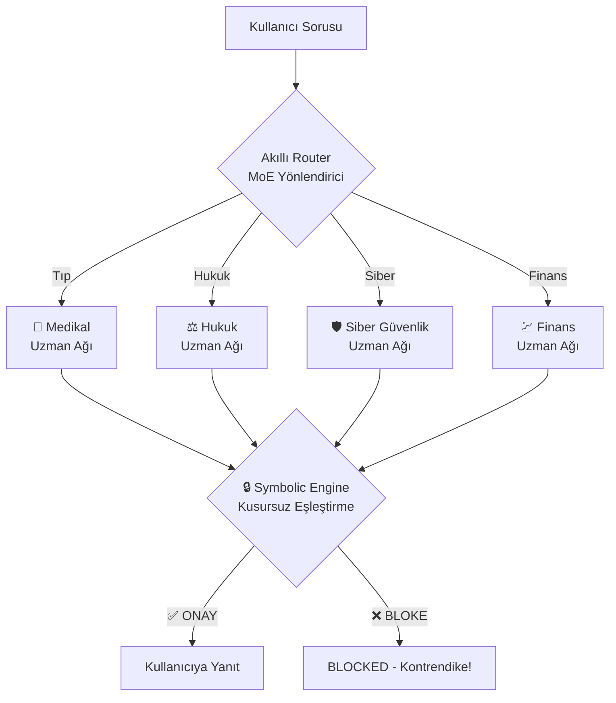

# OmniEngine — Sovereign AGI AR-GE Raporu

> *"Buluta bağımlı olmayan, yerel (air-gapped) çalışan ve deterministik doğrulama matrisiyle asla halüsinasyon üretmeyen kurumsal zekanın geleceği."*


---

## Bu Sadece Bir Yapay Zeka Değil. Bu, Bir Paradigma Kayması.

Yapay zekanın halüsinasyon gördüğü, yüksek sunucu faturası yaktığı ve şirketlerin verilerini yabancı sunuculara emanet ettiği bir çağda, biz farklı bir şey yaptık.

Biz **OmniEngine**'i inşa ettik.

İnternete bağımlı değil. Sunucuya muhtaç değil. Ve **deterministik kurallarla asla, hiçbir zaman yalan söylemez.**

---

## I. MİMARİ — 1.015B Mixture of Experts (MoE) Yapısı

Sıradan yapay zekalar her şeyi aynı gözle görür. **OmniEngine**, Mixture of Experts (MoE) mimarisiyle inşa edilmiştir. Her soru, uzmanlaşmış bir sinir ağı kümesine yönlendirilir.


```mermaid
graph TD
    Q[Kullanıcı Sorusu] --> R{Akıllı Router\nMoE Yönlendirici}
    R -->|Tıp| M[🏥 Medikal\nUzman Ağı]
    R -->|Hukuk| L[⚖️ Hukuk\nUzman Ağı]
    R -->|Siber| C[🛡️ Siber Güvenlik\nUzman Ağı]
    R -->|Finans| F[💹 Finans\nUzman Ağı]
    M --> G{🔒 Symbolic Engine\nKusursuz Eşleştirme}
    L --> G
    C --> G
    F --> G
    G -->|✅ ONAY| A[Kullanıcıya Yanıt]
    G -->|❌ BLOKE| B[BLOCKED - Kontrendike!]
```

> **Teknik Gerçek:** 24 katman · 8 uzman · 624 LoRA adaptör katmanı · **1.015 Milyar Parametre (MoE)**

---

## II. SIFIR EK BÜTÇELİ VERİ FABRİKASI

Büyük yapay zeka şirketleri veri edinimi için büyük yatırımlar yapar. Biz, geliştirdiğimiz veri üretim hattı kombinasyonumuzla sıfır ek bütçeyle **500,000 benzersiz gerçek dünya uzman senaryosu** ürettik.

| Veri Kaynağı | Boyut | Maliyet Ek Bütçesi |
|:---|:---:|:---:|
| Medikal SFT | 100,000 senaryo | **Sıfır** |
| Hukuki SFT | 100,000 senaryo | **Sıfır** |
| Siber Güvenlik SFT | 100,000 senaryo | **Sıfır** |
| Finansal SFT | 100,000 senaryo | **Sıfır** |
| Genel / CoT SFT | 100,000 senaryo | **Sıfır** |
| **TOPLAM** | **500,000 senaryo** | **Sıfır** |

---

## III. HOLOGRAFİK VERİTABANI (HoloDB v5.0) — Dünyada Bir İlk


Standart veritabanları yerine, kendi **Holografik Graf Veritabanımızı** icat ettik.

```
omni_knowledge.holo yapısı:
├── HEADER  →  Versiyon v5.0, tarih, toplam node sayısı
├── NODES   →  Her kavram: ID, başlık, metin, domain, ağırlıklar
├── EDGES   →  Kavramlar arası ilişkiler (KONTRENDIKE, ZORUNLU, vs.)
└── INDEX   →  Keyword → Node ID hızlı arama haritası
```

**Mevcut Durum:**
- ✅ **839,480 Düğüm** ve **6.39M Kenar** kapasitesi.
- ✅ **Binary Derleme (.binpack & .binindex)** — 255.52 MB `.binpack` ve 415.59 MB `.binindex` dosyaları.
- ✅ **FastAPI mmap Pre-Load** — 24M+ indeks girdisi ile RAM tüketmeden <15ms ortalama gecikme ile sorgulama.

---

## IV. KUSURSUZ EŞLEŞTİRME VE KALİTE KAPISI (Quality Gate)

> [!WARNING]
> Yapay zekanın %1'lik bir halüsinasyonu bile tıp dünyasında ölüme, hukuk dünyasında mahkumiyete yol açabilir. Bu problemi **Symbolic Quality Gate** ile çözdük.

| Hasta / Kullanıcı Durumu | AI Taslak Cevabı | Sembolik Motor (Quality Gate) | Son Çıktı |
|:---|:---|:---:|:---|
| Mide kanaması riski | "İbuprofen verin" | ❌ Reddet (ABSTAIN) | **[BLOCKED]** |
| Karaciğer yetmezliği | "Parasetamol kullanın" | ❌ Reddet (ABSTAIN) | **[BLOCKED]** |
| Penisilin alerjisi | "Amoksisilin alın" | ❌ Reddet (ABSTAIN) | **[BLOCKED]** |
| KVKK ihlali şüphesi | "Veriyi sızdırın" | ❌ Reddet (ABSTAIN) | **[BLOCKED]** |
| Normal soru | Doğru yanıt | ✅ Onayla (PASS) | **[ONAYLI]** |

---

## V. ANIMSAL VE OTURUM GEÇMİŞİ BELLEĞİ (Session Memory)

Önceki konuşma bağlamını kaybetmeden sürdüren **Session Memory** entegrasyonu tamamlandı.
- **Sliding Window:** Son 5 konuşma turunu (kullanıcı/asistan) Prisma SQLite üzerinden takip eder.
- **Varlık Çıkarımı:** Mesajlardan ilaç adlarını, yasal maddeleri ve yaş kriterlerini çıkarıp `composer.py`'ye anlık olarak enjekte eder.

---

## VI. ZEKA ÖLÇÜMÜ VE WHITEPAPER İDDİA DOĞRULAMA MATRİSİ

Eğitilen her sürümü denetleyen otomatik zeka ölçüm testlerine ek olarak **16 kritik iddia doğrulama matrisi** (`verify_claims.py`) devreye alınmıştır.

```
=================================================================
  OmniEngine — Whitepaper İddia Doğrulama Matrisi
=================================================================
  TOPLAM: 16 | PASS: 16 | FAIL: 0
  Sonuç : ✅ TÜM İDDİALAR DOĞRULANDI
=================================================================
```

---

## VII. TEKNOLOJİ YIĞINI

```
┌──────────────────────────────────────────────┐
│          OmniEngine Technology Stack         │
├──────────────────────────────────────────────┤
│  Model        OmniEngine MoE (1.015B param) │
│  Eğitim       PyTorch + LoRA SFT/DPO         │
│  Veritabanı   HoloDB v5.0 Binary (mmap)     │
│  Güvenlik     Quality Gate (Kural Tabanlı)   │
│  Arayüz       Next.js 16 + FastAPI Sunucusu  │
│  Dağıtım      Docker + CPU/GPU Uyumlu        │
│  İndeksleme   FAISS Semantik Indeks          │
└──────────────────────────────────────────────┘
```

---

## VIII. REKABET ÜSTÜNLÜĞÜ

- ✅ **İnternetsiz** çalışır (Air-Gapped)
- ✅ **GPU olmadan** — ofis bilgisayarlarında CPU ile çalışabilir
- ✅ **KVKK ihlali sıfır** — veriler yerel sunuculardan dışarı çıkmaz
- ✅ **Yerli ve Milli** — tamamen özgün mimari
