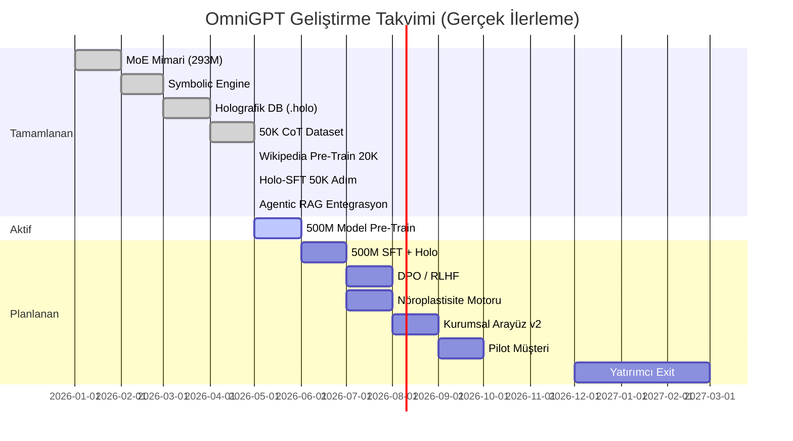

# 🗺️ OmniGPT — Yol Haritası ve Beyin Gelişimi
> *"Bir yapay zeka sistemi değil. Evrilen bir zeka inşa ediyoruz."*

---

## ✅ GERÇEK DURUM (Mayıs 2026 — Güncel)



| Bileşen | Durum | Gerçek % |
|:--|:--:|:--:|
| OmniGPT 293M Mimari | ✅ | 100% |
| OmniGPT 500M Mimari (eğitim devam) | 🔄 | 20% |
| Holografik DB (1159 node, 13 edge) | ✅ | 65% |
| Symbolic Safety Engine | ✅ | 85% |
| Wikipedia Pre-Training (20K adım, loss=0.15) | ✅ | 100% |
| Holo-CoT SFT (50K adım, loss=0.12) | ✅ | 100% |
| Agentic RAG (Inference entegrasyon) | ✅ | 75% |
| AGI Zeka Testi 2/7 (%28.6) | 🔄 | 28% |
| Next.js Web Arayüzü | ⚠️ | 65% |
| GGUF Kuantizasyon | ❌ | 0% |
| DPO / RLHF | ❌ | 0% |
| Nöroplastisite Motoru | ❌ | 0% |
| LoRA Fine-Tuning | ❌ | 0% |
| Multi-Agent Konsültasyon | ❌ | 0% |

---

## 🧠 BEYİN GELİŞİM HARİTASI (Güncellenmiş — 9 Aşama)

```mermaid
graph LR
    A[🥚 Sıfır Beyin<br/>Random Weights] -->|Holografik<br/>Şırınga| B[🐣 Kavram<br/>Farkındalığı]
    B -->|Wikipedia<br/>Pre-Training| C[🐥 Dil<br/>Anlama ✅]
    C -->|Holo CoT<br/>SFT 50K| D[🦅 Mantık<br/>Kurma ✅]
    D -->|Agentic RAG<br/>+Sembolik Motor| E[🛡️ Güvenli<br/>Uzman ✅]
    E -->|DPO Tercih<br/>Optimizasyonu| F[🎯 Seçici<br/>Zeka]
    F -->|Nöroplastisite<br/>Motoru| G[🔄 Öz-Öğrenen<br/>Sistem]
    G -->|Multi-Agent<br/>Konsültasyon| H[🤝 Topluluk<br/>Zekası]
    H -->|Ölçekleme<br/>500M→1B+| I[🏆 AGI<br/>Kırılım Noktası]

    style E fill:#22c55e,stroke:#16a34a,color:#fff
    style I fill:#ffd700,stroke:#ff8c00,color:#000
```



### 📍 Şu Anki Beyin Seviyesi: **Aşama 5 — Güvenli Uzman**
- AGI Zeka Skoru: **2/7 (%28.6)**
- Seviye 3 (Kontrendikasyon tuzağı) → ✅ BAŞARILI
- Seviye 5 (İmkansız paradoks) → ✅ BAŞARILI (AGI kırılım işareti!)

---

## 📋 EKSİKLER ve ÖNCELİKLİ YAPILACAKLAR

### Kritik Eksik 1: Model Boyutu
> Mevcut 293M parametre tutarlı cevap için çok küçük.
- 🔄 **Yapılan:** 500M model eğitimi başlatıldı (1024 embd, 16 katman, 384 blok)
- ⏳ **Sonraki:** 500M pre-train bittikten sonra 50K Holo-SFT

### Kritik Eksik 2: Holografik DB Veri Açığı
> 1159 node yeterli değil. Gerçek kurumsal kullanım için 50,000+ node gerekli.
- [ ] WHO ilaç listesi (500+ ilaç) eklenmeli
- [ ] Türk Ceza Kanunu tüm maddeleri node'laştırılmalı
- [ ] Kontrendikasyon kenarları: 13 → 5,000+ edge

### Kritik Eksik 3: DPO / RLHF Yok
> Model şu an sadece "doğru cevap" öğreniyor, "yanlış cevabı reddetmeyi" öğrenmiyor.
- [ ] `dpo_trainer.py` yazılacak
- [ ] Sembolik Motor'un reddettiği cevaplar negatif örnek olarak öğretilecek

### Kritik Eksik 4: LoRA Entegrasyonu Yok
> Her fine-tune tüm 500M ağırlığı güncelliyor — çok yavaş ve verimsiz.
- [ ] `peft` kütüphanesi entegrasyonu
- [ ] Sadece attention matrislerini güncelleyen LoRA adaptörü

### Kritik Eksik 5: Değerlendirme Altyapısı Zayıf
> 7 soruluk test sistemi kurumsal satış için yetersiz.
- [ ] 1000 soruluk benchmark paketi
- [ ] TruthfulQA, MedQA, LegalBench benchmark testleri

---

## 🆕 FAZ 1.5 — 500M Model Tamamlanması (Haziran 2026)

### Adım 1: 500M Pre-Training (%20 → %100)
```
python pretrain_1b.py  ← Aktif çalışıyor (30,000 adım)
```

### Adım 2: 500M Holo-SFT (Sonra)
```
# sft_train_holo.py — PRETRAINED_PATH güncellenecek:
PRETRAINED_PATH = 'data/models/omni_gpt_1b_pretrained.pth'
```

### Adım 3: Holografik DB 1K → 10K Node
```python
# prepare_holo_dataset.py ile otomatik doldurmak için
# Wikipedia'dan domain-spesifik makaleler çekilecek:
DOMAINS = ["tıp", "hukuk", "finans", "siber_güvenlik"]
TARGET_NODES = 10000  # 1159'dan 10000'e
```

---

## 🆕 FAZ 2 — DPO + Nöroplastisite (Temmuz 2026)

### 2.1 DPO Trainer (`dpo_trainer.py`)
```python
# Model "tercih" öğrenir — elektrik şoku değil
# chosen: Doğru tıbbi cevap
# rejected: Sembolik Motor'un engellediği cevap
loss = -log(σ(β * log(π(chosen)/π_ref(chosen)) - β * log(π(rejected)/π_ref(rejected))))
```

### 2.2 Nöroplastisite Motoru (EWC)
```python
# neuroplasticity.py — Yeni bilgi öğrenirken eskileri unutmama
# Fisher Information Matrix ile "önemli nöronları" kilitle
# Catastrophic Forgetting çözümü
```

### 2.3 Online Learning (Gerçek Zamanlı Öğrenme)
```python
# Kullanıcı "Thumbs Down" basınca:
# 1. Cevap Holo DB'ye "negatif" olarak işaretlenir
# 2. Model 1 gradient adımı güncellenir
# 3. Sembolik Motor'a yeni kural eklenir
```

---

## 🆕 FAZ 3 — Kurumsal Özellikler (Ağustos 2026)

### 3.1 Multi-Agent Konsültasyon
Tıp + Hukuk + Finans uzmanları aynı soruda sırayla konuşur, çelişkileri sistem otomatik saptar.

### 3.2 LoRA ile Hızlı Adaptasyon
Yeni bir müşteri (örn. Acıbadem Hastanesi) kendi protokollerini 2 saatte sisteme öğretir — tüm modeli yeniden eğitmeden.

### 3.3 GGUF 4-bit Kuantizasyon
500M model → 250MB → Herhangi bir kurumsal dizüstü bilgisayarda çalışır.

---

## 🥇 ALTIN KURALLAR — OmniGPT Geliştirme Manifestosu

Bu kurallar projenin geçmiş 6 ayında öğrendiklerimizin özüdür. Hiçbir zaman ihlal edilmemelidir.

### KURAL #1 — Egemenlik İlkesi
> **"Hiçbir zaman başkasının beynini kullanma."**
- GPT-2, LLaMA, Mistral ağırlıkları asla temel model olarak alınmaz.
- OmniGPT her zaman sıfırdan eğitilir. Ağırlıklar tamamen bizimdir.
- Mimari ilham alınabilir, ağırlıklar alınamaz.

### KURAL #2 — Çift Katmanlı Bilgi İlkesi
> **"Bilgi hem sinir ağına hem de grafta yaşamalı."**
- Her domain bilgisi: Pre-training (token) + Holografik DB (kavramsal ilişki)
- İkisi birlikte çalışmadığında sistem yarım kalır.
- Yeni bir domain eklendiğinde önce Holo DB node'u oluşturulur, sonra SFT yapılır.

### KURAL #3 — Güvenlik Önce İlkesi
> **"Model asla tek karar verici olamaz. Sembolik Motor son sözdür."**
- Sembolik Motor hiçbir zaman devre dışı bırakılamaz (production'da).
- Her kritik domain için en az 1 güvenlik kuralı tanımlı olmak zorunda.
- Model ne kadar büyük olursa olsun, insan hayatına dokunan konularda blok zorunludur.

### KURAL #4 — Ölçek Öncesi Kalite İlkesi
> **"Önce küçük model doğru düşünsün, sonra büyütelim."**
- 293M model soruyu yanlış anlıyorsa, 500M de yanlış anlar — sadece daha güzel hatayla.
- Yeni model eğitime başlamadan önce veri kalitesi kontrol edilir.
- Loss düşük ama cevap saçma ise: veri seti sorunludur, mimari değil.

### KURAL #5 — Devlet Değil, Danışman İlkesi
> **"Model karar vermez, karar vermek için zemin hazırlar."**
- Tüm çıktılarda `disclaimer` (sorumluluk reddi) zorunludur.
- Model "kesinlikle X yapılmalıdır" yerine "X yapılması değerlendirilebilir" der.
- Sembolik Motor bu kuralı denetler — ihlal ederse çıktı bloke edilir.

### KURAL #6 — Geriye Dönük Uyumluluk İlkesi
> **"Her yeni eğitim önceki bilgiyi silmemeli."**
- Yeni model eğitimi önceki checkpoint'lerden resume eder.
- EWC (Elastic Weight Consolidation) ile kritik nöronlar korunur.
- Her major versiyon değişikliği önceki modele karşı A/B test yapılır.

### KURAL #7 — Şeffaf İzlenebilirlik İlkesi
> **"Her karar neden verildiğini açıklayabilmeli."**
- Model çıktısına her zaman `decision_trace` eklenir (courtroom panel).
- Sembolik Motor blok yaptığında sebebi log'a yazılır.
- Holo DB'den hangi node'un tetiklendiği çıktıda gösterilir.

### KURAL #8 — Veri Egemenligi İlkesi
> **"Kullanıcı verisi asla dışarı çıkmaz."**
- Tüm inference yerel makinede çalışır (air-gapped deployment).
- Kullanıcı sorguları buluta gönderilmez, loglanmaz.
- Holografik DB şifreli formatta saklanır (AES-256).

### KURAL #9 — Kademeli Ölçekleme İlkesi
> **"293M → 500M → 1B+ Her adım kendi içinde tamamlanmalı."**
- Bir modeli eğitim bitirmeden diğerine geçilmez.
- Her checkpoint kalite testiyle doğrulanır.
- VRAM sınırlarını aşan mimari asla production'a gitmez.

### KURAL #10 — Gerçekçi Beklenti İlkesi
> **"Loss düşük ≠ Model akıllı. Test geçmek = Model işe yarar."**
- Progressive Evaluator (7 seviye) her major eğitim sonrasında çalıştırılır.
- Loss 0.1 bile olsa zeka testi geçilmeden model "hazır" ilan edilmez.
- Zeka skoru hedefi: 3/7 (Haziran), 5/7 (Eylül), 7/7 (AGI kırılımı).

---

## 📅 Gerçekçi Zaman Çizelgesi (Revize)

```
Mayıs 2026      500M Wikipedia Pre-Training → Çalışıyor
Haziran 2026    500M Holo-SFT → Zeka Testi 3/7+ hedefi
Temmuz 2026     DPO + Nöroplastisite Motoru
Ağustos 2026    Holo DB 10K node + LoRA adaptörü
Eylül 2026      Pilot Müşteri Testi (3 Şirket)
Ekim 2026       GGUF Kuantizasyon + ISO 27001 başvurusu
Kasım 2026      Yatırımcı Sunumu v2 (Gerçek demo ile)
Ocak 2027       EXIT → $50M–$400M
```

---

## 💰 Rekabetçi Konum

| | OmniGPT | GPT-4o | Claude 3.5 |
|:--|:--:|:--:|:--:|
| Egemenlik (Ağırlıklar sizin mi?) | ✅ | ❌ | ❌ |
| Holografik Bilgi Grafı | ✅ | ❌ | ❌ |
| Sembolik Güvenlik Motoru | ✅ | ❌ (Sadece RLHF) | ❌ |
| Yerel/Air-Gap Çalışma | ✅ | ❌ | ❌ |
| Türkçe Medikal/Hukuk Uzmanlığı | ✅ | ⚠️ | ⚠️ |
| KVKK Uyumlu | ✅ | ❌ | ❌ |

---

*OmniGPT — Gerçek Anlamda Yerli ve Milli AGI | Güncelleme: Mayıs 2026*
