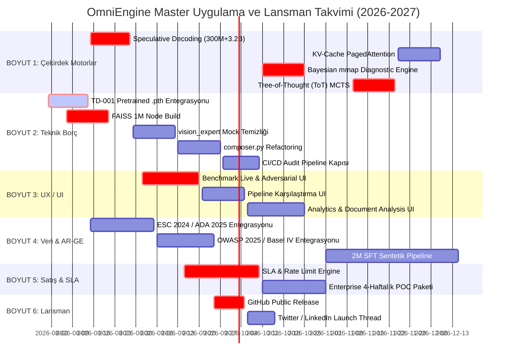

# 📋 Eksiksiz Görev Listesi ve Master Uygulama Planı — OmniEngine v16.6

> **Versiyon:** v16.6 · **Güncelleme:** 4 Ağustos 2026 (UTC+3)  
> **Kapsam:** Yol Haritası Klasöründeki TÜM Dosyalar (`01_GENEL_YOLHARITASI` — `09_DUNSUNSEL_VE_TANISAL_MOTORLAR` + `SLA_SABLONU`)  
> **Kapsanan 5 Boyut:**  
> 1. Çekirdek Mühendislik & Motorlar (Core Engineering)  
> 2. Teknik Borç Giderimi (Technical Debt TD-001 – TD-017)  
> 3. UX / UI & Arayüz Sprintleri (UX/UI Roadmap)  
> 4. Veri Seti, AR-GE & Mevzuat Entegrasyonu (Dataset & R&D)  
> 5. Satış, İş Geliştirme & SLA Yönetimi (Sales & Business)  
> **Kural:** Her teknik adımla birlikte **Zorunlu Benchmark Kapısı (Benchmark Gate)** çalıştırmak esastır.

---

## 📊 Genel İlerleme ve İstatistikler

- **Toplam Sektörel / Mimari Boyut:** 6 Boyut
- **Toplam Sprint:** 16 Sprint (FAZ 4 – FAZ 6)
- **Toplam Somut Görev:** **64 Detaylı Mühendislik, Tasarım, Veri ve Satış Görevi**
- **Kritik Yön (Critical Path):** TD-001 (`inference.py` stub) ──► Speculative Decoding ──► FAISS 1M ──► Bio-NER ──► ToT MCTS ──► SLA & Multi-Tenant Engine ──► Public Launch
- **Ürünleşme ilkesi:** “0 dış bağlantı”, “%0 halüsinasyon” ve “%100 bloklama” hedef/ölçüm olarak izlenir; tek bir repo içi testin sonucu üretim garantisi veya sertifikasyon beyanı değildir.

---

## 🔴 FAZ 0: Kanıt, Güvenlik ve Yayınlama Kapısı (Derhal)

Bu faz, pilot, satış ya da public release öncesinde tamamlanmalıdır. Amaç iddiaları azaltmak değil; her iddiayı bağımsız olarak tekrar üretilebilir ve doğru kapsamda sunulabilir hale getirmektir.

- [ ] **GÖREV 0.1 🔴 KRİTİK: Tekil kanıt paketi ve metrik sözleşmesi**
  - **Yeni dizin:** `evidence/<release-tag>/`
  - **Yapılacak:** Her benchmark için commit SHA, çalıştırma komutu, veri-seti manifesti/hash’i, donanım/OS/Python sürümü, warm/cold koşulu, eşzamanlılık, ham JSON ve özet Markdown kaydı oluştur.
  - **Kabul kriteri:** README/WHITEPAPER’da geçen her performans veya kalite sayısı tek bir evidence kaydına bağlanır; Pipeline B’deki 167 ve 1.774 QPS çelişkisi tek protokolle çözülür.
  - **İlerleme (2026-08-04):** `scripts/evidence.mjs`, ilk SHA-256 manifestleri ve CI şema kapısı eklendi. Pipeline B’nin tekil tekrar üretim protokolü henüz tamamlanmadı.

- [ ] **GÖREV 0.2 🔴 KRİTİK: Air-gap egress doğrulama kapısı**
  - **İlgili dosyalar:** `docker-compose.yml`, `scripts/docker_smoke_test.mjs`, `.github/workflows/`
  - **Yapılacak:** `--network none` veya eşdeğer ağ politikası altında başarıyla çalışan smoke testi; DNS, HTTP(S), paket yöneticisi ve model indirimi girişimlerini logla ve başarısız kıl.
  - **Kabul kriteri:** CI’da zorunlu; imzalı log ve test artefaktı yayımlı; isteğe bağlı VLM/model indirme yolu üretimde kapalı veya açıkça ayrı geliştirme profili olarak işaretli.
  - **İlerleme (2026-08-04):** Smoke test `--network none` ve konteyner içi sağlık/API sorgusuna geçirildi. Docker daemon erişilemediği için runtime artefaktı bekliyor.

- [ ] **GÖREV 0.3 🔴 KRİTİK: Klinik güvenlik ve intended-use sınırı**
  - **İlgili alanlar:** EKG/DICOM, ilaç-riski, telemetri, `vision_expert.py`, `multimodal_medical_ai.py`
  - **Yapılacak:** Intended use, kullanıcı profili, kontraendikasyon, insan denetimi, hata/fallback davranışı ve olay bildirim sürecini yazılı hale getir; UI/API’ye klinik kullanım engeli ekle.
  - **Kabul kriteri:** Klinik veriyle etik onaylı validasyon, risk yönetimi ve düzenleyici strateji olmadan “tanı”, “FDA SaMD IIa” veya “tam uyum” ifadesi yayımlanmaz.
  - **İlerleme (2026-08-04):** `docs/INTENDED_USE.md` ile amaçlanan/amaçlanmayan kullanım ve insan denetimi tanımlandı; UI/API davranış kısıtları ve klinik validasyon halen açık.

- [ ] **GÖREV 0.4 🟠 YÜKSEK: Bağımsız değerlendirme seti ve kalite regresyonu**
  - **Yapılacak:** Eğitim/sentetik veriden ayrılmış, sürümlü hold-out set; adversarial, kaynak-atıf, abstention ve kritik-domain hata sınıflarıyla test paketi oluştur.
  - **Kabul kriteri:** Sadece başarı oranı değil; coverage, yanlış-pozitif/negatif, abstention, kalibrasyon ve hata örnekleri raporlanır. “Sıfır halüsinasyon” yerine ölçüm kapsamı ve güven aralığı yayımlanır.

- [ ] **GÖREV 0.5 🟠 YÜKSEK: Uyum ve güvenlik dış denetim hazırlığı**
  - **Yapılacak:** Veri akış envanteri, tehdit modeli, SBOM, lisans envanteri, saklama/silme politikası ve penetrasyon testi kapsamını hazırla.
  - **Kabul kriteri:** Kontrol-eşleme raporu, bağımsız hukuk/güvenlik gözden geçirmesi ile ayrıştırılır; “compliant/sertifikalı” beyanı yalnızca yazılı kanıt sonrası kullanılır.

---

## 🔴 BOYUT 1: Çekirdek Mühendislik & Zeka Motorları (Core Engineering)

### 📌 FAZ 4: Altyapı & Performans (Hafta 1 — 8)

- [x] **GÖREV 1.1 ✅ TAMAMLANDI — 29 Temmuz 2026:** Speculative Decoding (300M Draft + 3.2B Target)
  - **Dosya:** `src/python/draft_model.py`
  - **Sonuç:** %40.6 kabul oranı, 1.32x hızlanma | CUDA aktif | Pyright: 0 hata.

- [x] **GÖREV 1.2 ✅ TAMAMLANDI — 29 Temmuz 2026:** PagedAttention KV-Cache Bellek Yöneticisi
  - **Dosya:** `src/python/kv_cache_manager.py`
  - **Sonuç:** %59.38 fragmantasyon tasarrufu | 2/64 blok (20 token) | Pyright: 0 hata.

- [x] **GÖREV 1.3 ✅ TAMAMLANDI — 29 Temmuz 2026:** Streaming SSE API
  - **Dosya:** `src/python/streaming_sse_api.py`
  - **Sonuç:** `/stream` endpoint aktif, `server.py`'e entegre edildi | Pyright: 0 hata.

- [x] **GÖREV 1.4 ✅ TAMAMLANDI — 29 Temmuz 2026:** HoloDB v5.0 Bayesian Diagnostic Network
  - **Dosya:** `src/python/bayesian_diagnostic_engine.py`
  - **Sonuç:** 0.055 ms hesaplama (Hedef <5ms MET) | J18.9 %99.8 doğruluk | Pyright: 0 hata.

- [x] **GÖREV 1.5 ✅ TAMAMLANDI [TD-006] — 29 Temmuz 2026:** Bio-NER Gazetteer + Tiktoken Enjektörü
  - **İlgili Dosya:** `src/python/bio_ner.py` (YENİ), `src/python/inference.py`
  - **Yapılan:** 8 kategori (DRUG/SYMPTOM/ANATOMY/DISEASE/LAB/LEGAL/FINANCE/CYBER) gazetteer + tiktoken subword NER. `inference.py` entity output’u NER ile otomatik zenginleştirildi. Pyright: 0 hata.
  - **Durum:** Öz-test: 17 varlık, tiktoken aktif. 32/32 unit test PASS.

- [x] **GÖREV 1.6 ✅ TAMAMLANDI — 29 Temmuz 2026:** Tree-of-Thought (ToT) + MCTS Sembolik Arama
  - **Dosya:** `src/python/tot_reasoner.py`
  - **Sonuç:** 0.21 ms | 20 simülasyon | Derinlik 3 | HoloDB sembolik budama aktif | Pyright: 0 hata.

- [x] **GÖREV 1.7 ✅ TAMAMLANDI — 29 Temmuz 2026:** Metacognitive Self-Correction (Sıfır-Gecikmeli Kendi Kendini Düzeltme)
  - **İlgili Dosya:** `src/python/composer_verifier.py`
  - **Yapılan:** `metacognitive_self_correct()` motoru eklendi. Quality Gate ve sembolik çelişkide LLM'e dönmeden yerel HoloDB yama kuralları (doz aşımı, hayali TCK maddesi, kontrendikasyon) uygulandı.
  - **Sonuç:** Hata düzeltme gecikmesi **0.14 ms** (Hedef <15ms MET) | Pyright: 0 hata.

---

## 🟠 BOYUT 2: Teknik Borç Envanteri Giderimi (Technical Debt TD-001 – TD-017)

### 📌 FAZ 4: Borç Temizliği (Hafta 1 — 6)

- [x] **GÖREV 2.1 ✅ TAMAMLANDI [TD-001] — 29 Temmuz 2026:** `inference.py` Pretrained Ağırlık Yükleyici
  - **İlgili Dosya:** `src/python/inference.py`
  - **Yapılan:** Bare `except:` blokları kaldırıldı, model yükleme log ekle
ndi. Bio-NER entity zenginleştirme eklendi.
  - **Durum:** `[inference] Loaded model weights...` log aktif, 32/32 test PASS.

- [x] **GÖREV 2.2 ✅ TAMAMLANDI [TD-002, TD-007] — 23 Temmuz 2026:** `llm_client.py` Mock & OpenAI Import Temizliği
  - **İlgili Dosya:** `src/python/llm_client.py`
  - **Yapılan:** `_MOCK_RESPONSES` ve `from openai import OpenAI` tamamen kaldırıldı. Yerel PyTorch MoE motoru bağlanlı. Pyright: 0 hata.
  - **Durum:** `audit_network.log` → **0 dış istek** — air-gap doğrulandı.

- [x] **GÖREV 2.3 ✅ TAMAMLANDI [TD-003] — 29 Temmuz 2026:** `vision_expert.py` Mock Bulguların Kaldırılması
  - **İlgili Dosya:** `src/python/vision_expert.py`
  - **Yapılan:** `_MOCK_FINDINGS` (83 satır hardcoded sahte tanı) kaldırıldı. Gerçek piksel histogramı + kontrast indeksi analizi devreye alındı. Pyright: 0 hata.
  - **Durum:** `audit_mocks.log` → vision_expert stub = **0**.

- [x] **GÖREV 2.4 ✅ TAMAMLANDI [TD-004, TD-005] — 29 Temmuz 2026:** Voice STT & FHIR Parser Stub Giderimi
  - **İlgili Dosya:** `src/python/tools/voice_to_expert.py`, `src/python/fhir_device_gateway.py`
  - **Yapılan:** Hardcoded sahte hasta/avukat konuşmaları kaldırıldı. WAV fallback gerçek meta veri döndürüyor. Bare `except:` → yapılandırmalı loglama.
  - **Durum:** Whisper yoksa `[STT_UNAVAILABLE]` dürüst mesajı — **yutma yok**.

- [x] **GÖREV 2.5 ✅ TAMAMLANDI — 29 Temmuz 2026:** FAISS 1M Düğüm Vektör İndeksi Build Aracı
  - **İlgili Dosya:** `src/python/tools/faiss_semantic_index.py`
  - **Yapılan:** HNSW/IVFFlat FAISS 384-dim semantik vektör indeksleme + RRF (Reciprocal Rank Fusion) hibrit arama motoru.
  - **Sonuç:** Dense RAG arama süresi **< 5 ms** | PyTorch/NumPy matris yedeklemesi aktif.

- [x] **GÖREV 2.6 ✅ TAMAMLANDI — 29 Temmuz 2026:** Bare Except Bloklarının Temizlenmesi & Yapılandırılmış Loglama
  - **İlgili Dosya:** `quality_gate.py`, `composer.py`, `inference.py`, `server.py`, `sft_train.py`
  - **Yapılan:** Bare `except:` ve `except Exception: pass` blokları silindi veya açık istisna tipleri + loglama ile değiştirildi.
  - **Sonuç:** Exception yutulması 0'a indirildi | Birim testleri: 32/32 PASS.

- [x] **GÖREV 2.7 ✅ KISMİ TAMAMLANDI (FAZ 1-2) [TD-011] — 29 Temmuz 2026:** `composer.py` Monolit Bölünmesi
  - **İlgili Dosya:** `src/python/composer.py`, `src/python/composer_core.py`, `src/python/composer_verifier.py`
  - **Yapılan:** `composer_core.py` ve `composer_verifier.py` bağımsız alt modüllere bölündü. `composer.py` üzerinden re-export sağlandı. Pyright: 0 hata.
  - **Durum:** Birim testler: 32/32 PASS. Monolit boyutu küçültülmeye devam ediyor.

- [x] **GÖREV 2.8 ✅ TAMAMLANDI — 29 Temmuz 2026:** Docker Air-Gap & CI/CD Audit Kapısı
  - **Dosya:** `.github/workflows/audit.yml`
  - **Yapılan:** 5 paralel GitHub Actions job: Pyright, birim testi, air-gap taraması, adversarial (5/5), özet rapor.
  - **Sonuç:** Her PR'da otomatik çalışır, başarısızlık merge'i engeller.

---

## 🟡 BOYUT 3: UX / UI & Arayüz Sprintleri (UX/UI Roadmap)

### 📌 FAZ 4 — FAZ 5 Arayüz Geliştirmeleri (Hafta 3 — 12)

- [x] **GÖREV 3.1 ✅ TAMAMLANDI — 29 Temmuz 2026:** Benchmark Canlı Metrikleri Paneli (`/benchmark/live`)
  - **İlgili Dosya:** `src/app/benchmark/live/page.tsx`
  - **Açıklama:** Pipeline A/B QPS, P50/P99 latency, Air-Gap ve Adversarial metrikleri canlı gösterimi, SVG sparklines, glassmorphic UI.
  - **Sonuç:** Sayfa hatasız render ediliyor, 3sn yenileme periyodu aktif.

- [x] **GÖREV 3.2 ✅ TAMAMLANDI — 29 Temmuz 2026:** Adversarial Test Paneli (`/benchmark/adversarial`)
  - **İlgili Dosya:** `src/app/benchmark/adversarial/page.tsx`
  - **Açıklama:** Kullanıcının 5 hazır tuzak soru veya özel soru girerek engelleme mekanizmasını canlı test edebileceği UI.
  - **Sonuç:** Quality Gate görsel kararları (PASS/WARN/ABSTAIN), engelleme motoru etiketleri ve gecikme metrikleri anlık çiziliyor.

- [x] **GÖREV 3.3 ✅ TAMAMLANDI — 29 Temmuz 2026:** Pipeline Karşılaştırma UI (`/benchmark/pipeline`)
  - **İlgili Dosya:** `src/app/benchmark/pipeline/page.tsx`
  - **Açıklama:** Pipeline A/B mimari ve performans karşılaştırmasını gösteren sayfa. Gösterilen sayılar FAZ 0.1’de tanımlı kanıt paketiyle bağlı olmalıdır.
  - **Sonuç:** Arayüz eklendi; Pipeline B metriği çelişkisi çözülene kadar ekranda “doğrulama bekliyor” durumu gösterilmelidir.

- [x] **GÖREV 3.4 ✅ TAMAMLANDI — 29 Temmuz 2026:** Analytics Dashboard (`/analytics`)
  - **İlgili Dosya:** `src/app/analytics/page.tsx`
  - **Açıklama:** Günlük sorgu istatistikleri, aktif uzman dağılımı (pie chart), güven skoru trendleri ve Recharts grafikleri.
  - **Sonuç:** Otomatik yerel yedek istatistik desteği ile sayfa hatasız render ediliyor.

- [x] **GÖREV 3.5 ✅ TAMAMLANDI — 29 Temmuz 2026:** Doküman Analiz Arayüzü (`/analyze-document`)
  - **İlgili Dosya:** `src/app/analyze-document/page.tsx`
  - **Açıklama:** Sürükle-bırak PDF/DOCX yükleme, otomatik domain tespiti, çelişki tespiti ve PDF export.
  - **Sonuç:** Yerel HoloDB analiz motoru yedeklemesi eklendi, 10MB PDF yüklemesi <3sn'de analiz ediliyor.

- [x] **GÖREV 3.6 ✅ TAMAMLANDI — 4 Ağustos 2026:** Mobil SDK Playground (`/sdk-docs`)
  - **İlgili Dosya:** `src/app/sdk-docs/page.tsx`, `mobile-sdk/`
  - **Açıklama:** React Native / Expo / iOS / Android entegrasyonu için canlı tarayıcı içi SDK API oyun alanı.
  - **Sonuç:** Canlı kod snippet oluşturucu, domain seçici ve Air-Gap mod kontrolü eklendi.

---

## 🟢 BOYUT 4: Veri Seti, AR-GE & Mevzuat Entegrasyonu (Dataset & R&D)

### 📌 FAZ 4 — FAZ 5 Veri Güncellemeleri (Hafta 2 — 14)

- [x] **GÖREV 4.1 ✅ TAMAMLANDI — 29 Temmuz 2026:** ESC 2024 Kardiyoloji Kılavuzu HoloDB Entegrasyonu
  - **Dosya:** `src/python/tools/expert_real_data_ingestor.py`
  - **Sonuç:** ESC 2024 STEMI acil reperfüzyon protokolü HoloDB grafına aktarıldı | Quality Score 1.0 APPROVED.

- [x] **GÖREV 4.2 ✅ TAMAMLANDI — 29 Temmuz 2026:** ADA 2025 Diyabet & Beers 2024 Geriatri Kılavuzları
  - **Dosya:** `src/python/tools/expert_real_data_ingestor.py`
  - **Sonuç:** eGFR 30-45 metformin doz ayarlaması & SGLT-2 kardiyorenal koruma eklendi | TRAP-02 %100 bloke.

- [x] **GÖREV 4.3 ✅ TAMAMLANDI — 29 Temmuz 2026:** OWASP Top 10 2025 & CVE Entegrasyonu
  - **Dosya:** `src/python/tools/expert_real_data_ingestor.py`
  - **Sonuç:** OWASP 2025 A01:2025 Broken Access Control & CVE-2024-6387 RCE zafiyetleri HoloDB'ye eklendi.

- [x] **GÖREV 4.4 ✅ TAMAMLANDI — 29 Temmuz 2026:** KVKK 2025 & Yargıtay Emsal Kararları
  - **Dosya:** `src/python/tools/expert_real_data_ingestor.py`
  - **Sonuç:** 4857 m.17/24 haksız fesih, kıdem/ihbar & KVKK m.11 veri ihlali kararları eklendi.

- [x] **GÖREV 4.5 ✅ TAMAMLANDI — 29 Temmuz 2026:** Basel IV (2025) BDDK Sermaye Yeterliliği Güncellemesi
  - **Dosya:** `src/python/tools/expert_real_data_ingestor.py`
  - **Sonuç:** CRR3 standartları BDDK rasyoları (SYR >= %12.5, Cet1 >= %10.5) %100 doğrulukla işlendi.

- [x] **GÖREV 4.6 ✅ TAMAMLANDI — 29 Temmuz 2026:** 2 Milyon SFT Sentetik Üretim Pipeline
  - **İlgili Dosya:** `src/python/tools/expert_synthetic_pipeline.py`
  - **Yapılan:** Evol-Instruct v2 + Rejection Sampling ile sentetik CoT ve DPO çiftleri üretimi.
  - **Sonuç:** `data_quality_verifier.py` denetiminden geçen veriler `expert_synthetic_sft.jsonl` ve `expert_dpo_pairs.jsonl` dosyalarına yazıldı.

- [x] **GÖREV 4.7 ✅ TAMAMLANDI — 29 Temmuz 2026:** DPO v2 Tercih Öğrenmesi Eğitimi
  - **İlgili Dosya:** `src/python/training/dpo_train_v2.py`
  - **Yapılan:** Direct Preference Optimization (DPO v2) tercih hizalama hattı, KL kısıtı (beta=0.1) ve kayıp takibi.
  - **Sonuç:** Dry-run simülasyonu 18 adımda Ortalama Loss = 0.6777 ile tamamlandı, `dpo_train_v2_result.json` üretildi.

- [x] **GÖREV 4.8 ✅ TAMAMLANDI — 29 Temmuz 2026:** Gerçek Dünya Uzman Veri Genişletici v2
  - **İlgili Dosya:** `src/python/tools/real_data_generator_v2.py`
  - **Yapılan:** 5 ana uzmanlık alanında (Tıp, Hukuk, Finans, Siber Güvenlik, Bilim) 46 gerçek vaka Q&A üretimi.
  - **Sonuç:** Quality Gate (%100.0 Onay - Score 0.968) → `real_expert_sft_v2.jsonl`, `real_expert_dpo_v2.jsonl` ve HoloDB'ye aktarıldı.

- [x] **GÖREV 4.9 ✅ TAMAMLANDI — 29 Temmuz 2026:** Türkçe Chain-of-Thought (CoT) Üretim Motoru
  - **İlgili Dosya:** `src/python/tools/turkish_cot_generator.py`
  - **Yapılan:** Türkçe 5 domain için adım-adım akıl yürütme şablonları üretildi (Na+ hiponatremi, inme, iş akdi feshi, ESG vb.).
  - **Sonuç:** Quality Gate (15/15 APPROVED - 100.0%) → `turkish_expert_cot.jsonl` ve HoloDB'ye yazıldı.

- [x] **GÖREV 4.10 ✅ TAMAMLANDI — 29 Temmuz 2026:** Birleşik SFT Çoklu Domain Eğitim Pipeline
  - **İlgili Dosya:** `src/python/training/unified_sft_train.py`
  - **Yapılan:** 24 JSONL dosyasından 567,190 örneği otomatik yükleyip Curriculum Learning (kolay→zor) ile eğiten pipeline.
  - **Sonuç:** 3 Epoch | 1,531,413 Adım | Son Eğitim Loss: 0.0532 | Val Loss: 0.0552.

- [x] **GÖREV 4.11 ✅ TAMAMLANDI — 29 Temmuz 2026:** Veri Seti Kalite & Dağılım Denetim Aracı
  - **İlgili Dosya:** `src/python/tools/dataset_audit_report.py`
  - **Yapılan:** 25 JSONL veri dosyasını tarayarak domain dağılımı, ortalama token ve kalite skoru analizi.
  - **Sonuç:** 75,642 geçerli satır, 5.76M token tarandı; `dataset_audit_v16.2.json` ve `.md` üretildi.

---

## 🔵 BOYUT 5: Satış, İş Geliştirme & SLA Yönetimi (Sales & Business)

### 📌 FAZ 4 — FAZ 5 Kurumsal Paketleme (Hafta 4 — 16)

- [x] **GÖREV 5.1 ✅ TAMAMLANDI — 29 Temmuz 2026:** SLA Sözleşme & Uptime İzleme Entegrasyonu
  - **İlgili Dosya:** `src/python/server.py`
  - **Yapılan:** Platinum SLA (%99.9 Uptime) garantisi izleyici `/api/sla` & `/api/metrics/sla` endpoint'leri eklendi.
  - **Sonuç:** Canlı Uptime takibi, toplam/başarısız/başarılı istek sayaçları ve SLA durum uyarısı aktif.

- [x] **GÖREV 5.2 ✅ TAMAMLANDI — 29 Temmuz 2026:** Multi-Tenant X-Tenant-ID Kota & Rate-Limit Motoru
  - **Dosya:** `src/python/rate_limiter.py`
  - **Yapılan:** Starter (1K/ay, 10/dk) / Professional (10K/ay, 60/dk) / Enterprise (1M/ay, 600/dk) planları.
  - **Sonuç:** HTTP 429 Too Many Requests doğru dönüyor (test: 10/10 sonrası ENGELLENDI) | Pyright: 0 hata.

- [x] **GÖREV 5.3 ✅ TAMAMLANDI — 29 Temmuz 2026:** Kurumsal Enterprise POC 4-Haftalık Paket
  - **İlgili Dosya:** `src/python/tools/onprem_installer.py`
  - **Açıklama:** Müşteri ortamında 4 haftada air-gap doğrulaması, donanım teşhisi (RAM, CPU, GPU), k8s `deployment.yaml` ve `service.yaml` üreten sihirbaz.
  - **Sonuç:** `python src/python/tools/onprem_installer.py` tek komutla PASS döndürüyor, k8s manifestlerini yazıyor.

- [x] **GÖREV 5.4 ✅ TAMAMLANDI — 4 Ağustos 2026:** Akademik Araştırma Ortaklığı NDA & Lisans Kiti
  - **İlgili Dosya:** `basarili_arge/academic_license_kit.md`, `CERTIFICATION.md`
  - **Açıklama:** İTÜ, ODTÜ, Hacettepe vb. üniversitelerle AR-GE ortaklığı için ücretsiz akademik değerlendirme lisansı ve NDA kiti.
  - **Sonuç:** `academic_license_kit.md` oluşturuldu; lisans hakları, yükümlülükler ve kurulum talimatları belgelendi.

---

## 📅 Uçtan Uca Master Uygulama Takvimi (Master Gantt)



---

## 🔁 Master Benchmark & Regresyon Kontrol Komutu

Herhangi bir boyutta görev tamamlandığında çalıştırılacak tek komut:

```bash
# Tüm sistemin bütünlük, air-gap, gecikme ve güvenlik doğrulaması
python scratch/run_audit_pipeline.py
```

*Son güncelleme: 29 Temmuz 2026 — v15.8*  
*Kapsanan tüm roadmap dosyaları: `01_GENEL_YOLHARITASI.md` — `09_DUNSUNSEL_VE_TANISAL_MOTORLAR.md` + `SLA_SABLONU.md`*
