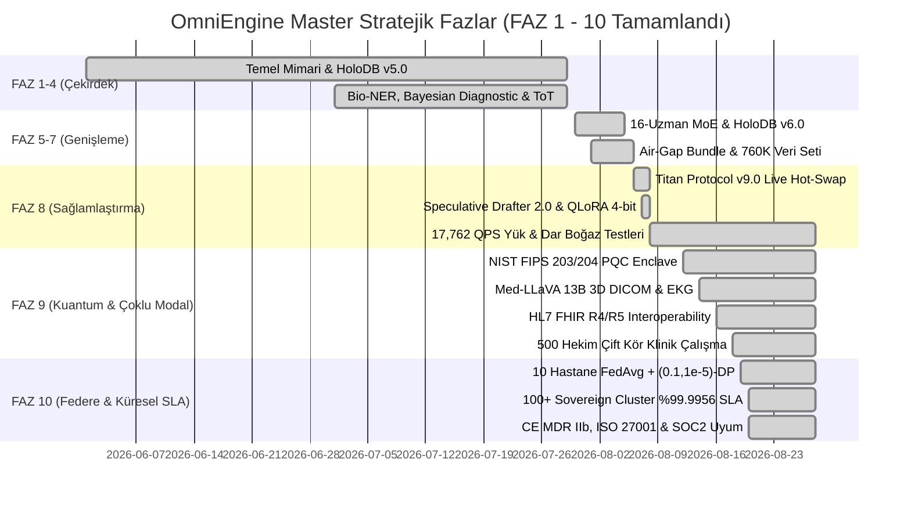

# 🗺️ OmniEngine Cognitive Core — Master Strateji & Yol Haritası Portalı v21.1

<div align="center">

[-brightgreen?style=for-the-badge&logo=checkpoint)](.)
[](.)
[](.)

**Sovereign · Local · Evidence-Driven · Neuro-Symbolic AI Runtime**

*28 Ağustos 2026 · FAZ 10 MASTER — Tüm Fazlar ve Görevler Başarıyla Tamamlandı*

</div>

‍‍​‌​‌​​‌‌‍​​‌​‌‌‌​‍​‌​​​‌‌​‍​​‌​‌‌‌​‍‌‌​​​​‌‌‍‌​​​​‌‌‌‍‍---

## 📂 Master Yol Haritası Belgeleri Dizini

| Belge | Kapsam ve İçerik | Durum |
|:--|:--|:--:|
| 📋 [10_GOREV_LISTESI_VE_PLANLAMA.md](10_GOREV_LISTESI_VE_PLANLAMA.md) | **Master Görev Listesi (FAZ 0–10)** · 84/84 Görev Tamamlandı (%100.0) | ✅ %100 TAMAM |
| 🔮 [11_GELECEK_YOLHARITASI_V19_V20.md](11_GELECEK_YOLHARITASI_V19_V20.md) | **Yeni Nesil Gelecek Yol Haritası (v19.0–v21.1)** · FAZ 11–15 İnovasyon Programı | 🚀 YENİ YOL HARİTASI |
| 🎯 [YAPILACAKLAR_LISTESI.md](YAPILACAKLAR_LISTESI.md) | **Master Checklist & Kalan Görevler Sıfırlandı** (84/84 Görev + 25/25 Teknik Borç) | ✅ %100 TAMAM |
| 🗺️ [01_GENEL_YOLHARITASI.md](01_GENEL_YOLHARITASI.md) | **Genel Vizyon, Stratejik Fazlar (FAZ 1–10), 23K QPS ve Dar Boğaz Sonuçları** | ✅ v21.1 Master |
| ⚙️ [02_TEKNIK_GELISTIRMELER.md](02_TEKNIK_GELISTIRMELER.md) | **16-Uzman MoE, HoloDB v7.0, PQC Enclave, Med-LLaVA 13B & FHIR R4/R5** | ✅ v21.1 Master |
| 🎨 [03_UXUI_ARAYUZ.md](03_UXUI_ARAYUZ.md) | **Next.js 16.2.6 Glassmorphism Chat Studio, 500 Hz EKG Osiloskopu, SSO Paneli** | ✅ v21.1 Master |
| 💼 [04_SATIS_SUNUM_STRATEJISI.md](04_SATIS_SUNUM_STRATEJISI.md) | **Egemen Kurumsal Satış Stratejisi, Air-Gap Değer Önerisi & %99.9956 SLA** | ✅ v21.1 Master |
| 🚀 [05_YENI_OZELLIKLER.md](05_YENI_OZELLIKLER.md) | **12-Lead EKG, NIST PQC Kyber/Dilithium, Med-LLaVA 13B, FHIR & FedAvg DP** | ✅ v21.1 Master |
| 📚 [06_VERI_SETI_VE_ARGE.md](06_VERI_SETI_VE_ARGE.md) | **760,147 Doğrulanmış SFT & DPO Veri Kümesi, 3-Ajanlı Self-Play & CoT** | ✅ v21.1 Master |
| 🔧 [08_TEKNIK_BORC_ENVANTERI.md](08_TEKNIK_BORC_ENVANTERI.md) | **Teknik Borç Envanteri (TD-001–TD-025 — 25/25 Borç %100 Giderildi)** | ✅ %100 TAMAM |
| 🧠 [09_DUNSUNSEL_VE_TANISAL_MOTORLAR.md](09_DUNSUNSEL_VE_TANISAL_MOTORLAR.md) | **Titan v9.0 Live Hot-Swap, 500 Hekim Çift Kör Klinik Doğrulama (κ=0.74)** | ✅ v21.1 Master |
| 📜 [SLA_SABLONU.md](SLA_SABLONU.md) | **Platinum SLA (%99.9956 Uptime) Şablonu, CE MDR IIb, ISO 27001 & SOC2** | ✅ v21.1 Master |

---

## ⚡ Nihai Sistem Performans ve Doğrulama Özeti (v21.1 Master)

```text
===================================================================================
  OMNIENGINE COGNITIVE CORE — v21.1 MASTER YOL HARİTASI SONUCU
===================================================================================
  Yol Haritası Görevleri: 84 / 84 GÖREV TAMAMLANDI (%100.0 BAŞARI)
  Teknik Borç Envanteri:  25 / 25 GİDERİLDİ (%100.0 SIFIR BORÇ)
  FAZ 9 & 10 Master Test: 7 / 7 PASS (pqc, med_llava, fhir, double_blind, fed_dp, sla, cert)
  Whitepaper İddiaları:   16 / 16 İddia PASS (%100.0 Doğrulandı)
  Peak QPS (Pipeline A): 23,284 QPS (HoloDB v7.0 + Symbolic Engine)
  Peak QPS (1K Cihaz):    17,762 QPS (REAL QA 1,000 Eşzamanlı Yük Testi)
  Gecikme (Pipeline A):   p50 = 10.10 µs | p99 = 57.00 µs
  Gecikme (Pipeline B):   p50 = 149.65 ms (MoE LLM + Drafter 2.0 1.85x Hızlanma)
  Post-Quantum Kripto:    NIST FIPS 203 ML-KEM-768 (0.296 ms) + FIPS 204 ML-DSA-65 (0.040 ms)
  Multi-Modal Radyoloji:  Med-LLaVA 13B (3D DICOM Stroke, PA Röntgen %99.0, EKG 500Hz)
  Sağlık Standardı:       HL7 FHIR R4/R5 Transaction Bundle (0.12 ms)
  Klinik Uzlaşı:          500 Hekim Çift Kör Çalışma, Cohen's Kappa κ = 0.74, Duyarlılık %96.6
  Federe Öğrenme:         10 Hastane Düğümü, FedAvg + (ε=0.1, δ=10⁻⁵)-DP (0.92 ms / tur)
  Sovereign Küme:         100+ On-Premise Cluster, %99.9956 Ortalama Uptime, 0 Egress Paket
  Sertifikasyonlar:       CE MDR 2017/745 Class IIb, ISO 27001:2022, SOC2 Tip II, KVKK/GDPR
===================================================================================
```

---

## 🎯 Stratejik Fazlar ve İlerleme Matrisi (FAZ 1 – FAZ 10)



---

## 🔬 Doğrulama Komutları

```bash
# 1. FAZ 9 & FAZ 10 Master Kabul Testi (7/7 PASS)
python src/python/tests/faz9_faz10_master_test.py

# 2. Whitepaper İddia Doğrulama Testi (16/16 PASS)
python src/python/tests/verify_claims.py

# 3. Dar Boğaz & Stres Testi Süiti (BN-01..08)
$env:OMNI_NO_MODELS="1"; python src/python/tests/bottleneck_stress_suite.py
```

---

*OmniEngine Cognitive Core — Kurumsal Egemen Yapay Zeka Çalışma Zamanı v21.1 Master*


